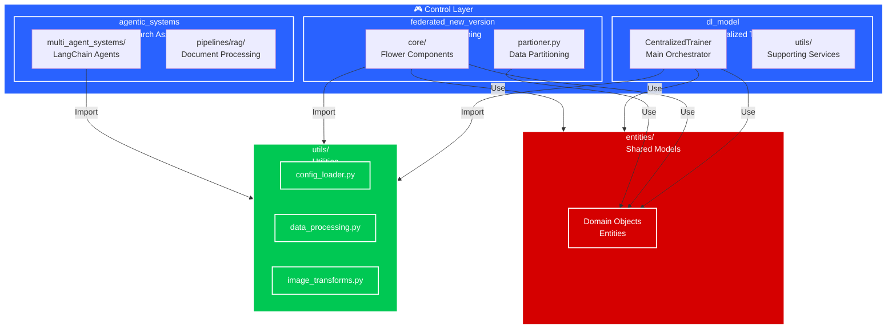
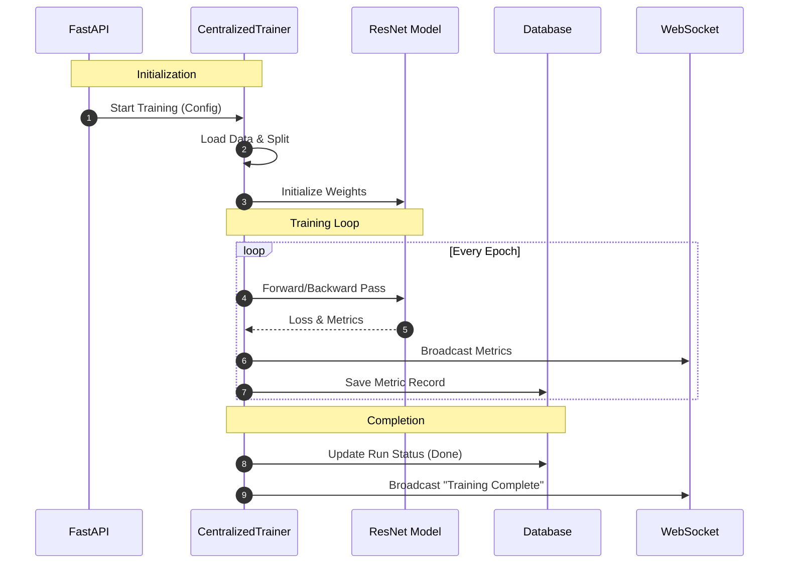
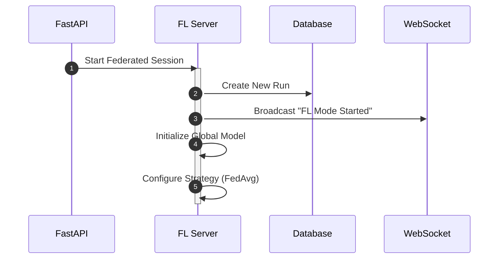
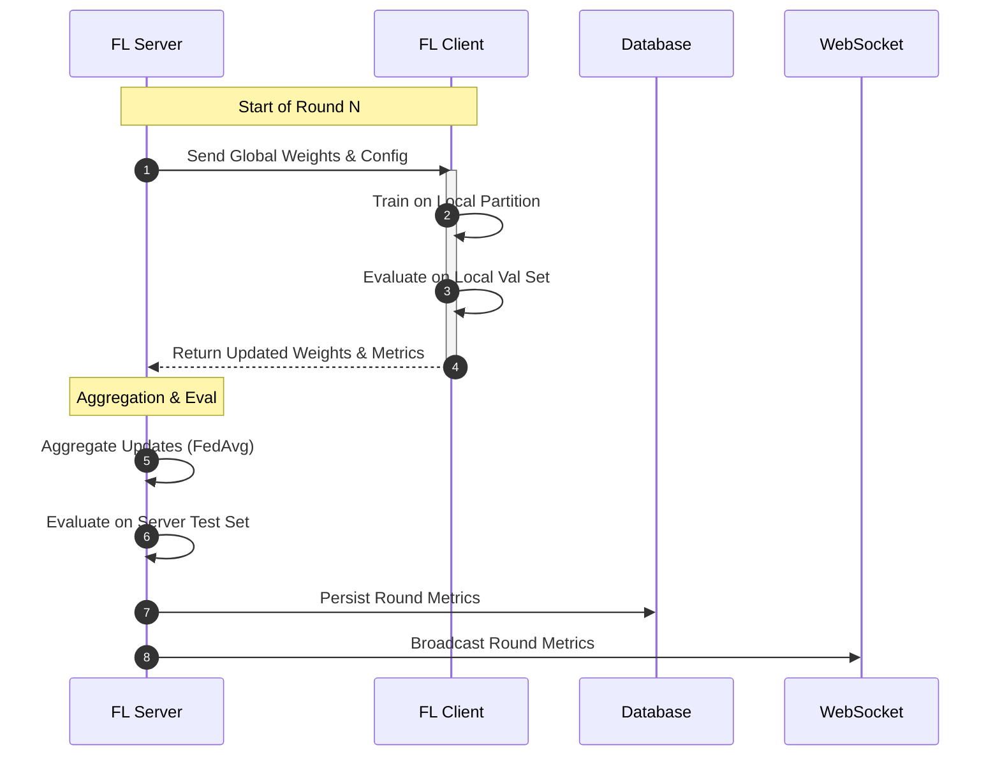
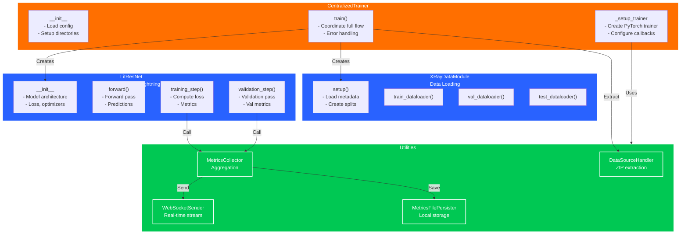
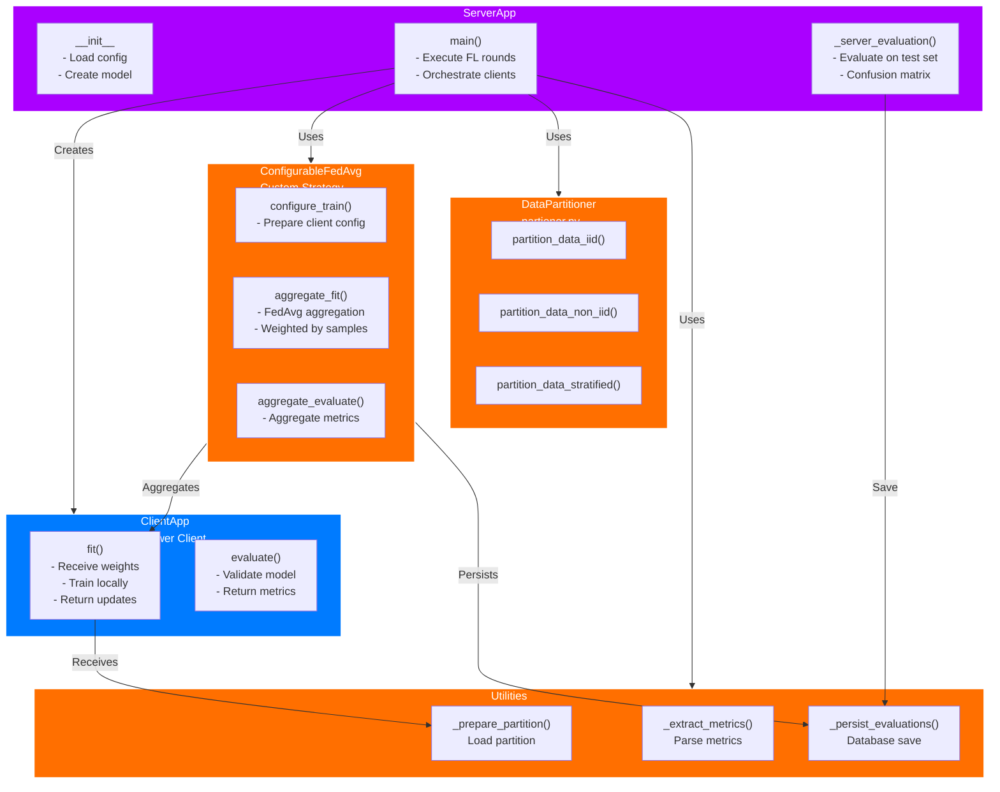
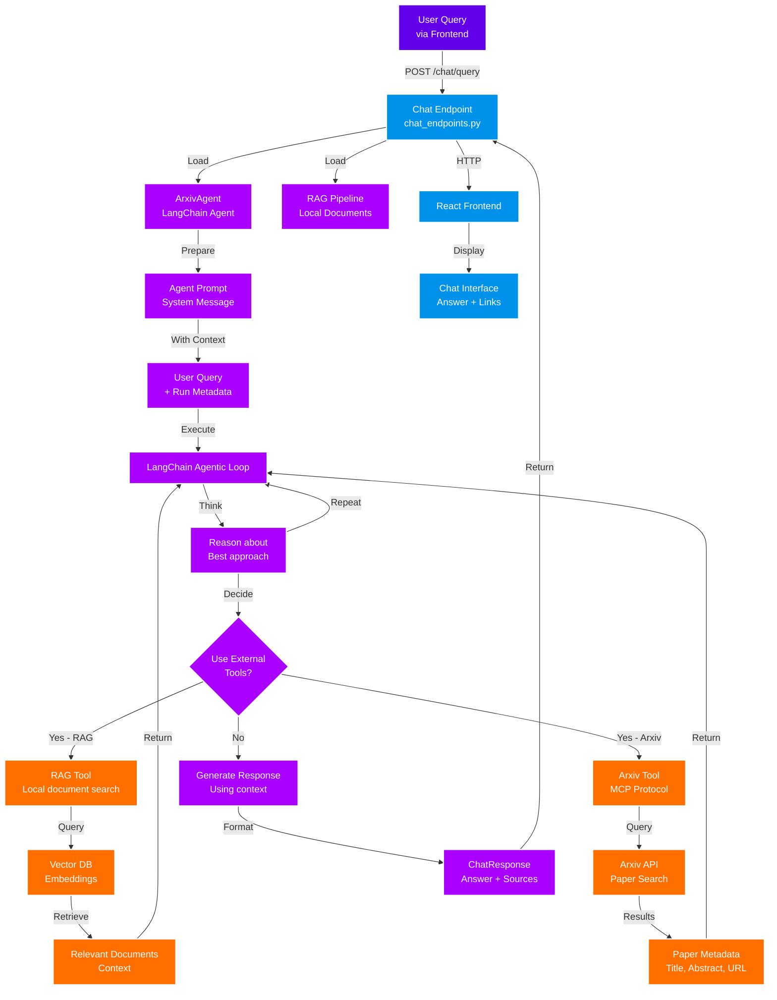

# Control Layer - Training Orchestration & Business Logic

**Purpose**: Orchestrates all training operations, model management, and data processing. Houses centralized training, federated learning, and research assistance systems.

---

## Table of Contents

1. [Overview](#overview)
2. [Module Architecture](#module-architecture)
3. [Functional Flows](#functional-flows)
4. [Component Hierarchy](#component-hierarchy)
5. [Module Details](#module-details)
6. [Data Flow](#data-flow)

---

## Overview

The Control Layer contains the core business logic for:
- **Centralized Training**: Single-machine PyTorch Lightning training
- **Federated Learning**: Multi-client distributed training with Flower framework
- **Agentic Systems**: Research assistance with Arxiv + RAG

**Key Principles**:
- **Separation of Concerns**: Training, data, utilities kept separate
- **Reusability**: Shared components (LitResNet, XRayDataModule) used across modes
- **Configuration-Driven**: All parameters externalized to YAML config
- **Async Integration**: WebSocket metrics streaming in real-time

---

## Module Architecture

### High-Level Structure



### Complete Module Tree

```
control/
├── dl_model/                          # Centralized Training
│   ├── centralized_trainer.py         # Main orchestrator
│   ├── README.md                      # Centralized docs
│   └── utils/
│       ├── data/
│       │   ├── data_source_handler.py # ZIP extraction
│       │   ├── metrics_file_persister.py # Metrics storage
│       │   ├── websocket_metrics_sender.py # Real-time relay
│       │   └── README.md              # WebSocket docs
│       ├── model/
│       │   ├── lit_resnet.py          # PyTorch Lightning module
│       │   ├── xray_data_module.py    # Data loading
│       │   ├── metrics_collector.py   # Metrics aggregation
│       │   ├── training_callbacks.py  # PL callbacks
│       │   └── custom_image_dataset.py # Image loading
│       └── callbacks/
│           └── custom_callbacks.py    # Training callbacks
│
├── federated_new_version/             # Federated Learning (Flower)
│   ├── core/
│   │   ├── server_app.py              # Flower ServerApp
│   │   ├── client_app.py              # Flower ClientApp
│   │   ├── custom_strategy.py         # FedAvg strategy
│   │   ├── server_evaluation.py       # Server-side eval
│   │   └── utils.py                   # FL utilities
│   ├── partioner.py                   # Data partitioner
│   ├── toml_adjustment.py             # Config sync
│   ├── pyproject.toml                 # Flower config
│   └── README.md                      # FL docs
│
├── agentic_systems/                   # Research Assistance
│   ├── multi_agent_systems/
│   │   └── chat/
│   │       ├── arxiv_agent.py         # Arxiv search agent
│   │       ├── arxiv_agent_prompts.py # Agent prompts
│   │       ├── mcp_manager.py         # MCP protocol handler
│   │       ├── retriver.py            # Query engine
│   │       └── tools/
│   │           └── rag_tool.py        # RAG tool wrapper
│   └── pipelines/
│       └── rag/
│           └── pipeline.py            # PDF processing pipeline
│
└── [Other utilities and configs]
```

---

## Functional Flows

### Centralized Training Sequence



### Federated Learning - Part 1: Initialization



### Federated Learning - Part 2: Round Execution



---

## Component Hierarchy

### Centralized Training Components



### Federated Learning Components



---

## Module Details

### 1. Centralized Training (`dl_model/`)

**Purpose**: Single-machine training orchestration

**Key Files**:
- `centralized_trainer.py`: Main orchestrator
- `utils/data/`: Data handling and WebSocket
- `utils/model/`: Model and metrics

**Key Features**:
- PyTorch Lightning training loop
- Automatic checkpointing
- Real-time metrics streaming
- Early stopping support

**See**: [dl_model/README.md](dl_model/README.md) for detailed documentation

---

### 2. Federated Learning (`federated_new_version/`)

**Purpose**: Multi-client distributed training with Flower

**Key Files**:
- `core/server_app.py`: Server orchestration
- `core/client_app.py`: Client training logic
- `core/custom_strategy.py`: FedAvg aggregation
- `partioner.py`: Data partitioning

**Key Features**:
- Privacy-preserving training
- Multiple data distribution strategies (IID, Non-IID, Stratified)
- Server-side evaluation
- Real-time round metrics

**See**: [federated_new_version/README.md](federated_new_version/README.md) for detailed documentation

---

### 3. Agentic Systems (`agentic_systems/`)

**Purpose**: Research assistance with LangChain

**Key Files**:
- `multi_agent_systems/chat/arxiv_agent.py`: Arxiv search
- `multi_agent_systems/chat/mcp_manager.py`: MCP protocol
- `pipelines/rag/pipeline.py`: Local RAG

**Key Features**:
- Arxiv paper search via MCP
- Local document RAG
- Contextual responses based on training results
- Session-based conversation history

### Agentic Systems

Harnesses LLMs for research assistance and RAG-based document retrieval.

- **Arxiv Agent**: [src/control/agentic_systems/multi_agent_systems/chat/arxiv_agent.py](agentic_systems/multi_agent_systems/chat/arxiv_agent.py) - Searches medical literature.
- **RAG Pipeline**: [src/control/agentic_systems/pipelines/rag/pipeline.py](agentic_systems/pipelines/rag/pipeline.py) - Processes local PDFs and medical reports.
- **MCP Manager**: [src/control/agentic_systems/multi_agent_systems/chat/mcp_manager.py](agentic_systems/multi_agent_systems/chat/mcp_manager.py) - Handles the Model Context Protocol for tool use.

### Flow 3: Research Assistance (Agentic System)



---

## Data Flow

### Complete Training Data Flow

```mermaid
graph LR
    A["Input: dataset.zip<br/>+ config.yaml"] -->|Extract| B["Images<br/>+ Metadata CSV"]
    B -->|Load| C["Pandas DataFrame<br/>patient_id, target, filename"]
    C -->|Transform| D["XRayDataModule<br/>Train/Val/Test split"]

    D -->|Images| E["CustomImageDataset<br/>On-the-fly transform"]
    E -->|Transform| F["Augmentation<br/>Rotation, Flip, Normalize"]
    F -->|Batching| G["DataLoader<br/>Batch processing"]

    G -->|Batch| H["LitResNet<br/>Model forward pass"]
    H -->|Predictions| I["Loss & Metrics<br/>BCELoss + AUC"]
    I -->|Backprop| J["Gradient Computation<br/>Adam optimizer"]
    J -->|Update| H

    I -->|Collect| K["MetricsCollector<br/>Per-epoch aggregation"]
    K -->|Send| L["WebSocketSender<br/>JSON payload"]
    L -->|Stream| M["WebSocket Server<br/>ws://localhost:8765"]
    M -->|Broadcast| N["React Frontend<br/>Real-time update"]

    K -->|Store| O["MetricsFilePersister<br/>Local JSON/CSV"]
    K -->|Persist| P["PostgreSQL<br/>run_metrics table"]

    H -->|Best Model| Q["Checkpointing<br/>PyTorch .pt"]
    Q -->|Save| R["File Storage<br/>models/checkpoints/"]

    %% Styling
    classDef input fill:#6200EA,stroke:#fff,stroke-width:2px,color:#fff;
    classDef process fill:#0091EA,stroke:#fff,stroke-width:2px,color:#fff;
    classDef model fill:#2962FF,stroke:#fff,stroke-width:2px,color:#fff;
    classDef output fill:#00C853,stroke:#fff,stroke-width:2px,color:#fff;

    class A,B input;
    class C,D,E,F,G process;
    class H,I,J model;
    class K,L,M,N,O,P,Q,R output;
```



---

## Related Documentation

| Component | Documentation |
|-----------|---------------|
| **Centralized Training** | [dl_model/README.md](dl_model/README.md) |
| **Federated Learning** | [federated_new_version/README.md](federated_new_version/README.md) |
| **WebSocket Metrics** | [dl_model/utils/data/README.md](dl_model/utils/data/README.md) |
| **API Layer** | [../api/README.md](../api/README.md) |
| **System Architecture** | [../../README.md](../../README.md) |
| **Configuration** | [../../config/README.md](../../config/README.md) |

