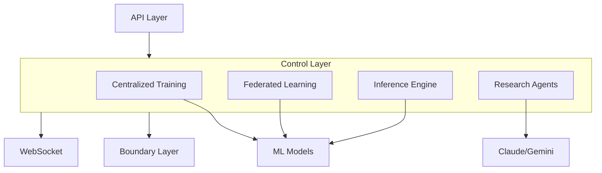
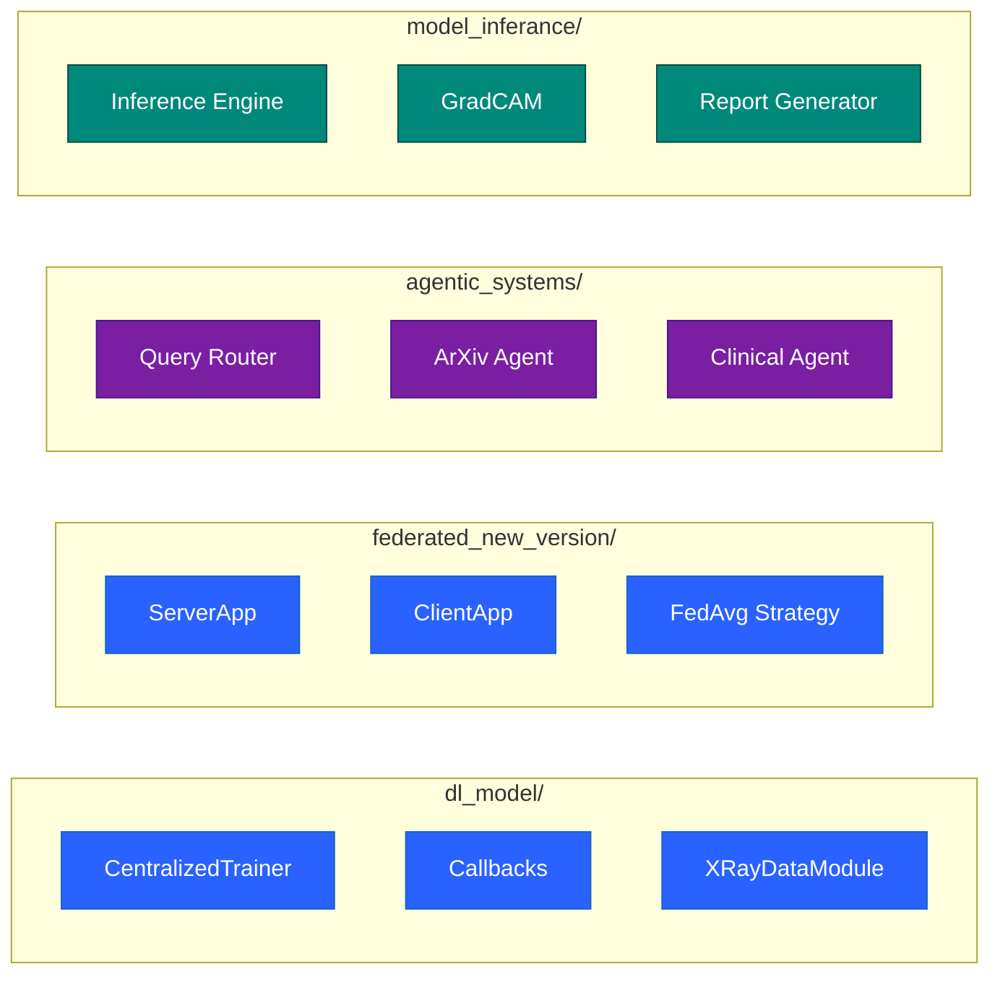
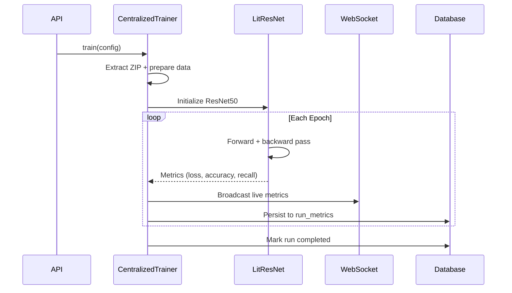
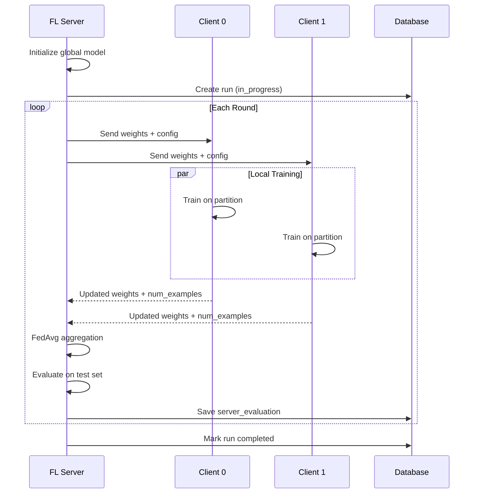
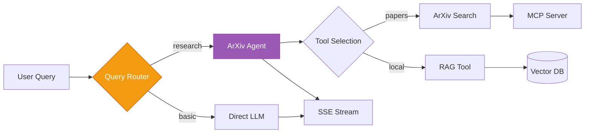
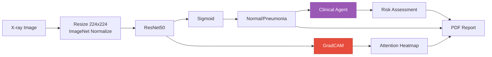
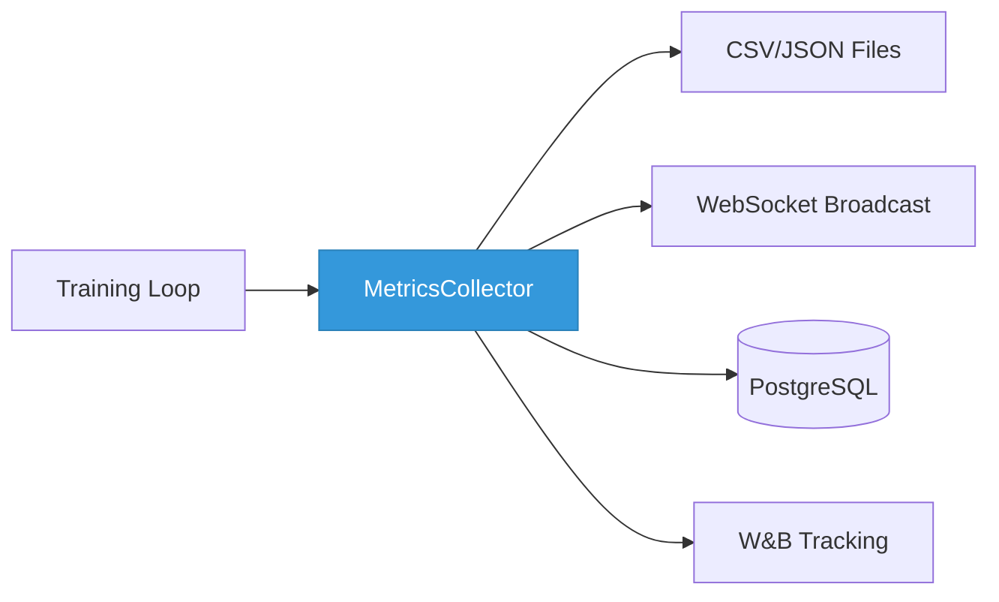

# Control Layer

Business logic hub orchestrating ML training, federated learning, and AI research assistants.

## What It Does



## Architecture

Four subsystems handle different concerns:



## Module Overview

| Module                     | Purpose                           | Key Pattern                   |
| -------------------------- | --------------------------------- | ----------------------------- |
| **dl_model/**              | Single-node GPU training          | PyTorch Lightning + callbacks |
| **federated_new_version/** | Multi-client distributed training | Flower framework              |
| **agentic_systems/**       | LLM research assistants           | LangChain + MCP tools         |
| **model_inferance/**       | Predictions + explanations        | GradCAM heatmaps              |
| **report_generation/**     | PDF export                        | ReportLab templates           |

## Centralized Training Flow



**Callbacks Chain:**


- **ModelCheckpoint**: Save top-3 by val_recall
- **EarlyStopping**: Patience=7 on val_recall
- **MetricsCollector**: CSV + JSON per epoch

## Federated Learning Flow



**Key Components:**
| Component | Role |
|-----------|------|
| **ServerApp** | Orchestrates rounds, broadcasts weights |
| **ClientApp** | Local training on data partition |
| **ConfigurableFedAvg** | Weighted aggregation by num_examples |
| **Partitioner** | IID/Non-IID data distribution |

## Research Agent Flow



**Agents:**
| Agent | Purpose | Model |
|-------|---------|-------|
| **Query Router** | Classify research vs basic | Gemini 2.0 Flash |
| **ArXiv Agent** | Paper search + synthesis | Claude 3.5 Sonnet |
| **Clinical Agent** | Risk assessment from predictions | Claude 3.5 Sonnet |

## Inference Pipeline



**GradCAM Process:**

1. Hook final conv layer
2. Backward pass on target class
3. Global average pool gradients
4. ReLU activation map
5. Overlay with 40% alpha

## Key Files

```
control/
├── dl_model/
│   ├── centralized_trainer.py      # Main training orchestrator
│   └── utils/
│       └── model/
│           ├── lit_resnet.py       # PyTorch Lightning model
│           ├── training_callbacks.py
│           └── xray_data_module.py
│
├── federated_new_version/
│   └── core/
│       ├── server_app.py           # FL server
│       ├── client_app.py           # FL client
│       └── custom_strategy.py      # FedAvg variant
│
├── agentic_systems/
│   └── multi_agent_systems/
│       └── chat/
│           ├── arxiv_agent/engine.py
│           ├── query_router.py
│           └── mcp_manager.py
│
├── model_inferance/
│   ├── inference_engine.py
│   └── gradcam.py
│
└── report_generation/
    └── pdf_report.py
```

## Metrics Pipeline

All training modes share a common metrics flow:



| Metric           | Centralized         | Federated               |
| ---------------- | ------------------- | ----------------------- |
| Loss             | Per epoch           | Per round (server eval) |
| Accuracy         | Per epoch           | Per round               |
| Recall           | Per epoch (primary) | Per round               |
| AUROC            | Per epoch           | Per round               |
| Confusion Matrix | Final               | Per round               |

## Quick Reference

| Action                     | Entry Point                          |
| -------------------------- | ------------------------------------ |
| Start centralized training | `CentralizedTrainer(config).train()` |
| Start federated training   | `ServerApp(config).main()`           |
| Run single prediction      | `InferenceEngine().predict(image)`   |
| Generate heatmap           | `GradCAM(model)(image)`              |
| Query research agent       | `ArxivAgentEngine().stream(query)`   |
| Generate PDF report        | `generate_prediction_report(result)` |
