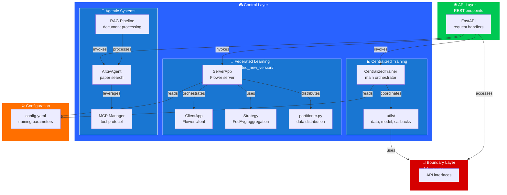
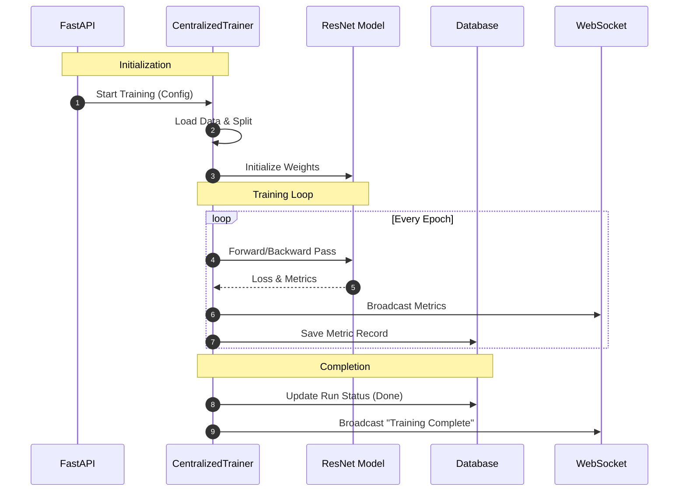
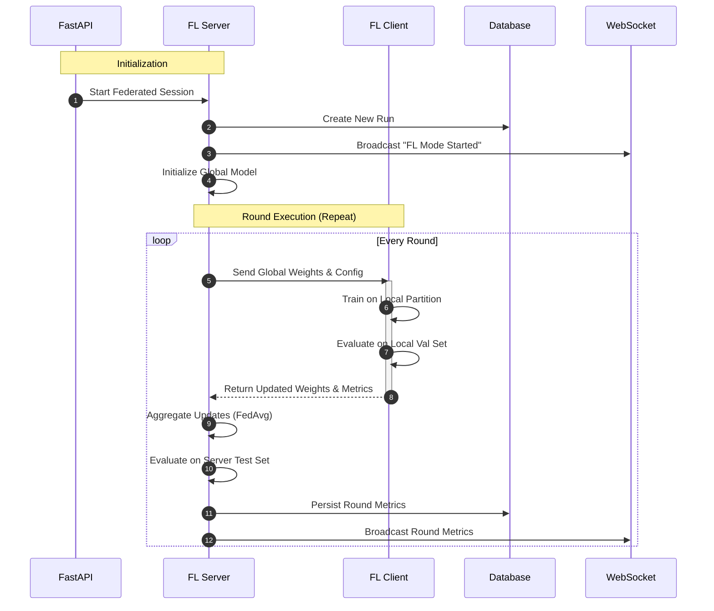
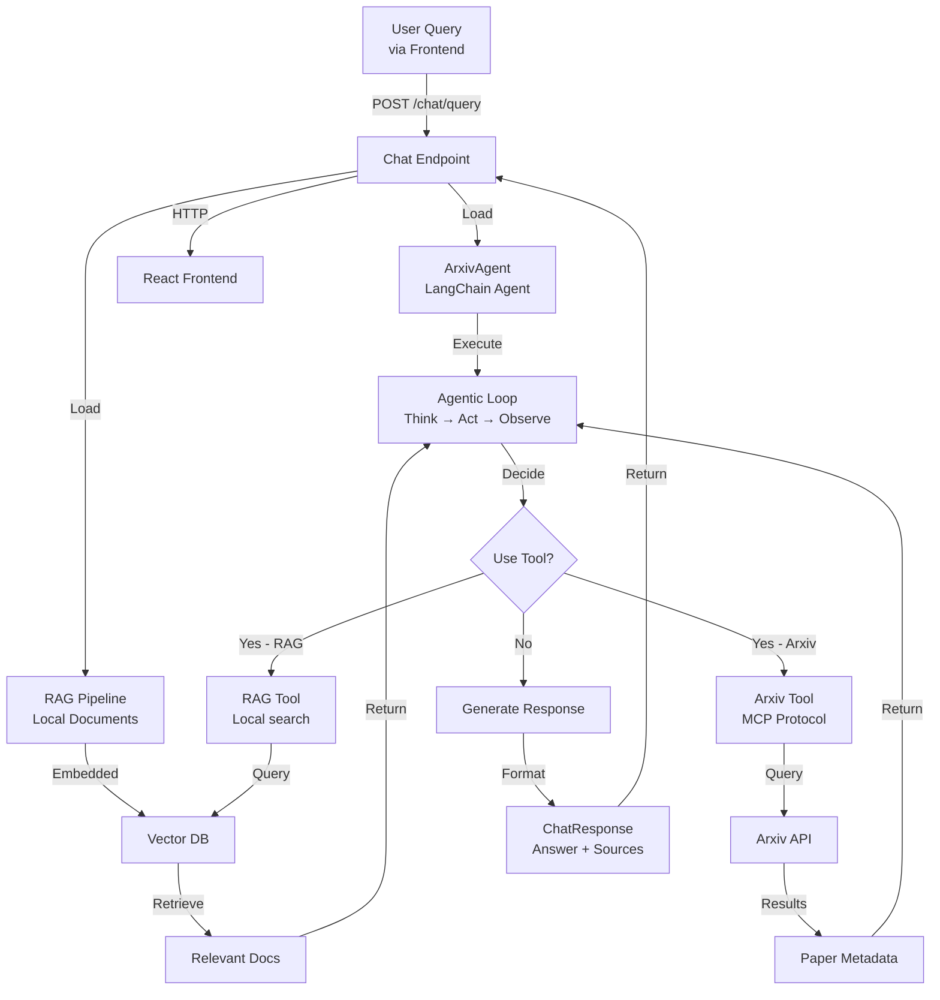
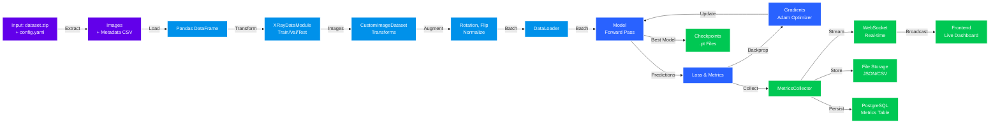

# Control Layer - Training Orchestration & Business Logic

**Purpose**: Orchestrates all training operations, model management, and data processing. Houses centralized training, federated learning, and research assistance systems.

---

## Control Layer Architecture



---

## Table of Contents

1. [Control Layer Overview](#control-layer-overview)
2. [Sub-systems Overview](#sub-systems-overview)
3. [Training Orchestration](#training-orchestration)
4. [Common Components](#common-components)
5. [Configuration Integration](#configuration-integration)
6. [Error Handling & Logging](#error-handling--logging)
7. [Sub-module Links](#sub-module-links)
8. [Functional Flows](#functional-flows)
9. [Data Flow](#data-flow)

---

## Control Layer Overview

The Control Layer is the **central business logic hub** of the federated pneumonia detection system. It orchestrates three distinct training paradigms:

### Key Principles
- **Separation of Concerns**: Each subsystem (centralized, federated, agentic) operates independently with clean interfaces
- **Configuration-Driven**: All parameters externalized to `config.yaml`
- **Real-time Monitoring**: WebSocket integration for live metric streaming
- **Failure Resilience**: Structured error handling with logging throughout

### Core Responsibilities
- **Model Training**: Execute single-node or multi-node training
- **Data Management**: Load, partition, and validate datasets
- **Metrics Collection**: Aggregate and persist training metrics
- **Research Assistance**: Query papers and local documents via LLM agents

---

## Sub-systems Overview

### 1. Centralized Training (`dl_model/`)

**What it does**: Single-machine PyTorch Lightning training on GPU or CPU.

**When to use**:
- Initial model development and experimentation
- Rapid iteration on hyperparameters
- Full dataset training on single node

**Architecture**:
- `CentralizedTrainer`: Main orchestrator that coordinates setup, training loops, and shutdown
- `LitResNet`: PyTorch Lightning module wrapping ResNet architecture
- `XRayDataModule`: Lightning DataModule handling train/val/test splits
- Utilities: Data extraction, metrics collection, WebSocket streaming, checkpointing

**Key Features**:
- Automatic mixed precision training
- Checkpointing best models
- Real-time metrics streaming to frontend
- Early stopping on validation metrics

**See**: [./dl_model/README.md](./dl_model/README.md) for detailed documentation

---

### 2. Federated Learning (`federated_new_version/`)

**What it does**: Multi-client distributed training using the Flower framework.

**When to use**:
- Training across multiple data centers or edge devices
- Privacy-preserving training where data never leaves clients
- Heterogeneous data distribution across clients

**Architecture**:
- `ServerApp`: Flower server orchestrating rounds and aggregation
- `ClientApp`: Flower client implementing local training logic
- `ConfigurableFedAvg`: Custom aggregation strategy with FedAvg
- `partitioner.py`: Data distribution utilities (IID, Non-IID, Stratified)
- `toml_adjustment.py`: Synchronizes config across clients

**Key Features**:
- Privacy-preserving (weights only, no raw data shared)
- Multiple data distribution strategies
- Server-side evaluation on held-out test set
- Real-time round metrics and confusion matrices
- Graceful client dropout handling

**See**: [./federated_new_version/README.md](./federated_new_version/README.md) for detailed documentation

---

### 3. Agentic Systems (`agentic_systems/`)

**What it does**: LLM-based research assistance with paper search and document RAG.

**When to use**:
- Users need contextual research background during training
- Answering domain questions about training results
- Searching medical literature (Arxiv)

**Architecture**:
- `ArxivAgent`: LangChain agent that searches Arxiv papers via MCP
- `RAG Pipeline`: Processes PDFs and medical documents into embeddings
- `MCP Manager`: Handles Model Context Protocol for tool integration
- `Retriever`: Query engine for document similarity search

**Key Features**:
- Integration with Claude API for reasoning
- Arxiv search via MCP protocol
- Local RAG for training reports and papers
- Session-based conversation history
- Contextual answers based on training run metadata

**See**: [./agentic_systems/README.md](./agentic_systems/README.md) for detailed documentation (create if missing)

---

## Training Orchestration

Training in the Control Layer is initiated and managed through the API layer endpoints, which instantiate and coordinate the appropriate subsystem.

### Initialization Flow

```
API Request → Control Layer → Subsystem Initialization
     ↓
Load config.yaml
Load training data
Initialize model & optimizers
Setup monitoring (WebSocket, logging)
Begin training loop
```

### Training Lifecycle

1. **Pre-Training**: Validate config, load data, check resources
2. **Setup**: Initialize model, optimizers, schedulers
3. **Execution**: Run training loop with periodic evaluation
4. **Monitoring**: Stream metrics in real-time
5. **Cleanup**: Save final model, close resources

### Mode Selection

The API layer routes to the appropriate subsystem based on request parameters:

- **mode=centralized** → `CentralizedTrainer`
- **mode=federated** → `ServerApp`
- **mode=agentic** → `ArxivAgent` / RAG Pipeline

---

## Common Components

### Shared Utilities

Located in `control/` and imported by all subsystems:

#### Metrics Handling
- `MetricsCollector`: Aggregates epoch/round metrics
- `MetricsFilePersister`: Saves metrics to JSON/CSV locally
- `WebSocketMetricsSender`: Streams metrics to frontend in real-time

#### Data Processing
- `DataSourceHandler`: Extracts ZIP files and validates structure
- `CustomImageDataset`: On-the-fly image transforms and loading
- `image_transforms.py`: Augmentation pipeline (rotation, flip, normalize)

#### Model Artifacts
- `LitResNet`: PyTorch Lightning wrapper (used by both centralized and federated)
- `XRayDataModule`: Dataset splits (used by both centralized and federated)
- Checkpointing utilities for model persistence

### Interface Contracts

All subsystems follow these patterns:

```
Initialization:
  __init__(config: ConfigSchema, data_path: str, callbacks: List[Callable])

Execution:
  train() -> TrainingResult

Monitoring:
  on_epoch_complete(metrics: Dict[str, float]) -> None
  on_error(error: Exception) -> None
```

---

## Configuration Integration

All training parameters are specified in `../config/default_config.yaml` and follow this hierarchy:

```yaml
training:
  mode: 'centralized'  # or 'federated' or 'agentic'
  model:
    architecture: 'resnet50'
    num_classes: 2
  optimizer:
    type: 'adam'
    lr: 0.001

federated:
  num_rounds: 10
  num_clients: 5
  client_fraction: 0.8

data:
  train_split: 0.7
  val_split: 0.15
  test_split: 0.15
```

### Config Loading

Each subsystem loads config via:
```
ConfigLoader.load_default() → ConfigSchema → subsystem.__init__()
```

Changes to `config.yaml` are picked up on next training run. For federated learning, `toml_adjustment.py` syncs config to all clients.

---

## Error Handling & Logging

### Structured Logging

All subsystems use Python's built-in `logging` module with:

- **Log Levels**: DEBUG, INFO, WARNING, ERROR, CRITICAL
- **Correlation IDs**: Tracking requests across subsystems
- **Contextual Info**: Training run ID, epoch/round number, metrics

### Error Scenarios

| Scenario | Handling | Log Level |
|----------|----------|-----------|
| Invalid config | Fail fast, print validation errors | ERROR |
| Data not found | Retry with backoff, then error | ERROR |
| OOM during training | Graceful shutdown, save checkpoint | CRITICAL |
| Client dropout (federated) | Exclude from round, continue | WARNING |
| WebSocket disconnection | Retry, fallback to file logging | WARNING |

### Try-Except Pattern

All I/O, external calls, and failure-prone operations follow:

```python
try:
    result = operation()
except SpecificException as e:
    logger.error(f"Operation failed: {e}", exc_info=True)
    raise CustomError(f"Context: {e}") from e
```

---

## Sub-module Links

| Component | Documentation | Purpose |
|-----------|---------------|---------|
| **Centralized Training** | [./dl_model/README.md](./dl_model/README.md) | Single-node PyTorch Lightning training |
| **Federated Learning** | [./federated_new_version/README.md](./federated_new_version/README.md) | Multi-client Flower framework |
| **Agentic Systems** | [./agentic_systems/README.md](./agentic_systems/README.md) | LLM research assistance & RAG |
| **Boundary Layer** | [../boundary/README.md](../boundary/README.md) | Data access interfaces |
| **API Layer** | [../api/README.md](../api/README.md) | REST endpoints & routing |
| **Configuration** | [../../config/README.md](../../config/README.md) | Config schema & defaults |

---

## Functional Flows

### Centralized Training Sequence



### Federated Learning Sequence



### Research Assistance Flow



---

## Data Flow

### Complete Training Data Pipeline



---

## Quick Reference

### Starting a Centralized Training Run
```python
from control.dl_model.centralized_trainer import CentralizedTrainer
from control.config_loader import ConfigLoader

config = ConfigLoader.load_default()
trainer = CentralizedTrainer(config, data_path="/path/to/data")
result = trainer.train()
```

### Starting a Federated Learning Run
```python
from control.federated_new_version.core.server_app import ServerApp

config = ConfigLoader.load_default()
server = ServerApp(config)
server.main()
```

### Querying the Research Assistant
```python
from control.agentic_systems.multi_agent_systems.chat.arxiv_agent import ArxivAgent

agent = ArxivAgent()
response = agent.query("What are recent advances in pneumonia detection?")
```

