# Control Layer - Training Orchestration & Business Logic

**Purpose**: Orchestrates all training operations, model management, and data processing. Houses centralized training, federated learning, and research assistance systems.

---

## Table of Contents

1. [Overview](#overview)
2. [Module Architecture](#module-architecture)
3. [Functional Flows](#functional-flows)
4. [Component Hierarchy](#component-hierarchy)
5. [Module Details](#module-details)
6. [Data Flow](#data-flow)

---

## Overview

The Control Layer contains the core business logic for:
- **Centralized Training**: Single-machine PyTorch Lightning training
- **Federated Learning**: Multi-client distributed training with Flower framework
- **Agentic Systems**: Research assistance with Arxiv + RAG

**Key Principles**:
- **Separation of Concerns**: Training, data, utilities kept separate
- **Reusability**: Shared components (LitResNet, XRayDataModule) used across modes
- **Configuration-Driven**: All parameters externalized to YAML config
- **Async Integration**: WebSocket metrics streaming in real-time

---

## Module Architecture

### High-Level Structure

```mermaid
graph TB
    subgraph Control["🎮 Control Layer<br/>src/control/"]
        subgraph DL["dl_model<br/>Centralized Training"]
            CT["CentralizedTrainer<br/>Main Orchestrator"]
            Utils["utils/<br/>Supporting Services"]
        end

        subgraph Fed["federated_new_version<br/>Federated Learning"]
            Core["core/<br/>Flower Components"]
            Part["partioner.py<br/>Data Partitioning"]
        end

        subgraph Agent["agentic_systems<br/>Research Assistant"]
            MAS["multi_agent_systems/<br/>LangChain Agents"]
            RAG["pipelines/rag/<br/>Document Processing"]
        end
    end

    subgraph Shared["entities/<br/>Shared Models"]
        Models["Domain Objects<br/>Entities"]
    end

    subgraph Utils["utils/<br/>Utilities"]
        Config["config_loader.py"]
        Data["data_processing.py"]
        Transforms["image_transforms.py"]
    end

    CT -->|Use| Models
    CT -->|Use| Shared
    Core -->|Use| Models
    Core -->|Use| Shared
    Part -->|Use| Models

    CT -->|Import| Utils
    Core -->|Import| Utils
    MAS -->|Import| Utils

    style Control fill:#f3e5f5
    style DL fill:#f8bbd0
    style Fed fill:#c8e6c9
    style Agent fill:#fff9c4
    style Shared fill:#e8f5e9
    style Utils fill:#f0f4c3
```



### Complete Module Tree

```
control/
├── dl_model/                          # Centralized Training
│   ├── centralized_trainer.py         # Main orchestrator
│   ├── README.md                      # Centralized docs
│   └── utils/
│       ├── data/
│       │   ├── data_source_handler.py # ZIP extraction
│       │   ├── metrics_file_persister.py # Metrics storage
│       │   ├── websocket_metrics_sender.py # Real-time relay
│       │   └── README.md              # WebSocket docs
│       ├── model/
│       │   ├── lit_resnet.py          # PyTorch Lightning module
│       │   ├── xray_data_module.py    # Data loading
│       │   ├── metrics_collector.py   # Metrics aggregation
│       │   ├── training_callbacks.py  # PL callbacks
│       │   └── custom_image_dataset.py # Image loading
│       └── callbacks/
│           └── custom_callbacks.py    # Training callbacks
│
├── federated_new_version/             # Federated Learning (Flower)
│   ├── core/
│   │   ├── server_app.py              # Flower ServerApp
│   │   ├── client_app.py              # Flower ClientApp
│   │   ├── custom_strategy.py         # FedAvg strategy
│   │   ├── server_evaluation.py       # Server-side eval
│   │   └── utils.py                   # FL utilities
│   ├── partioner.py                   # Data partitioner
│   ├── toml_adjustment.py             # Config sync
│   ├── pyproject.toml                 # Flower config
│   └── README.md                      # FL docs
│
├── agentic_systems/                   # Research Assistance
│   ├── multi_agent_systems/
│   │   └── chat/
│   │       ├── arxiv_agent.py         # Arxiv search agent
│   │       ├── arxiv_agent_prompts.py # Agent prompts
│   │       ├── mcp_manager.py         # MCP protocol handler
│   │       ├── retriver.py            # Query engine
│   │       └── tools/
│   │           └── rag_tool.py        # RAG tool wrapper
│   └── pipelines/
│       └── rag/
│           └── pipeline.py            # PDF processing pipeline
│
└── [Other utilities and configs]
```

---

## Functional Flows

### Flow 1: Centralized Training Execution


### Flow 2: Federated Learning Execution

```mermaid
graph TD
    A["API: POST /experiments/federated<br/>+ dataset.zip, num_rounds=15"] -->|Queue| B["Background Task"]
    B -->|Extract| C["Data Preparation<br/>Load metadata"]
    C -->|Partition| D["DataPartitioner<br/>IID/Non-IID/Stratified"]

    D -->|Initialize| E["Flower ServerApp<br/>core/server_app.py"]
    E -->|Create| F["LitResNet<br/>Global Model"]
    E -->|Create| G["ConfigurableFedAvg<br/>Aggregation Strategy"]

    E -->|Signal| H["send_training_mode<br/>is_federated=True"]
    H -->|Relay| I["WebSocket Server"]
    I -->|Broadcast| J["React Frontend"]

    loop "For each Round (1 to 15)"
        E -->|Distribute| K["Broadcast Weights<br/>+ Config to Clients"]
        K -->|Receive| L["ClientApp ×N<br/>core/client_app.py"]

        par "Parallel Client Execution"
            L -->|Load| M["Data Partition<br/>Client 0"]
            M -->|Train| N["LitResNet<br/>Local Training"]
            N -->|Compute| O["Training Metrics<br/>Loss, Accuracy"]
        and
            L -->|Load| P["Data Partition<br/>Client 1"]
            P -->|Train| Q["LitResNet<br/>Local Training"]
            Q -->|Compute| R["Training Metrics"]
        and
            L -->|Load| S["Data Partition<br/>Client N"]
            S -->|Train| T["LitResNet<br/>Local Training"]
            T -->|Compute| U["Training Metrics"]
        end

        O -->|Return| V["Aggregate Weights<br/>FedAvg Strategy"]
        R -->|Return| V
        U -->|Return| V

        V -->|Aggregated| W["Server-Side Evaluation<br/>Test Set"]
        W -->|Compute| X["Metrics & CM<br/>Accuracy, Precision, Recall"]
        X -->|Persist| Y["Database<br/>server_evaluations table"]

        V -->|Signal| Z["send_round_metrics<br/>Aggregated metrics"]
        Z -->|Relay| I
        I -->|Update| J
    end

    E -->|Mark Complete| Y
    E -->|Signal| AA["send_training_end<br/>+ run_id"]
    AA -->|Relay| I

    J -->|Query| AB["API: /api/runs/{id}/federated-rounds"]
    AB -->|Fetch| Y
    J -->|Display| AC["Federated Results<br/>Per-round charts"]

    style A fill:#ffe0b2
    style E fill:#c8e6c9
    style L fill:#bbdefb
    style I fill:#f8bbd0
    style J fill:#e1f5ff
    style Y fill:#e8f5e9
    style AC fill:#c8e6c9
```

### Flow 3: Research Assistance (Agentic System)


---

## Component Hierarchy

### Centralized Training Components


### Federated Learning Components


---

## Module Details

### 1. Centralized Training (`dl_model/`)

**Purpose**: Single-machine training orchestration

**Key Files**:
- `centralized_trainer.py`: Main orchestrator
- `utils/data/`: Data handling and WebSocket
- `utils/model/`: Model and metrics

**Key Features**:
- PyTorch Lightning training loop
- Automatic checkpointing
- Real-time metrics streaming
- Early stopping support

**See**: [dl_model/README.md](dl_model/README.md) for detailed documentation

---

### 2. Federated Learning (`federated_new_version/`)

**Purpose**: Multi-client distributed training with Flower

**Key Files**:
- `core/server_app.py`: Server orchestration
- `core/client_app.py`: Client training logic
- `core/custom_strategy.py`: FedAvg aggregation
- `partioner.py`: Data partitioning

**Key Features**:
- Privacy-preserving training
- Multiple data distribution strategies (IID, Non-IID, Stratified)
- Server-side evaluation
- Real-time round metrics

**See**: [federated_new_version/README.md](federated_new_version/README.md) for detailed documentation

---

### 3. Agentic Systems (`agentic_systems/`)

**Purpose**: Research assistance with LangChain

**Key Files**:
- `multi_agent_systems/chat/arxiv_agent.py`: Arxiv search
- `multi_agent_systems/chat/mcp_manager.py`: MCP protocol
- `pipelines/rag/pipeline.py`: Local RAG

**Key Features**:
- Arxiv paper search via MCP
- Local document RAG
- Contextual responses based on training results
- Session-based conversation history

---

## Data Flow

### Complete Training Data Flow


---

## Related Documentation

| Component | Documentation |
|-----------|---------------|
| **Centralized Training** | [dl_model/README.md](dl_model/README.md) |
| **Federated Learning** | [federated_new_version/README.md](federated_new_version/README.md) |
| **WebSocket Metrics** | [dl_model/utils/data/README.md](dl_model/utils/data/README.md) |
| **API Layer** | [../api/README.md](../api/README.md) |
| **System Architecture** | [../../README.md](../../README.md) |
| **Configuration** | [../../config/default_config.yaml](../../config/default_config.yaml) |

