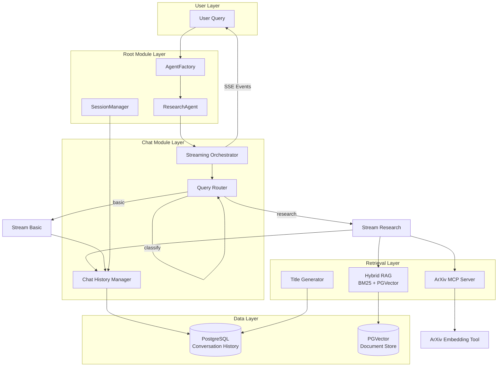

# Multi-Agent Systems Module

**A sophisticated multi-mode research chat system with hybrid retrieval, arXiv integration, and streaming capabilities**

---

## Table of Contents

1. [Architecture Overview](#architecture-overview)
2. [Module Structure](#module-structure)
3. [Core Components](#core-components)
4. [Design Patterns](#design-patterns)
5. [API Reference](#api-reference)
6. [Usage Examples](#usage-examples)
7. [Configuration](#configuration)
8. [Dependencies](#dependencies)

---

## Architecture Overview

The multi_agent_systems module implements a research-grade chat system with intelligent query classification, dual retrieval strategies, and real-time streaming responses.



---

## Module Structure

```
multi_agent_systems/
├── __init__.py                 # Public API exports
├── base_agent.py              # Abstract base class for agents
├── contracts.py               # Type definitions and data contracts
├── factory.py                 # Agent instantiation factory
├── session_manager.py         # Session persistence facade
├── README.md                  # This file
│
├── providers/
│   └── research_agent.py      # ResearchAgent implementation
│
└── chat/                      # Chat submodule
    ├── core/
    │   ├── content.py         # LLM response normalization
    │   ├── router.py          # Query classification
    │   └── streaming.py       # SSE event utilities
    │
    ├── agents/
    │   ├── research_engine.py # Main orchestrator
    │   ├── research_helpers.py # Agent building utilities
    │   ├── research_stream.py # Streaming orchestration
    │   ├── stream_basic.py    # Basic mode streaming
    │   ├── stream_research.py # Research mode streaming
    │   └── stream_state.py    # Stream state management
    │
    ├── history/
    │   └── postgres_history.py # Conversation persistence
    │
    ├── prompts/
    │   └── research_prompts.py # System prompt templates
    │
    ├── providers/
    │   ├── arxiv_mcp.py       # MCP server manager
    │   ├── rag.py             # Hybrid retrieval engine
    │   ├── titles.py          # Title generation
    │   └── tools/
    │       ├── arxiv_embedding_tool.py # ArXiv paper tools
    │       └── rag_tool.py    # RAG wrapper tool
```

---

## Core Components

### Root-Level Components

#### `BaseAgent` (base_agent.py)

Abstract base class defining the contract for all agent implementations.

**Methods:**

- `stream(input: ChatInput, callback: Callable) -> AsyncGenerator[AgentEvent]`: Stream responses with SSE events
- `query(input: ChatInput) -> str`: Execute a query and return complete response
- `history(session_id: str) -> List[Dict]`: Retrieve conversation history
- `clear_history(session_id: str) -> None`: Clear conversation history

#### `AgentFactory` (factory.py)

Factory pattern implementation for agent instantiation with lazy initialization.

**Methods:**

- `get_chat_agent() -> BaseAgent`: Returns singleton ResearchAgent instance
- `reset() -> None`: Clear cached instances (useful for testing)

#### `SessionManager` (session_manager.py)

Facade for session persistence and management operations.

**Methods:**

- `list_sessions() -> List[Session]`: List all active sessions
- `create_session(title: str) -> Session`: Create new conversation session
- `ensure_session(session_id: str) -> Session`: Get or create session by ID
- `delete_session(session_id: str) -> None`: Delete session and history
- `clear_history(session_id: str) -> None`: Clear messages for session

### Chat Submodule Components

#### Query Router (chat/core/router.py)

Intelligent query classifier using gemini-2.0-flash-exp to determine query complexity.

**Classification Modes:**

- **Basic Mode**: Simple conversational queries, no tools required
- **Research Mode**: Complex queries requiring retrieval, tool execution, synthesis

**Example Classification:**

- "Hello, how are you?" → Basic Mode
- "Compare recent research on pneumonia detection using CT vs. X-ray" → Research Mode

#### Research Engine (chat/agents/research_engine.py)

Main orchestrator `ArxivAugmentedEngine` that coordinates:

- RAG retrieval from internal knowledge base
- ArXiv search for academic papers
- Conversation history integration
- Tool execution via LangGraph

#### Streaming Orchestrator (chat/agents/research_stream.py)

Manages real-time response streaming via Server-Sent Events (SSE).

**Stream Flow:**

1. Classify query type
2. Build appropriate tool set
3. Construct message context
4. Route to `stream_basic` or `stream_research`
5. Emit SSE events (tokens, tool calls, status updates)

#### Hybrid RAG (chat/providers/rag.py)

Ensemble retrieval combining:

- **BM25**: Keyword-based search (50% weight)
- **PGVector**: Semantic search with all-MiniLM-L6-v2 embeddings (50% weight)

**Features:**

- Dense document chunks with metadata
- Configurable top-k retrieval
- Automatic query expansion

#### MCP Integration (chat/providers/arxiv_mcp.py)

Singleton `MCPManager` for ArXiv MCP server lifecycle management.

**Capabilities:**

- Server process management
- Tool discovery and registration
- Paper metadata retrieval
- Abstract and citation extraction

#### Conversation History (chat/history/postgres_history.py)

PostgreSQL-backed chat history using LangChain's `PostgresChatMessageHistory`.

**Features:**

- Automatic title generation
- Message deduplication
- Timestamp tracking
- Session metadata storage

---

## Design Patterns

| Pattern                 | Location                                              | Purpose                                                  |
| ----------------------- | ----------------------------------------------------- | -------------------------------------------------------- |
| **Abstract Base Class** | `base_agent.py`                                       | Defines common interface for all agent implementations   |
| **Factory Pattern**     | `factory.py`                                          | Centralizes agent creation and manages lifecycles        |
| **Singleton Pattern**   | `factory.py`, `chat/providers/arxiv_mcp.py`           | Ensures single instances of factory and MCP manager      |
| **Adapter Pattern**     | `providers/research_agent.py`                         | Bridges `ArxivAugmentedEngine` to `BaseAgent` contract   |
| **Facade Pattern**      | `session_manager.py`                                  | Simplifies session operations over multiple repositories |
| **DTO Pattern**         | `contracts.py`                                        | Data transfer objects for clean type boundaries          |
| **Strategy Pattern**    | `chat/agents/stream_basic.py` vs `stream_research.py` | Interchangeable streaming strategies                     |

---

## API Reference

### Public API

#### Factory Access

```python
from multi_agent_systems import get_agent_factory

# Get singleton factory
factory = get_agent_factory()

# Get chat agent
agent = factory.get_chat_agent()
```

#### Agent Operations

```python
from multi_agent_systems.contracts import ChatInput
from multi_agent_systems import get_agent_factory

agent = get_agent_factory().get_chat_agent()

# Query mode
input_data = ChatInput(
    query="What is pneumonia?",
    session_id="session-123",
    arxiv_enabled=True,
    run_id="run-456",
    original_query="What is pneumonia?"
)
response = await agent.query(input_data)

# Streaming mode
async for event in agent.stream(input_data, callback=print):
    # Handle SSE events
    pass
```

#### Session Management

```python
from multi_agent_systems import SessionManager

sessions = SessionManager.list_sessions()
session = SessionManager.create_session("Research on X-ray detection")
SessionManager.delete_session(session.id)
```

### Type Definitions

#### `AgentEventType`

```python
class AgentEventType(Enum):
    SESSION = "session"      # Session metadata
    TOKEN = "token"          # LLM token stream
    STATUS = "status"        # Status updates
    TOOL_CALL = "tool_call"  # Tool invocation
    ERROR = "error"          # Error events
    DONE = "done"            # Stream completion
```

#### `ChatInput`

```python
@dataclass
class ChatInput:
    query: str              # User query text
    session_id: str         # Session identifier
    arxiv_enabled: bool = True  # Enable arXiv search
    run_id: Optional[str] = None # Run identifier
    original_query: Optional[str] = None # Original query
```

#### `AgentEvent`

```python
class AgentEvent(TypedDict):
    type: AgentEventType    # Event type
    content: Optional[str]  # Event payload
    message: Optional[str]  # Human-readable message
    tool: Optional[str]     # Tool name (for tool_call events)
    args: Optional[dict]    # Tool arguments
    session_id: str         # Session identifier
```

---

## Usage Examples

### Basic Query

```python
from multi_agent_systems import get_agent_factory
from multi_agent_systems.contracts import ChatInput

factory = get_agent_factory()
agent = factory.get_chat_agent()

input_data = ChatInput(
    query="Explain how convolutional neural networks work",
    session_id="demo-session-1"
)

response = await agent.query(input_data)
print(response)
```

### Research Query with Streaming

```python
import asyncio

async def stream_research_query():
    factory = get_agent_factory()
    agent = factory.get_chat_agent()

    input_data = ChatInput(
        query="Compare federated vs centralized learning for medical imaging",
        session_id="research-session-1",
        arxiv_enabled=True
    )

    async for event in agent.stream(input_data, callback=lambda e: print(e)):
        if event['type'] == 'token':
            # Stream token to client
            await send_to_client(event['content'])
        elif event['type'] == 'tool_call':
            # Log tool execution
            print(f"Tool called: {event['tool']}")
        elif event['type'] == 'done':
            print("Stream completed")

asyncio.run(stream_research_query())
```

### Session Management

```python
from multi_agent_systems import SessionManager

# Create new session
session = SessionManager.create_session(
    title="Pneumonia Detection Research"
)
print(f"Created session: {session.id}")

# List all sessions
all_sessions = SessionManager.list_sessions()
print(f"Total sessions: {len(all_sessions)}")

# Clear history for specific session
SessionManager.clear_history(session.id)

# Delete session
SessionManager.delete_session(session.id)
```

### Integration with FastAPI

```python
from fastapi import FastAPI
from multi_agent_systems import get_agent_factory
from multi_agent_systems.contracts import ChatInput
from sse_starlette.sse import EventSourceResponse

app = FastAPI()
agent = get_agent_factory().get_chat_agent()

@app.post("/chat/stream")
async def chat_stream(input: ChatInput):
    async def event_generator():
        async for event in agent.stream(input, callback=lambda e: e):
            yield event

    return EventSourceResponse(event_generator())
```

---

## Configuration

### Environment Variables

| Variable         | Description                     | Default | Required |
| ---------------- | ------------------------------- | ------- | -------- |
| `DATABASE_URL`   | PostgreSQL connection string    | None    | Yes      |
| `GEMINI_API_KEY` | Google Gemini API key           | None    | Yes      |
| `OPENAI_API_KEY` | OpenAI API key (for embeddings) | None    | Yes      |

### Database Setup

The module requires PostgreSQL with the following extensions:

```sql
CREATE EXTENSION IF NOT EXISTS vector;
CREATE TABLE IF NOT EXISTS chat_message_history (
    id SERIAL PRIMARY KEY,
    session_id VARCHAR(255) NOT NULL,
    message JSONB NOT NULL,
    created_at TIMESTAMP DEFAULT CURRENT_TIMESTAMP
);
CREATE INDEX idx_chat_session ON chat_message_history(session_id);
```

### PostgreSQL Vector Setup

```sql
CREATE EXTENSION IF NOT EXISTS vector;

-- Documents table for RAG
CREATE TABLE documents (
    id SERIAL PRIMARY KEY,
    content TEXT NOT NULL,
    metadata JSONB,
    embedding vector(384)  -- all-MiniLM-L6-v2 dimension
);

CREATE INDEX ON documents USING ivfflat (embedding vector_cosine_ops);
```

---

## Dependencies

### Internal Dependencies

```
federated_pneumonia_detection/
├── src/
│   ├── control/
│   │   ├── boundary/          # Database CRUD operations
│   │   │   ├── CRUD.py
│   │   │   └── models.py
│   └── multi_agent_systems/   # This module
```

### External Dependencies

| Package                  | Version  | Purpose                       |
| ------------------------ | -------- | ----------------------------- |
| `langchain`              | ^0.3.0   | Orchestration framework       |
| `langchain-google-genai` | ^2.0.0   | Gemini LLM integration        |
| `langchain-openai`       | ^0.2.0   | OpenAI embeddings             |
| `langchain-postgres`     | ^0.0.12  | PostgreSQL history store      |
| `langgraph`              | ^0.2.0   | Streaming and orchestration   |
| `langchain-community`    | ^0.3.0   | Community tools (BM25)        |
| `pgvector`               | ^0.3.0   | Vector similarity search      |
| `mcp`                    | ^0.9.0   | Model Context Protocol        |
| `arxiv-mcp-server`       | ^0.1.0   | ArXiv MCP integration         |
| `sqlalchemy`             | ^2.0.0   | Database ORM                  |
| `pydantic`               | ^2.0.0   | Data validation               |
| `fastapi`                | ^0.115.0 | API framework (for endpoints) |
| `sse-starlette`          | ^2.1.0   | Server-Sent Events support    |

### Installation

```bash
# Install core dependencies
pip install langchain langchain-google-genai langchain-openai
pip install langchain-postgres langgraph langchain-community
pip install pgvector mcp arxiv-mcp-server
pip install sqlalchemy pydantic fastapi sse-starlette

# Install with uv (recommended)
uv pip install langchain langchain-google-genai langchain-openai \
    langchain-postgres langgraph langchain-community \
    pgvector mcp arxiv-mcp-server
```

---

## Additional Information

### Streaming Events Format

Server-Sent Events follow this JSON structure:

```json
{
  "type": "token",
  "content": " convolutional",
  "message": null,
  "tool": null,
  "args": null,
  "session_id": "session-123"
}
```

### ArXiv Tool Integration

The arXiv MCP server provides the following tools:

- `arxiv_search`: Search papers by query
- `arxiv_get`: Get paper details by ID
- `arxiv_download`: Download paper PDF
- `arxiv_embed`: Generate embeddings for paper abstract

### Performance Considerations

- **First query latency**: ~2-3s (router classification + tool setup)
- **Subsequent queries**: ~500ms (cached instances)
- **Token streaming**: ~10-50ms per token
- **RAG retrieval**: ~200-500ms (depends on database size)

### Troubleshooting

**Issue**: Query classification fails

- **Cause**: Missing or invalid `GEMINI_API_KEY`
- **Solution**: Verify API key and network connectivity

**Issue**: No arXiv results

- **Cause**: MCP server not running
- **Solution**: Check MCPManager initialization logs

**Issue**: History not persisting

- **Cause**: Database connection issues
- **Solution**: Verify `DATABASE_URL` and PostgreSQL extensions

---

## License

This module is part of the Federated Pneumonia Detection project.
