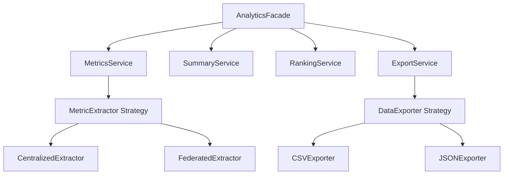

# Analytics Submodule

## Purpose
The Analytics submodule provides a unified interface for extracting, aggregating, and exporting experiment metrics and results. It supports both Centralized and Federated learning experiments.

## Problem Solved
Experiment data is stored in various formats and locations (CSV, JSON, database). This submodule abstracts the complexity of data retrieval and processing, providing a clean API for the frontend to display rankings, summaries, and detailed metrics.

## How It Works
The submodule uses a **Facade Pattern** (`AnalyticsFacade`) to orchestrate several specialized services. It employs a **Strategy Pattern** for metric extraction, allowing it to handle different experiment types seamlessly.

## Key Files
- `facade.py` - Unified entry point for all analytics logic.
- `internals/services/metrics_service.py` - Core logic for metric aggregation.
- `internals/extractors/` - Strategies for extracting data from different sources.
- `internals/exporters/` - Logic for generating CSV, JSON, and Text exports.

## Dependencies
- Requires: `pandas` for data manipulation.
- Used by: `api/endpoints/analytics/`

## Architecture

## Integration Points
- **Upstream**: Called by FastAPI endpoints in `src/api/endpoints/analytics/`.
- **Downstream**: Reads from `comparative_data/` and database.
- **State**: Uses `CacheProvider` for performance optimization.
