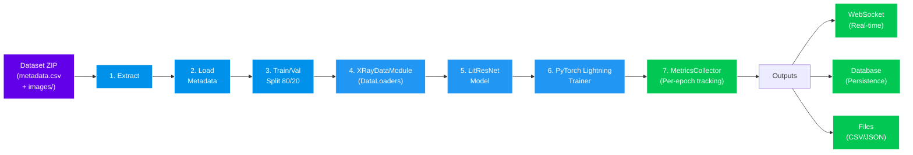

# Centralized Training Module

**Purpose**: Orchestrates centralized training pipeline for pneumonia detection model. Single-node training using PyTorch Lightning with real-time metrics collection and multi-channel output (WebSocket, database, files).

**Entry Point**: [centralized_trainer.py](centralized_trainer.py)

---

## Centralized Training Pipeline Overview



---

## Table of Contents

- [Centralized Training Overview](#centralized-training-pipeline-overview)
- [Training Pipeline](#training-pipeline)
- [Key Components](#key-components)
- [Outputs & Results](#outputs--results)
- [Configuration](#configuration)
- [Usage Example](#usage-example)
- [Sub-component Links](#sub-component-links)

---

## Training Pipeline

### Step-by-Step Execution

#### Phase 1: Data Handling
1. **Dataset Input**: ZIP file or directory containing metadata.csv and images/
2. **Extraction**: DataSourceExtractor validates structure, extracts if needed
3. **Metadata Loading**: CSV parsed to identify images and labels
4. **Train/Val Split**: Stratified 80/20 split from metadata
5. **DataModule Creation**: XRayDataModule wraps datasets in PyTorch DataLoaders

#### Phase 2: Model Setup
6. **Model Initialization**: LitResNet wraps ResNet50 backbone + custom classification head
7. **Metrics Registration**: Accuracy, Precision, Recall, F1, AUROC initialized
8. **Optimizer & Scheduler**: AdamW optimizer with ReduceLROnPlateau scheduler

#### Phase 3: Training Configuration
9. **Callbacks Setup**: ModelCheckpoint, EarlyStopping, MetricsCollector, LRMonitor
10. **Trainer Instantiation**: PyTorch Lightning Trainer with logging configuration
11. **Training Loop**: Epochs of forward pass → loss → backward → optimization

#### Phase 4: Metrics & Output
12. **Per-Epoch Collection**: MetricsCollector aggregates metrics after each epoch
13. **Real-time Streaming**: WebSocket sends metrics to frontend dashboard
14. **Checkpoint Management**: Best model saved based on validation recall
15. **Early Stopping**: Halts training if no improvement for N epochs

#### Phase 5: Results Aggregation
16. **Results Collection**: Extract training history, best model path, statistics
17. **Database Persistence**: Insert run metadata and per-epoch metrics
18. **File Export**: Save metrics as CSV and JSON for offline analysis
19. **Return Summary**: Complete results object with performance scores

---

## Key Components

### CentralizedTrainer
**File**: [centralized_trainer.py](centralized_trainer.py)

Main orchestrator class. Coordinates all phases from data extraction through results collection.

**Key Methods**:
- `__init__(config, run_name)` - Initialize with configuration and run identifier
- `prepare_data(dataset_path)` - Extract and validate dataset, return paths
- `train(dataset_path)` - Execute complete training pipeline
- `_build_model_and_callbacks()` - Create model, metrics collector, callbacks
- `_collect_training_results()` - Gather results after training completes

**Configuration Parameters**:
- `system.batch_size` - Training batch size (default: 32)
- `experiment.epochs` - Maximum training epochs (default: 50)
- `experiment.learning_rate` - Optimizer learning rate (default: 0.001)
- `experiment.early_stopping_patience` - Epochs without improvement before stop (default: 7)
- `output.checkpoint_dir` - Directory to save model checkpoints

### LitResNet
**File**: [utils/model/lit_resnet.py](utils/model/lit_resnet.py)

PyTorch Lightning module wrapper. Encapsulates ResNet50 backbone with custom classification head.

**Responsibilities**:
- Forward pass through model
- Loss computation (CrossEntropyLoss)
- Training step (backward pass, optimizer updates)
- Validation step (metrics computation)
- Metric initialization and tracking

**Metrics Computed**:
- Accuracy, Precision, Recall, F1-Score per class
- Area Under ROC Curve (AUROC) for binary classification

### XRayDataModule
**File**: [utils/model/xray_data_module.py](utils/model/xray_data_module.py)

PyTorch Lightning DataModule. Manages data loading, splitting, and batching.

**Responsibilities**:
- Train/validation dataset creation
- DataLoader instantiation with optimal settings
- Memory optimization (pin_memory, prefetch_factor)
- Image preprocessing and augmentation
- Batch collation

**Configuration**:
- `num_workers`: Parallel data loading processes
- `batch_size`: Samples per batch
- `pin_memory`: GPU transfer optimization
- `prefetch_factor`: Num batches to prefetch

### MetricsCollector
**File**: [utils/model/metrics_collector.py](utils/model/metrics_collector.py)

PyTorch Lightning callback for real-time metrics aggregation and transmission.

**Responsibilities**:
- Aggregate metrics after each epoch
- Maintain running history of all metrics
- Trigger WebSocket transmission
- Persist metrics to database
- Format metrics for export

**Output Channels**:
- WebSocket: Real-time dashboard updates
- Database: Persistent run_metrics table entries
- Files: CSV and JSON export post-training

### TrainingCallbacks
**File**: [utils/model/training_callbacks.py](utils/model/training_callbacks.py)

Additional PyTorch Lightning callbacks for monitoring and control.

**Callback Types**:
- `ModelCheckpoint`: Saves best model by validation recall metric
- `EarlyStopping`: Halts training if validation metric plateaus
- `LearningRateMonitor`: Logs learning rate changes per epoch
- `EarlyStoppingSignal`: Notifies frontend of early stopping event

---

## Outputs & Results

### Database Persistence

**run table** (main training record):
- run_id, run_description, training_mode='centralized'
- status, timestamps (created_at, started_at, completed_at)
- total_epochs_run, training_time, early_stopped flag

**run_metrics table** (per-epoch metrics):
- Epoch number, loss values (train_loss, val_loss)
- Classification metrics: train_accuracy, val_accuracy, val_precision, val_recall
- Advanced metrics: val_f1, val_auroc
- Note: client_id and round_id are NULL for centralized runs

### File Exports

**Directory**: `output/results/`
- `metrics_{run_id}.json` - Complete metrics with metadata
- `metrics_{run_id}.csv` - Metrics in tabular format
- `checkpoints/best_model.pt` - Best model weights

**Directory**: `output/logs/`
- Training logs with timestamps
- Console output capture
- Error stack traces

### WebSocket Streaming

**Real-time Transmission**: Metrics sent to connected frontends after each epoch
- Event: `training_metrics_update`
- Payload: Current epoch, all metrics, loss values
- Frequency: Once per epoch

**Completion Signal**: After training ends or early stops
- Event: `training_complete` or `training_stopped`
- Payload: Final statistics, best model path, summary

---

## Configuration

### YAML Parameters

**File**: [../config/default_config.yaml](../config/default_config.yaml)

```yaml
system:
  batch_size: 32                    # Training batch size
  num_workers: 0                    # Parallel data loading
  validation_split: 0.2             # Train/val ratio
  seed: 42                          # Reproducibility

experiment:
  learning_rate: 0.001              # Optimizer LR
  epochs: 50                        # Max training epochs
  weight_decay: 0.0001              # L2 regularization
  dropout_rate: 0.3                 # Dropout in head
  early_stopping_patience: 7        # Epochs without improvement
  reduce_lr_patience: 3             # LR scheduler patience

output:
  checkpoint_dir: models/checkpoints # Model save location
  log_dir: logs                      # Training logs
  results_dir: results               # Metrics export
```

### Configuration Override

Overrides passed via API request or programmatic call:

```python
config_overrides = {
    "experiment.epochs": 100,
    "experiment.learning_rate": 0.0005,
    "system.batch_size": 16
}
```

---

## Usage Example

### Programmatic Training

```python
from centralized_trainer import CentralizedTrainer
from config import ConfigManager

# Load base configuration
config = ConfigManager.load("config/default_config.yaml")

# Initialize trainer
trainer = CentralizedTrainer(
    config=config,
    run_name="exp_001_baseline"
)

# Prepare dataset (validate structure, extract if ZIP)
dataset_metadata = trainer.prepare_data(
    dataset_path="data/pneumonia_dataset.zip"
)

# Execute training pipeline
results = trainer.train(dataset_path="data/pneumonia_dataset.zip")

# Access results
print(f"Best accuracy: {results['best_accuracy']:.3f}")
print(f"Best F1: {results['best_f1']:.3f}")
print(f"Epochs completed: {results['total_epochs_run']}")
print(f"Model saved at: {results['best_model_path']}")
```

### Via FastAPI Endpoint

```json
POST /experiments/centralized

{
  "run_name": "exp_001_baseline",
  "dataset_path": "/data/pneumonia_dataset.zip",
  "config_overrides": {
    "experiment.epochs": 100,
    "experiment.learning_rate": 0.0005
  }
}
```

**Response**:
```json
{
  "run_id": 42,
  "training_mode": "centralized",
  "status": "in_progress",
  "message": "Training started",
  "estimated_duration": 3600
}
```

**Upon Completion** (WebSocket event):
```json
{
  "event": "training_complete",
  "run_id": 42,
  "metrics": {
    "best_accuracy": 0.891,
    "best_precision": 0.856,
    "best_recall": 0.923,
    "best_f1": 0.889,
    "best_auroc": 0.945
  },
  "total_epochs_run": 12,
  "training_time": 3847.5,
  "early_stopped": true,
  "best_model_path": "models/checkpoints/best_model.pt"
}
```

---

## Sub-component Links

### Data Utilities
- **Data Processing & Loading**: [utils/data/README.md](utils/data/README.md)
- ZIP extraction, metadata parsing, validation

### Model Utilities
- **Model Architecture & Components**: [utils/model/](utils/model/)
- LitResNet, XRayDataModule, MetricsCollector, TrainingCallbacks

### System Architecture
- **Control Module Overview**: [../README.md](../README.md)
- **Project Architecture**: [../../../../README.md](../../../../README.md)
- **Federated Learning Integration**: [../../federated_new_version/README.md](../../federated_new_version/README.md)
- **API Integration**: [../../api/README.md](../../api/README.md)
