# Centralized Training Module

**Purpose**: Orchestrates centralized training pipeline from data extraction through model training, metrics collection, and results storage.

The `CentralizedTrainer` class serves as the main entry point for single-node training of the pneumonia detection model on full datasets.

## Table of Contents
- [Overview](#overview)
- [Training Pipeline](#training-pipeline)
- [API Integration](#api-integration)
- [Results Output](#results-output)
- [Related Components](#related-components)

---

## Overview

The centralized training module is responsible for:
1. Extracting and validating training datasets (ZIP or directory)
2. Preparing data through train/validation splitting
3. Building PyTorch Lightning model with callbacks
4. Executing training with automatic logging
5. Collecting and persisting results

**Entry Point**: [centralized_trainer.py](centralized_trainer.py)

---

## Training Pipeline

### CentralizedTrainer Workflow

**File**: [centralized_trainer.py](centralized_trainer.py)

**Main Class**: `CentralizedTrainer`

**Key Methods**:

| Method | Purpose | Reference |
|--------|---------|-----------|
| `__init__()` | Initialize trainer with configuration | lines 40-70 |
| `prepare_data()` | Extract and validate dataset | lines 80-125 |
| `train()` | Execute complete training pipeline | lines 135-200 |
| `_build_model_and_callbacks()` | Create model, metrics collector, callbacks | lines 185-220 |
| `_collect_training_results()` | Gather results after training completes | lines 225-280 |

**Configuration Parameters**:
- `system.batch_size`: Training batch size
- `experiment.epochs`: Total training epochs
- `experiment.learning_rate`: Optimizer learning rate
- `experiment.early_stopping_patience`: Early stopping threshold
- `output.checkpoint_dir`: Model checkpoint directory

### Step-by-Step Execution

#### Architecture Flow Diagram

```mermaid
graph TD
    Start([User: train request]) --> Init["1️⃣ INITIALIZATION<br/>CentralizedTrainer<br/>Load Config<br/>Setup Directories"]

    Init --> Extract["2️⃣ DATA EXTRACTION<br/>DataSourceExtractor<br/>Validate ZIP/Directory<br/>Find CSV + Images"]

    Extract --> Prepare["3️⃣ DATA PREPARATION<br/>Load Metadata CSV<br/>Train/Val Split 80/20<br/>Stratified Sampling"]

    Prepare --> DataModule["4️⃣ DATA MODULE<br/>XRayDataModule<br/>Create Data Loaders<br/>Pin Memory, Prefetch"]

    DataModule --> ModelSetup["5️⃣ MODEL SETUP<br/>LitResNet<br/>ResNet50 Backbone<br/>Custom Head"]

    ModelSetup --> Callbacks["6️⃣ CALLBACKS CONFIG<br/>ModelCheckpoint<br/>EarlyStopping<br/>MetricsCollector<br/>LRMonitor"]

    Callbacks --> TrainStart["7️⃣ TRAINING EXECUTION<br/>PyTorch Lightning Trainer<br/>trainer.fit()"]

    TrainStart --> EpochLoop["FOR EACH EPOCH:<br/>Forward Pass<br/>Compute Loss<br/>Backward Pass<br/>Optimizer Step"]

    EpochLoop --> Validation["VALIDATION LOOP<br/>Evaluate on Val Set<br/>Compute Metrics<br/>Check Early Stopping"]

    Validation --> MetricsFlow["📤 METRICS PIPELINE"]

    MetricsFlow --> WebSocket["WebSocketSender<br/>Send to Frontend<br/>Real-time Dashboard"]

    MetricsFlow --> FilePersist["MetricsFilePersister<br/>Save CSV<br/>Save JSON Metadata"]

    Validation --> CheckStop{Early Stopping<br/>Triggered?}

    CheckStop -->|No| EpochLoop
    CheckStop -->|Yes| Collect["8️⃣ RESULTS COLLECTION<br/>Extract Training History<br/>Get Best Model Path<br/>Aggregate Statistics"]

    Collect --> Return["✅ RETURN RESULTS<br/>Best Model Path<br/>Metrics History<br/>Performance Scores"]

    Return --> End([Training Complete])

    %% Styling
    classDef start fill:#6200EA,stroke:#fff,stroke-width:2px,color:#fff;
    classDef data fill:#0091EA,stroke:#fff,stroke-width:2px,color:#fff;
    classDef model fill:#2962FF,stroke:#fff,stroke-width:2px,color:#fff;
    classDef metrics fill:#00C853,stroke:#fff,stroke-width:2px,color:#fff;
    classDef stop fill:#D50000,stroke:#fff,stroke-width:2px,color:#fff;

    class Start,Init,Extract,Collect,Return,End start;
    class Prepare,DataModule data;
    class ModelSetup,Callbacks,TrainStart,EpochLoop,Validation model;
    class MetricsFlow,WebSocket,FilePersist metrics;
    class CheckStop stop;
```



#### Detailed Step Breakdown

```
1. INITIALIZATION
   ├─ CentralizedTrainer(config, run_name)
   ├─ Load configuration
   └─ Setup directories (checkpoints, logs, results)

2. DATA EXTRACTION (prepare_data)
   ├─ DataSourceExtractor.extract_and_validate()
   │  ├─ Extract ZIP file (if provided)
   │  ├─ Validate metadata.csv exists
   │  ├─ Validate images/ directory exists
   │  └─ Return: paths to metadata and images
   └─ Load metadata using data_processing.load_metadata()

3. DATA PREPARATION
   ├─ Load metadata CSV → DataFrame
   ├─ Train/val split (80/20 stratified)
   ├─ Create CustomImageDataset for train/val/test
   └─ Wrap in XRayDataModule

4. MODEL SETUP
   ├─ Build ResNetWithCustomHead
   ├─ Wrap in LitResNet (PyTorch Lightning)
   ├─ Initialize metrics (Accuracy, Precision, Recall, F1, AUROC)
   └─ Create optimizer (AdamW) and scheduler (ReduceLROnPlateau)

5. CALLBACKS CONFIGURATION
   ├─ ModelCheckpoint: Save best by validation_recall
   ├─ EarlyStopping: Stop if no improvement (patience=7)
   ├─ LearningRateMonitor: Track LR changes
   ├─ MetricsCollector: Track all metrics per epoch
   └─ EarlyStoppingSignal: Notify frontend

6. TRAINING EXECUTION
   ├─ Trainer.fit(model, datamodule)
   ├─ For each epoch:
   │   ├─ Training loop: forward → loss → backward → update
   │   ├─ Validation loop: forward → metrics
   │   ├─ Callback triggers: on_epoch_end → MetricsCollector
   │   ├─ WebSocket stream: metrics to frontend
   │   └─ Early stopping check
   └─ Continue until early stopping or max_epochs

7. RESULTS COLLECTION
   ├─ Extract training history from callbacks
   ├─ Get best model checkpoint path
   ├─ Save final results to JSON/CSV
   └─ Persist to database

8. RESULTS RETURN
   └─ Training complete with summary statistics
```

---

## API Integration

### FastAPI Endpoints

**File**: [api/endpoints/experiments/centralized_endpoints.py](../../api/endpoints/experiments/centralized_endpoints.py)

**POST /experiments/centralized**

**Request Body**:
```json
{
  "run_name": "exp_01",
  "dataset_path": "/path/to/data.zip",
  "config_overrides": {
    "experiment.epochs": 15,
    "experiment.learning_rate": 0.0005
  }
}
```

**Workflow**:
1. API receives training request
2. Dispatches to background task via [centralized_tasks.py](../../api/endpoints/experiments/utils/centralized_tasks.py)
3. Initializes CentralizedTrainer
4. Calls trainer.train()
5. Persists results to database
6. Sends WebSocket completion signal

**Related Files**:
- Request validation: [schemas.py](../../api/endpoints/experiments/schemas.py)
- Task handling: [centralized_tasks.py](../../api/endpoints/experiments/utils/centralized_tasks.py)
- Status tracking: [status_endpoints.py](../../api/endpoints/experiments/status_endpoints.py)

---

## Results Output

### Database Persistence

**Tables Updated**:
1. **run** table
   - run_description, training_mode='centralized', status, timestamps

2. **run_metrics** table
   - Per-epoch: train_loss, train_accuracy, train_f1, val_loss, val_accuracy, val_precision, val_recall, val_f1, val_auroc
   - Note: client_id and round_id are NULL for centralized

3. **No ServerEvaluation entries** (centralized only uses RunMetric)

### File Exports

**Locations** (relative to output directory):
- `models/checkpoints/`: Best model checkpoint
- `results/metrics_{run_id}.json`: Complete metrics JSON
- `results/metrics_{run_id}.csv`: Metrics in CSV format
- `logs/`: Training logs with timestamps

### API Response

**GET /runs/{run_id}** returns:
```json
{
  "run_id": 42,
  "training_mode": "centralized",
  "status": "completed",
  "metrics": {
    "best_accuracy": 0.891,
    "best_precision": 0.856,
    "best_recall": 0.923,
    "best_f1": 0.889,
    "best_auroc": 0.945
  },
  "confusion_matrix": {
    "true_positives": 245,
    "true_negatives": 189,
    "false_positives": 23,
    "false_negatives": 17
  },
  "training_time": 3847.5,
  "total_epochs_run": 12,
  "early_stopped": true
}
```

---

## Directory Structure & Component Architecture

#### Directory Layout

```
dl_model/
├── centralized_trainer.py          # Main orchestrator
├── utils/                          # Training utilities
│   ├── model/
│   │   ├── lit_resnet.py           # Lightning model
│   │   ├── xray_data_module.py     # DataModule
│   │   ├── metrics_collector.py    # Metrics callback
│   │   └── training_callbacks.py   # Additional callbacks
│   └── data/
│       ├── data_source_handler.py  # ZIP extraction
│       ├── metrics_file_persister.py # File export
│       └── websocket_metrics_sender.py # Real-time streaming
└── README.md                        # This file
```

#### Component Interaction Diagram


---

## Configuration Example

```yaml
# config/default_config.yaml

system:
  batch_size: 32
  num_workers: 0
  validation_split: 0.2
  seed: 42

experiment:
  learning_rate: 0.001
  epochs: 10
  weight_decay: 0.0001
  dropout_rate: 0.3
  early_stopping_patience: 7
  reduce_lr_patience: 3

output:
  checkpoint_dir: models/checkpoints
  log_dir: logs
  results_dir: results
```

---

## Error Handling

**Common Failure Points**:

| Issue | Handling | Reference |
|-------|----------|-----------|
| Invalid ZIP file | DataSourceExtractor raises FileNotFoundError | data/data_source_handler.py |
| Missing metadata.csv | Raises ValueError with details | utils/data_processing.py |
| Image files not found | Dataset validation logs warnings | entities/custom_image_dataset.py |
| Out of memory | PyTorch Lightning handles gracefully | trainer configuration |
| Early stopping | Normal completion with message | training_callbacks.py |

**Logging**:
- Structured logs via logger.py
- Training progress in console and files
- Metrics logged at each epoch
- Errors with full context

---

## Performance Considerations

### Memory Optimization
- `pin_memory=true`: Faster GPU transfer
- `persistent_workers=false`: Lower memory footprint
- `prefetch_factor=2`: Balanced prefetching
- Image size: 256x256 (configurable)

### Training Speed
- Mixed precision training available via Trainer configuration
- Distributed data parallel support (single-node fallback)
- Model checkpointing only for best metrics
- Early stopping prevents unnecessary epochs

### Metrics Tracking
- In-memory per-epoch aggregation
- Database batch inserts
- WebSocket async transmission
- File export post-training

---

## Integration with Federated Learning

**Client-Side Reuse**:
The same components are used by federated learning clients:
- [client_app.py](../../federated_new_version/core/client_app.py) uses identical trainer setup (lines 113-126)
- MetricsCollector injection of federated context
- Same LitResNet and XRayDataModule implementations

**Key Difference**:
- Federated clients train on partitions (not full dataset)
- Federated clients report metrics per round (not per epoch)
- Server aggregates client metrics via FedAvg

---

## Related Documentation

- **Training Utilities**: See [dl_model/utils/README.md](utils/README.md)
- **Model Architecture**: See [entities/README.md](../../entities/README.md)
- **Data Processing**: See [utils/README.md](../../utils/README.md)
- **Federated Learning**: See [federated_new_version/README.md](../../federated_new_version/README.md)
- **API Integration**: See [api/README.md](../../api/README.md)
- **System Architecture**: See [README.md](../../../README.md)
