# Data Utils: Federated Pneumonia Detection Pipeline

**Purpose**: Core data pipeline for training federated and centralized pneumonia detection models, including dataset handling, metrics collection, and real-time metrics streaming.

---

## Data Pipeline Architecture

```mermaid
graph TD
    A["🗂️ Raw Dataset<br/>ZIP File"] -->|Extract| B["📁 Extracted Files<br/>Images + Metadata"]
    B -->|Load| C["📊 Metadata CSV<br/>Train/Val/Test Splits"]

    C -->|Validate & Filter| D["✅ Validated Dataset<br/>Clean Samples"]
    D -->|Split| E["📌 Train/Val Dataset<br/>PyTorch Dataset"]

    E -->|DataLoader| F["🔄 Batch Generator<br/>Mini-batches"]
    F -->|Feed| G["🧠 Model Training<br/>Loss Backprop"]

    G -->|Metrics per Epoch| H["📈 MetricsCollector<br/>Accumulate Metrics"]

    H -->|Stream| I["🌐 WebSocketMetricsSender<br/>Real-time WebSocket"]
    I -->|JSON Payload| J["📱 Frontend Dashboard<br/>Live Charts"]

    H -->|Persist| K["💾 MetricsFilePersister<br/>Save to Disk"]
    K -->|metrics.json| L["📁 Metrics Archive<br/>Historical Data"]

    style A fill:#fff3cd
    style B fill:#fff3cd
    style C fill:#d1ecf1
    style D fill:#d1ecf1
    style E fill:#d1ecf1
    style F fill:#d4edda
    style G fill:#f8d7da
    style H fill:#e2e3e5
    style I fill:#e2e3e5
    style J fill:#d1ecf1
    style K fill:#e2e3e5
    style L fill:#e2e3e5
```



---

## Table of Contents

1. [Data Utils Overview](#data-utils-overview)
2. [Pipeline Stages](#pipeline-stages)
3. [Key Components](#key-components)
4. [Real-time Metrics Streaming](#real-time-metrics-streaming)
5. [Configuration](#configuration)
6. [Error Handling](#error-handling)
7. [Integration with PyTorch Lightning](#integration-with-pytorch-lightning)
8. [Links](#links)

---

## Data Utils Overview

The Data Utils module provides a complete data pipeline for training federated and centralized pneumonia detection models:

- **Dataset Handling**: Extract, load, validate, and preprocess medical imaging datasets
- **Metrics Collection**: Capture training metrics in real-time
- **Metrics Streaming**: Send metrics via WebSocket for live frontend monitoring
- **Metrics Persistence**: Save metrics to disk for historical analysis

All components adhere to SOLID principles with clean separation of concerns.

---

## Pipeline Stages

### Stage 1: DataSourceHandler (Extract & Load)

**File**: [components/data_source_handler.py](components/data_source_handler.py)

**Purpose**: Extract ZIP files, validate structure, and load metadata

**Key Responsibilities**:

- Extract dataset ZIP archives
- Load metadata from CSV files
- Validate data file existence
- Handle corrupted or missing files
- Return clean dataset configuration

**Validation Checks**:

- ZIP file integrity
- CSV metadata completeness
- Image file references
- Train/Val/Test split consistency

---

### Stage 2: Metadata Processing & Validation

**Purpose**: Ensure data quality and consistency

**Validations Performed**:

- Missing values in metadata columns
- Invalid file paths
- Corrupted image files
- Mismatched labels across datasets
- Data leakage between splits

**Filters Applied**:

- Remove samples with corrupted images
- Remove samples with incomplete metadata
- Remove outlier samples (if configured)

---

### Stage 3: Train/Validation Splitting

**Purpose**: Create reproducible train/validation/test splits

**Splitting Strategies**:

- **Stratified Split**: Maintain class distribution across splits
- **Random Split**: Shuffle and split by ratio
- **Custom Split**: Use predefined split assignments from metadata

**Configuration Parameters**:

- `train_ratio`: Percentage for training (default: 0.7)
- `val_ratio`: Percentage for validation (default: 0.15)
- `test_ratio`: Percentage for testing (default: 0.15)
- `random_seed`: For reproducibility

---

### Stage 4: Data Loading Configuration

**Purpose**: Configure PyTorch DataLoader for batching and preprocessing

**DataLoader Features**:

- Configurable batch size
- Shuffle enabled for training
- Multi-worker data loading
- Persistent workers for efficiency
- Image augmentation (if configured)

**Key Parameters**:

- `batch_size`: Batch size per iteration
- `num_workers`: Parallel data loading threads
- `pin_memory`: GPU memory optimization
- `drop_last`: Drop incomplete batches

---

## Key Components

### 1. DataSourceHandler

**File**: [components/data_source_handler.py](components/data_source_handler.py)

**Purpose**: Extract and load datasets with validation

**Class**: `DataSourceHandler`

**Constructor**:

```python
handler = DataSourceHandler(
    dataset_zip_path="/path/to/dataset.zip",
    extract_dir="/path/to/extracted",
    config=data_config
)
```

**Core Methods**:

- `extract_dataset()`: Extract ZIP archive
- `load_metadata()`: Load CSV metadata
- `validate_dataset()`: Verify data integrity
- `get_dataset_info()`: Return dataset configuration

**Error Handling**:

- Raises `DatasetExtractionError` for ZIP failures
- Raises `DatasetValidationError` for missing files
- Raises `MetadataError` for CSV parsing issues

---

### 2. MetricsCollector

**File**: [components/metrics_collector.py](components/metrics_collector.py)

**Purpose**: Accumulate and aggregate training metrics during training loops

**Class**: `MetricsCollector`

**Constructor**:

```python
collector = MetricsCollector(
    track_fields=['loss', 'accuracy', 'precision', 'recall', 'f1', 'auroc']
)
```

**Core Methods**:

- `record_batch(metrics_dict)`: Record metrics for a batch
- `record_epoch(epoch_num, phase, metrics_dict)`: Record epoch-level metrics
- `get_epoch_metrics()`: Retrieve aggregated metrics for epoch
- `reset()`: Clear accumulated metrics

**Aggregation Strategy**:

- Batch metrics: Average across all batches in epoch
- Phase metrics: Separate train/val/test aggregation
- Epoch summary: Mean, min, max, std for each metric

---

### 3. WebSocketMetricsSender

**File**: [websocket_metrics_sender.py](websocket_metrics_sender.py)

**Purpose**: Stream collected metrics to frontend via WebSocket in real-time

**Class**: `WebSocketMetricsSender`

**Constructor**:

```python
sender = WebSocketMetricsSender(
    websocket_uri="ws://localhost:8765"
)
```

**Core Methods**:

- `send_metrics(metrics_dict, message_type)`: Send arbitrary metrics
- `send_training_mode(is_federated, num_rounds, num_clients)`: Signal training start
- `send_epoch_end(epoch, phase, metrics)`: Send epoch completion
- `send_round_end(round_num, total_rounds, fit_metrics, eval_metrics)`: Send FL round metrics
- `send_training_end(run_id, summary_data)`: Signal training completion
- `send_error(error_message, error_type)`: Report training errors
- `send_early_stopping_triggered(epoch, best_metric, metric_name, patience)`: Signal early stop

**Message Delivery**:

- Non-blocking: Uses asyncio for async sends
- Graceful failure: Errors logged, training continues
- JSON format: All messages are JSON-serializable

---

### 4. MetricsFilePersister

**File**: [components/metrics_file_persister.py](components/metrics_file_persister.py)

**Purpose**: Save training metrics to disk for historical analysis

**Class**: `MetricsFilePersister`

**Constructor**:

```python
persister = MetricsFilePersister(
    output_dir="/path/to/metrics",
    run_id=42
)
```

**Core Methods**:

- `save_epoch_metrics(epoch, phase, metrics)`: Save metrics for epoch
- `save_run_summary(summary_dict)`: Save complete run summary
- `load_run_metrics(run_id)`: Load historical metrics for run

**File Structure**:

```
output_dir/
├── run_42/
│   ├── metrics.json       # Complete metrics per epoch
│   ├── run_summary.json   # Run statistics and metadata
│   └── log.txt            # Event log
```

**Data Format**:

```json
{
  "run_id": 42,
  "training_mode": "centralized",
  "epochs": [
    {
      "epoch": 1,
      "phase": "train",
      "loss": 0.523,
      "accuracy": 0.845,
      "timestamp": "2024-01-15T10:30:45Z"
    }
  ]
}
```

---

## Real-time Metrics Streaming

### Streaming Architecture

The system captures metrics at training time and streams them to the frontend for live monitoring:

1. **MetricsCollector** accumulates metrics during each training loop
2. **MetricsCollector** reports aggregated metrics per epoch
3. **WebSocketMetricsSender** formats and sends metrics via WebSocket
4. **Frontend** receives messages and updates charts in real-time

### Message Types

#### training_mode

**Sent**: At training start

```json
{
  "type": "training_mode",
  "timestamp": "2024-01-15T10:30:00Z",
  "data": {
    "is_federated": false,
    "num_rounds": 0,
    "num_clients": 0
  }
}
```

#### epoch_end

**Sent**: After each epoch in centralized training

```json
{
  "type": "epoch_end",
  "timestamp": "2024-01-15T10:30:30Z",
  "data": {
    "epoch": 1,
    "phase": "train",
    "metrics": {
      "loss": 0.523,
      "accuracy": 0.845,
      "precision": 0.812,
      "recall": 0.923,
      "f1": 0.865,
      "auroc": 0.931
    }
  }
}
```

#### round_metrics

**Sent**: After each FL round

```json
{
  "type": "round_metrics",
  "timestamp": "2024-01-15T10:31:00Z",
  "data": {
    "round": 1,
    "total_rounds": 15,
    "metrics": {
      "loss": 0.267,
      "accuracy": 0.878,
      "precision": 0.852,
      "recall": 0.931,
      "f1": 0.889,
      "auroc": 0.945
    }
  }
}
```

#### training_end

**Sent**: When training completes

```json
{
  "type": "training_end",
  "timestamp": "2024-01-15T10:35:00Z",
  "data": {
    "run_id": 42,
    "status": "completed",
    "best_epoch": 10,
    "final_metrics": {
      "accuracy": 0.891,
      "f1": 0.889
    }
  }
}
```

#### error

**Sent**: When training encounters an error

```json
{
  "type": "error",
  "timestamp": "2024-01-15T10:32:00Z",
  "data": {
    "error": "CUDA out of memory",
    "error_type": "training_error"
  }
}
```

---

## Configuration

Data-related configuration is specified in `config/default_config.yaml`:

**Dataset Configuration**:

```yaml
dataset:
  zip_path: "path/to/dataset.zip"
  extract_dir: "path/to/extracted"
  metadata_file: "train_val_test_metadata.csv"
  validation_enabled: true
```

**Data Loading Configuration**:

```yaml
data_loading:
  batch_size: 32
  num_workers: 4
  pin_memory: true
  drop_last: false
  shuffle_train: true
```

**Splitting Configuration**:

```yaml
splitting:
  train_ratio: 0.7
  val_ratio: 0.15
  test_ratio: 0.15
  random_seed: 42
  stratified: true
```

**Metrics Configuration**:

```yaml
metrics:
  track_fields: [loss, accuracy, precision, recall, f1, auroc]
  websocket_uri: "ws://localhost:8765"
  enable_file_persistence: true
  metrics_output_dir: "path/to/metrics"
```

---

## Error Handling

### Invalid File Handling

**Error Types**:

- Corrupted ZIP files: Raises `DatasetExtractionError`
- Missing metadata CSV: Raises `MetadataError`
- Invalid file paths in metadata: Raises `DataValidationError`

**Recovery Strategy**:

- Skip corrupted samples
- Validate before processing
- Log all errors with context
- Raise specific exceptions with actionable messages

**Example**:

```python
try:
    handler = DataSourceHandler(zip_path, extract_dir, config)
    handler.extract_dataset()
    handler.validate_dataset()
except DatasetExtractionError as e:
    logger.error(f"Failed to extract dataset: {e}")
    # Handle or re-raise
except DatasetValidationError as e:
    logger.error(f"Dataset validation failed: {e}")
    # Handle or re-raise
```

### Corrupted Data Detection

**Validation Checks**:

- Image file size > 0 bytes
- Metadata columns non-null
- Image format matches expected type
- Pixel values within valid range
- No duplicate samples

**Handling Strategy**:

- Remove corrupted samples from dataset
- Log sample IDs that were removed
- Report summary statistics
- Continue training with clean data

### WebSocket Failures

**Graceful Degradation**:

- WebSocket errors do NOT block training
- All metrics logged locally regardless
- Reconnection attempted automatically
- User notified via error messages

**Error Handling Code**:

```python
try:
    sender.send_epoch_end(epoch, phase, metrics)
except Exception as e:
    logger.warning(f"Failed to send metrics via WebSocket: {e}")
    # Training continues
```

---

## Integration with PyTorch Lightning

### Training Loop Integration

**Callback Pattern**:

```python
class MetricsStreamingCallback(Callback):
    def __init__(self, sender: WebSocketMetricsSender):
        self.sender = sender
        self.collector = MetricsCollector()

    def on_train_epoch_end(self, trainer, pl_module):
        metrics = trainer.callback_metrics
        self.collector.record_epoch(
            trainer.current_epoch, 'train', metrics
        )
        self.sender.send_epoch_end(
            trainer.current_epoch, 'train', metrics
        )

    def on_validation_epoch_end(self, trainer, pl_module):
        metrics = trainer.callback_metrics
        self.sender.send_epoch_end(
            trainer.current_epoch, 'val', metrics
        )
```

### DataLoader Integration

```python
from torch.utils.data import DataLoader

# Load and validate dataset
handler = DataSourceHandler(
    dataset_zip_path=config.dataset.zip_path,
    extract_dir=config.dataset.extract_dir,
    config=config
)
handler.extract_dataset()
handler.validate_dataset()

# Create PyTorch Dataset
train_dataset = PneumoniaDataset(
    dataset_path=handler.extract_dir,
    split='train',
    transform=get_transforms()
)

# Create DataLoader
train_loader = DataLoader(
    train_dataset,
    batch_size=config.data_loading.batch_size,
    num_workers=config.data_loading.num_workers,
    pin_memory=config.data_loading.pin_memory,
    shuffle=config.data_loading.shuffle_train
)

# Pass to PyTorch Lightning Trainer
trainer = Trainer(...)
trainer.fit(model, train_dataloaders=train_loader)
```

---

## Links

**Parent Documentation**:

- [Model Utils README](../README.md)
- [DL Model README](../../README.md)
- [Boundary Layer README](../../../boundary/README.md)

**Related Components**:

- [WebSocket Metrics Sender](websocket_metrics_sender.py)
- [Data Source Handler](components/data_source_handler.py)
- [Metrics Collector](components/metrics_collector.py)
- [Metrics File Persister](components/metrics_file_persister.py)

**Training Integration**:

- [Centralized Trainer](../model/lit_resnet.py)
- [Federated Learning Strategy](../../federated_new_version/core/custom_strategy.py)

**Frontend Integration**:

- [WebSocket Server](../../../../scripts/websocket_server.py)
- [Frontend WebSocket Service](../../../../../../xray-vision-ai-forge/src/services/websocket.ts)
