# WebSocket Metrics Streaming Architecture

**Purpose**: Real-time streaming of training metrics from backend to frontend via WebSocket, enabling live monitoring of training progress.

---

## Table of Contents

1. [Overview](#overview)
2. [Architecture](#architecture)
3. [Component Details](#component-details)
4. [Message Format](#message-format)
5. [Usage Examples](#usage-examples)
6. [Integration Points](#integration-points)
7. [Error Handling](#error-handling)

---

## Overview

The system uses two complementary components for WebSocket communication:

| Component | Purpose | Location |
|-----------|---------|----------|
| **WebSocket Server** | Central relay/broadcaster | [scripts/websocket_server.py](../../../../scripts/websocket_server.py) |
| **Metrics Sender** | Metrics publisher from training | [websocket_metrics_sender.py](websocket_metrics_sender.py) |

This design separates concerns:
- **Server**: Handles connections, message relay, broadcasting
- **Sender**: Prepares metrics, sends to WebSocket server

---

## Architecture

```mermaid
graph LR
    subgraph Backend["🎮 Training Backend"]
        CT["CentralizedTrainer<br/>or Federated"]
        Metrics["Metrics Collected<br/>per epoch/round"]
        WMS["MetricsWebSocketSender<br/>(websocket_metrics_sender.py)"]
    end

    subgraph Network["🌐 Network"]
        WS["WebSocket Server<br/>ws://localhost:8765<br/>(websocket_server.py)"]
    end

    subgraph Frontend["🖥️ Frontend"]
        WSC["WebSocket Client<br/>(React)<br/>services/websocket.ts"]
        Component["TrainingExecution<br/>Component"]
        UI["Charts & Status<br/>Visualization"]
    end

    CT -->|report metrics| Metrics
    Metrics -->|send_metrics| WMS
    WMS -->|JSON payload<br/>asyncio.run| WS
    WS -->|broadcast| WSC
    WSC -->|dispatch action| Component
    Component -->|render| UI

    style Backend fill:#f3e5f5
    style Network fill:#e0e0e0
    style Frontend fill:#e1f5ff
```



---

## Component Details

### 1. WebSocket Server (`scripts/websocket_server.py`)

**Purpose**: Central message relay and broadcaster

**Key Responsibilities**:
- Accept WebSocket connections from frontend clients
- Receive metrics messages from training backend
- Broadcast messages to all connected clients
- Handle connection lifecycle (connect, disconnect)
- Log all activity

**Implementation Details**:

```python
# Handler for each WebSocket connection
async def handler(websocket, path):
    # Add new client
    connected_clients.add(websocket)

    try:
        async for message in websocket:
            # Parse incoming metric message (JSON)
            data = json.loads(message)

            # Broadcast to all connected clients
            for client in connected_clients:
                if client != websocket:
                    await client.send(message)
```

**Usage**:

```bash
# Start WebSocket server in background
python scripts/websocket_server.py

# Server listens on ws://localhost:8765
# Logs: "✓ WebSocket server is running and ready for connections"
```

**Key Features**:
- Async message broadcasting (concurrent `asyncio.gather()`)
- Connection tracking (clients set)
- JSON validation with error logging
- Graceful shutdown on Ctrl+C

---

### 2. Metrics WebSocket Sender (`websocket_metrics_sender.py`)

**Purpose**: Metrics publisher from training backend

**File Location**: [websocket_metrics_sender.py](websocket_metrics_sender.py)

**Key Responsibilities**:
- Collect metrics from training loop
- Format metrics into JSON payloads
- Send to WebSocket server
- Handle async operations from sync contexts
- Log all sends and errors

**Class**: `MetricsWebSocketSender`

**Constructor**:

```python
sender = MetricsWebSocketSender(
    websocket_uri="ws://localhost:8765"  # Default
)
```

**Core Methods**:

| Method | Purpose | Called By |
|--------|---------|-----------|
| `send_metrics(metrics, type)` | Send arbitrary metrics | All other methods |
| `send_training_mode(is_federated, num_rounds, num_clients)` | Signal training mode at start | ServerApp/CentralizedTrainer |
| `send_epoch_end(epoch, phase, metrics)` | Send epoch completion metrics | Training callbacks |
| `send_round_end(round_num, total_rounds, fit_metrics, eval_metrics)` | Send FL round metrics | ServerApp |
| `send_training_end(run_id, summary_data)` | Send completion signal with run_id | Training finish |
| `send_error(error_message, error_type)` | Send error notification | Exception handlers |
| `send_early_stopping_triggered(epoch, best_metric_value, metric_name, patience)` | Send early stopping signal | EarlyStoppingCallback |
| `send_round_metrics(round_num, total_rounds, metrics)` | Send aggregated round metrics | Custom strategy |

---

## Message Format

All messages are JSON with standard structure:

```json
{
    "type": "message_type",
    "timestamp": "2024-01-15T10:30:45.123456",
    "data": {
        // Message-specific fields
    }
}
```

### Message Types

#### 1. training_mode

**Sent**: At training start

**Structure**:
```json
{
    "type": "training_mode",
    "timestamp": "2024-01-15T10:30:00Z",
    "data": {
        "is_federated": true,
        "num_rounds": 15,
        "num_clients": 5
    }
}
```

**Purpose**: Signal to frontend whether training is federated or centralized

---

#### 2. epoch_end (Centralized)

**Sent**: After each epoch in centralized training

**Structure**:
```json
{
    "type": "epoch_end",
    "timestamp": "2024-01-15T10:30:30Z",
    "data": {
        "epoch": 1,
        "phase": "train",
        "metrics": {
            "loss": 0.523,
            "accuracy": 0.845,
            "precision": 0.812,
            "recall": 0.923,
            "f1": 0.865,
            "auroc": 0.931
        }
    }
}
```

---

#### 3. round_metrics (Federated)

**Sent**: After each FL round (aggregated from all clients)

**Structure**:
```json
{
    "type": "round_metrics",
    "timestamp": "2024-01-15T10:31:00Z",
    "data": {
        "round": 1,
        "total_rounds": 15,
        "metrics": {
            "loss": 0.267,
            "accuracy": 0.878,
            "precision": 0.852,
            "recall": 0.931,
            "f1": 0.889,
            "auroc": 0.945
        }
    }
}
```

---

#### 4. training_end

**Sent**: When training completes

**Structure**:
```json
{
    "type": "training_end",
    "timestamp": "2024-01-15T10:35:00Z",
    "data": {
        "run_id": 42,
        "status": "completed",
        "best_epoch": 10,
        "final_metrics": {
            "accuracy": 0.891,
            "f1": 0.889
        }
    }
}
```

**Important**: `run_id` is used by frontend to query `/api/runs/{run_id}/metrics` for final results

---

#### 5. early_stopping

**Sent**: When early stopping is triggered

**Structure**:
```json
{
    "type": "early_stopping",
    "timestamp": "2024-01-15T10:33:00Z",
    "data": {
        "epoch": 7,
        "best_metric_value": 0.923,
        "metric_name": "val_recall",
        "patience": 7,
        "reason": "Early stopping triggered at epoch 7 with best val_recall=0.9230"
    }
}
```

---

#### 6. error

**Sent**: When training encounters an error

**Structure**:
```json
{
    "type": "error",
    "timestamp": "2024-01-15T10:32:00Z",
    "data": {
        "error": "CUDA out of memory",
        "error_type": "training_error"
    }
}
```

---

## Usage Examples

### Centralized Training Integration

```python
from federated_pneumonia_detection.src.control.dl_model.utils.data.websocket_metrics_sender import MetricsWebSocketSender

# Initialize sender
sender = MetricsWebSocketSender()

# Signal start
sender.send_training_mode(is_federated=False, num_rounds=0, num_clients=0)

# After each epoch
for epoch in range(num_epochs):
    # Training...

    # Send epoch metrics
    sender.send_epoch_end(
        epoch=epoch,
        phase="train",
        metrics={
            "loss": train_loss,
            "accuracy": train_acc,
            "precision": precision,
            "recall": recall,
            "f1": f1_score,
            "auroc": auroc
        }
    )

# At completion
sender.send_training_end(
    run_id=42,
    summary_data={
        "status": "completed",
        "best_epoch": best_epoch,
        "final_metrics": final_metrics
    }
)
```

### Federated Learning Integration

```python
# In ServerApp (server_app.py)
from federated_pneumonia_detection.src.control.dl_model.utils.data.websocket_metrics_sender import MetricsWebSocketSender

sender = MetricsWebSocketSender()

# Signal federated mode
sender.send_training_mode(
    is_federated=True,
    num_rounds=num_server_rounds,
    num_clients=num_partitions
)

# In strategy's aggregate_fit or aggregate_evaluate
sender.send_round_metrics(
    round_num=server_round,
    total_rounds=num_server_rounds,
    metrics={
        "loss": aggregated_loss,
        "accuracy": aggregated_accuracy,
        "precision": precision,
        "recall": recall,
        "f1": f1_score,
        "auroc": auroc
    }
)

# At end
sender.send_training_end(run_id=run_id, summary_data=final_metrics)
```

---

## Integration Points

### 1. CentralizedTrainer Integration

**File**: [centralized_trainer.py](../model/lit_resnet.py)

**Points of Integration**:
- Create `MetricsWebSocketSender` instance
- Send `training_mode` at start
- Send `epoch_end` after each epoch (via callbacks)
- Send `training_end` at completion

---

### 2. Federated Learning Integration

**File**: [core/custom_strategy.py](../../federated_new_version/core/custom_strategy.py)

**Points of Integration**:
- Server creates sender instance
- Sends metrics in `aggregate_fit()` and `aggregate_evaluate()`
- Broadcasts metrics via strategy

---

### 3. Frontend Integration

**File**: [services/websocket.ts](../../../../../../xray-vision-ai-forge/src/services/websocket.ts)

**React Component**: `TrainingExecution.tsx`

**Integration Flow**:
1. Component initiates training via REST API
2. Backend starts training and connects to WebSocket
3. Frontend connects WebSocket client
4. Messages received trigger Redux/Context state updates
5. Component re-renders with updated metrics
6. Charts update in real-time

---

## Error Handling

### Graceful Failures

All `send_*` methods wrap operations in try-except:

```python
try:
    # Prepare and send message
    asyncio.run(self._send_async(payload))
except Exception as e:
    logger.warning(f"Failed to send metrics via WebSocket: {e}")
    # Training continues even if WebSocket fails
```

**Important**: WebSocket failures do NOT block training. Metrics are logged locally regardless.

### Common Errors

| Error | Cause | Resolution |
|-------|-------|-----------|
| "Connection refused" | WebSocket server not running | Start `python scripts/websocket_server.py` |
| "Event loop already running" | Async context issue | Use `asyncio.run()` wrapper |
| "JSON serialization failed" | Non-JSON-serializable object in metrics | Ensure all metrics are primitives (float, int, str) |

---

## Performance Considerations

### Asynchronous Non-Blocking Design

- Uses `asyncio.run()` to execute async WebSocket sends from sync training loop
- Non-blocking: If WebSocket is slow, training doesn't stall
- Each message send is independent

### Frequency Recommendations

- **Epoch-level**: Send after each epoch (reasonable frequency)
- **Batch-level**: Avoid sending per-batch (too frequent, bandwidth waste)
- **Custom**: Adjust frequency based on training duration

### Network Overhead

Default message size: ~300 bytes (JSON)
- 15 epochs × 300 bytes = 4.5 KB per run
- Acceptable for production

---

## Related Documentation

- **WebSocket Server**: [scripts/websocket_server.py](../../../../scripts/websocket_server.py)
- **Centralized Training**: [centralized_trainer.py](../model/lit_resnet.py)
- **Federated Training**: [federated_new_version/README.md](../../federated_new_version/README.md)
- **Frontend Integration**: [services/websocket.ts](../../../../../../xray-vision-ai-forge/src/services/websocket.ts)
- **System Architecture**: [README.md](../../../../README.md)

