# Federated Learning - Architecture Diagrams

## Component Architecture

## Sequence Flow - One Complete Round

```mermaid
sequenceDiagram
    autonumber
    participant Server as 🖥️ ServerApp
    participant Strategy as ConfigurableFedAvg
    participant Client1 as 👥 Client 1
    participant ClientN as 👥 Client N
    participant DB as 💾 Database
    participant WS as 📡 WebSocket

    %% Initialization
    Server->>Server: Create run in DB
    Server->>Server: Load ConfigManager
    Server->>Server: Initialize LitResNetEnhanced

    %% Training Phase
    Server->>Strategy: start(grid, initial_arrays, num_rounds, evaluate_fn)

    loop Each Federated Round
        %% Configure Training
        Server->>Strategy: configure_train(round, arrays, config)
        Strategy->>Strategy: Merge train_config (file_path, image_dir, seed, run_id)
        par Parallel to all clients
            Strategy->>Client1: configure_train (arrays + config)
            Strategy->>ClientN: configure_train (arrays + config)
        end

        %% Local Training
        par Parallel training
            Client1->>Client1: Load partition (CustomPartitioner)
            Client1->>Client1: Set seed, build model/trainer
            Client1->>Client1: Train locally (CentralizedTrainer)
            Client1->>Client1: Collect metrics (with num-examples)
            ClientN->>ClientN: Load partition
            ClientN->>ClientN: Set seed, build model/trainer
            ClientN->>ClientN: Train locally
            ClientN->>ClientN: Collect metrics
        end

        %% Return Updates
        par Return updates
            Client1->>Strategy: train_reply (arrays + metrics)
            ClientN->>Strategy: train_reply (arrays + metrics)
        end

        %% Aggregation
        Strategy->>Strategy: aggregate_fit (FedAvg weighted by num-examples)
        Strategy->>Strategy: Update global model

        %% Client Evaluation
        Server->>Strategy: configure_evaluate(round, arrays, config)
        Strategy->>Strategy: Merge eval_config (csv_path, image_dir)
        par Parallel evaluation
            Strategy->>Client1: configure_evaluate (arrays + config)
            Strategy->>ClientN: configure_evaluate (arrays + config)
        end

        par Evaluate locally
            Client1->>Client1: Load global model, evaluate on val set
            ClientN->>ClientN: Load global model, evaluate on val set
        end

        par Return eval metrics
            Client1->>Strategy: evaluate_reply (metrics + num-examples)
            ClientN->>Strategy: evaluate_reply (metrics + num-examples)
        end

        %% Server Evaluation
        Server->>Server: central_evaluate(round, arrays)
        Server->>Server: Load test set (20% of data)
        Server->>Server: Evaluate on held-out test set

        %% Persistence
        Server->>DB: Persist server metrics (server_loss, server_acc, etc.)
        Strategy->>WS: Broadcast round metrics (loss, acc, precision, recall, f1, auroc)
        Strategy->>Strategy: aggregate_evaluate (weighted by num-examples)
    end

    %% Completion
    Server->>DB: Update run status to "completed"
    Server->>WS: Send training_end event
```

## Data Flow

## Message Protocols

| Message Type | Direction | Key Fields | Purpose |
|-------------|-----------|-----------|---------|
| **configure_train** | Server → Client | `arrays`, `config` | Distribute global model and training config |
| **config (train)** | Inside configure_train | `file_path`, `image_dir`, `num_partitions`, `run_id`, `seed` | Training parameters and reproducibility |
| **train_reply** | Client → Server | `arrays`, `metrics` | Return updated model and local training metrics |
| **metrics (train)** | Inside train_reply | `train_loss`, `train_acc`, `val_loss`, `val_acc`, `val_precision`, `val_recall`, `val_f1`, `val_auroc`, `num-examples` | Local training results with sample count |
| **configure_evaluate** | Server → Client | `arrays`, `config` | Distribute global model for evaluation |
| **config (eval)** | Inside configure_evaluate | `csv_path`, `image_dir` | Evaluation dataset paths |
| **evaluate_reply** | Client → Server | `metrics` | Return evaluation metrics |
| **metrics (eval)** | Inside evaluate_reply | `loss`, `accuracy`, `precision`, `recall`, `f1`, `auroc`, `num-examples` | Local evaluation results with sample count |
| **central_evaluate** | Server → Server | `arrays` | Server-side evaluation callback |
| **WebSocket** | Server → Frontend | `round_num`, `total_rounds`, `metrics` | Real-time metrics broadcast |

### Aggregation Method
- **FedAvg (Weighted Average)**: `sum(metric * num_examples) / sum(num_examples)`
- **Critical Key**: `num-examples` must be included in client metrics for proper weighting
- **Server Evaluation**: Centralized evaluation on 20% held-out test set after each round

### Configuration Sources
1. **YAML** → `default_config.yaml` (primary config)
2. **TOML** → `pyproject.toml` (Flower framework integration)
3. **Environment** → `FL_SEED`, `FL_RUN_ID` (analysis reproducibility)
