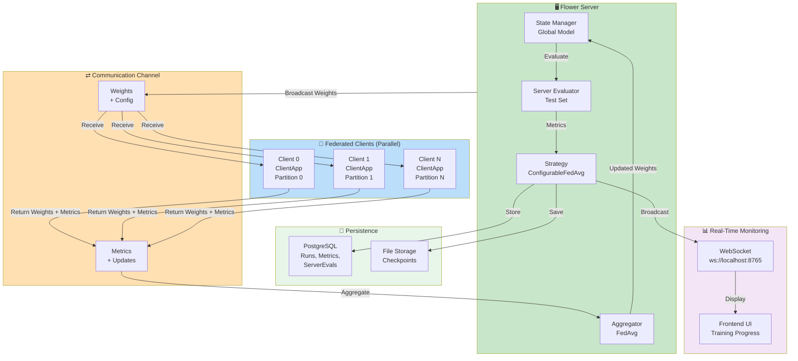
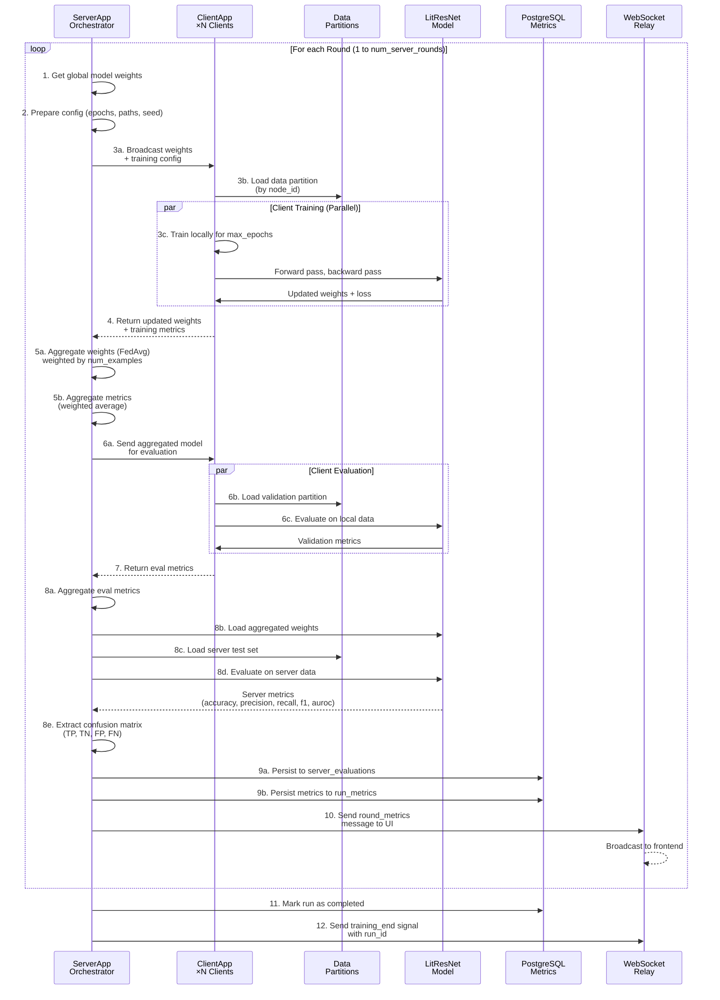

# Federated Learning Module (Flower Framework)

**Purpose**: Implements Flower-based federated learning for distributed training of the pneumonia detection model across multiple clients while preserving data privacy.

This module orchestrates server-client communication, model aggregation, and centralized evaluation. Each client trains locally on its private data partition; only model updates are aggregated centrally.

---

## Table of Contents

1. [Overview](#overview)
2. [Architecture](#architecture)
3. [Federated Learning Workflow](#federated-learning-workflow)
4. [Data Partitioning](#data-partitioning)
5. [Key Components](#key-components)
6. [Configuration](#configuration)
7. [Execution](#execution)
8. [Integration](#integration)

---

## Overview

**Framework**: [Flower (flwr.dev)](https://flower.dev) - A Friendly Federated Learning Framework

**Key Characteristics**:
- **Privacy-First**: Patient data never leaves client machines; only model weights are aggregated
- **Decentralized Training**: Each client trains locally on its data partition
- **Centralized Aggregation**: Server aggregates client updates using FedAvg (Federated Averaging)
- **Server Evaluation**: Global model validated on server-held test dataset each round
- **Configuration-Driven**: All parameters (rounds, epochs, clients) controlled via YAML + pyproject.toml
- **Real-Time Monitoring**: WebSocket streaming of metrics to frontend UI

---

## Architecture

### Client/Server Communication Model



---

## Federated Learning Workflow

### Round-by-Round Process

**File**: [core/server_app.py](core/server_app.py) - See lines 71-274 for main orchestration logic

**Sequence Diagram**:



**Key Details**:

| Step | Component | Purpose | Details |
|------|-----------|---------|---------|
| 1-2 | ServerApp | Initialization | Get global model, prepare configuration |
| 3a-3c | ClientApp | Training | Clients train locally in parallel on their partitions |
| 4 | ClientApp | Return Updates | Send trained weights + metrics back to server |
| 5a-5b | FedAvg | Aggregation | Weighted average of all client updates |
| 6-7 | ClientApp | Validation | Evaluate aggregated model on client validation sets |
| 8a-8e | ServerEval | Server Evaluation | Evaluate on server-held test set; compute metrics |
| 9 | Database | Persistence | Store all metrics in PostgreSQL |
| 10 | WebSocket | Monitoring | Stream metrics to frontend for real-time visualization |
| 11-12 | Finalization | Completion | Mark run as complete, send final signal |

---

## Data Partitioning

### IID Partition Strategy

**File**: [partioner.py](partioner.py)

**Process**:
1. Load full dataset metadata (all patient IDs and labels)
2. Randomly shuffle all indices (seed-controlled)
3. Split evenly into `num_partitions` (e.g., 2 clients = 2 equal parts)
4. Each client loads its partition deterministically by node_id

**Example** (100 samples, 2 clients):
- Partition 0 (Client 0): Samples 0-49 (50 samples)
- Partition 1 (Client 1): Samples 50-99 (50 samples)

**Class Distribution**: Stratified splits ensure balanced labels in each partition

**Reproducibility**: Seed propagated from server ensures consistent partitions across rounds

---

## Key Components

### 1. Server Application (`core/server_app.py`)

**File**: [core/server_app.py](core/server_app.py)

**Lifespan Management** (lines 40-68):
- `on_startup()`: Create database run entity
- `on_shutdown()`: Finalize run, update status
- Environment setup, configuration loading

**Main Logic** (lines 71-274):
- Initialize global model (LitResNet)
- Configure strategy with FedAvg and evaluation function
- Execute federated rounds via `strategy.start()`
- Persist results to database and JSON
- Send training completion signal

**Configuration** (lines 133-146):
- `num_server_rounds`: Total federated rounds
- `max_epochs`: Local epochs per client per round
- `num_partitions`: Total number of clients
- Applied to all client configurations

---

### 2. Client Application (`core/client_app.py`)

**File**: [core/client_app.py](core/client_app.py)

**Training** (lines 28-171):
- Load global model from server
- Get data partition by `context.node_id % num_partitions`
- Train locally for `max_epochs` epochs
- Return: Updated weights + training metrics

**Evaluation** (lines 174-269):
- Evaluate global model on validation set
- Return: Validation metrics (accuracy, precision, recall, f1, auroc)
- Include `num-examples` for weighted aggregation

**Data Pipeline**:
- Uses [utils.py::_prepare_partition_and_split()](core/utils.py#L53-L75) to load partition
- Creates XRayDataModule with local data
- Trains with identical LitResNet as centralized

---

### 3. Server Evaluation (`core/server_evaluation.py`)

**File**: [core/server_evaluation.py](core/server_evaluation.py)

**Purpose**: Centralized evaluation of aggregated model on server-held test set

**Process** (lines 38-173):
1. Receive aggregated model weights from FedAvg
2. Load model into LitResNet
3. Evaluate on server test set (last 20% of full dataset)
4. Compute metrics: loss, accuracy, precision, recall, f1, auroc
5. Extract confusion matrix: TP, TN, FP, FN
6. Return as MetricRecord

**Server Test Set**:
- Independent of client partitions
- Provides unbiased global performance estimate
- Used for monitoring convergence

---

### 4. Custom Strategy (`core/custom_strategy.py`)

**File**: [core/custom_strategy.py](core/custom_strategy.py)

**Class**: `ConfigurableFedAvg` (extends Flower's `FedAvg`)

**Features**:
- **configure_train()**: Pass custom config (paths, seeds) to clients
- **configure_evaluate()**: Pass model + evaluation config to clients
- **aggregate_evaluate()**: Weighted aggregation of client metrics
- **Metrics Broadcasting**: Send round metrics to WebSocket for frontend

**Weighted Aggregation Formula**:
```
aggregated_metric = Σ(client_metric_i × num_examples_i) / Σ(num_examples_i)
```

**Critical Convention**: Clients must include `num-examples` (with HYPHEN, not underscore) in MetricRecord for proper weighting.

---

### 5. Utilities (`core/utils.py`)

**File**: [core/utils.py](core/utils.py)

**Key Functions**:

| Function | Purpose | Reference |
|----------|---------|-----------|
| `_prepare_partition_and_split()` | Load and split client data partition | lines 53-75 |
| `_extract_metrics_from_result()` | Map various metric names to standard format | lines 127-166 |
| `_create_metric_record_dict()` | Create metric dict with num-examples (CRITICAL) | lines 169-186 |
| `_persist_server_evaluations()` | Save server metrics to database | lines 279-376 |
| `read_configs_to_toml()` | Sync YAML config to Flower pyproject.toml | lines 189-264 |

---

## Configuration

### Flower Configuration (`pyproject.toml`)

**File**: [pyproject.toml](pyproject.toml)

```toml
[tool.flwr.app.config]
num-server-rounds = 2
max-epochs = 2

[tool.flwr.federations.local-simulation.options]
num-supernodes = 2  # Number of clients
```

### YAML Configuration (`config/default_config.yaml`)

```yaml
experiment:
  num_rounds: 2
  num_clients: 2
  clients_per_round: 2
  local_epochs: 2
  num-server-rounds: 2
  max-epochs: 2
  options:
    num-supernodes: 2
```

**Synchronization**: `utils.py::read_configs_to_toml()` keeps values in sync

---

## Metrics Tracking

### Three Types of Metrics

| Type | Source | Aggregation | Storage |
|------|--------|-------------|---------|
| **Client Training** | Client local training | Per-client (not aggregated) | run_metrics |
| **Client Evaluation** | Client validation sets | Weighted (by num_examples) | run_metrics (aggregated) |
| **Server Evaluation** | Server test set | Not aggregated (global) | server_evaluations |

### Database Tables

- **run**: Training session metadata
- **client**: Federated participants (multiple per federated run, NULL for centralized)
- **round**: FL communication rounds per client
- **run_metrics**: Training metrics (supports both centralized and federated)
- **server_evaluations**: Global model performance per round

---

## Real-Time Monitoring

### WebSocket Streaming

**File**: [websocket_metrics_sender.py](../dl_model/utils/data/websocket_metrics_sender.py)

**Messages Sent**:
1. `training_mode`: Federated vs centralized + num_rounds, num_clients
2. `round_end`: Per-round aggregated metrics
3. `training_end`: Final status + run_id

**Frontend Reception**: [services/websocket.ts](../../../../../xray-vision-ai-forge/src/services/websocket.ts) receives and updates TrainingExecution component

---

## Execution

### Command Line

```bash
# Run federated simulation (2 clients, 2 rounds, local simulation)
uv run flwr run federated_pneumonia_detection/src/control/federated_new_version

# Via PowerShell script
./federated_pneumonia_detection/src/rf.ps1
```

### Via API

**POST /experiments/federated**:
```json
{
  "run_name": "federated_exp_01",
  "dataset_path": "/path/to/data.zip",
  "config_overrides": {
    "experiment.num_rounds": 3,
    "experiment.num_clients": 2
  }
}
```

---

## Integration with Centralized Training

**Shared Components**:
- LitResNet (model wrapper)
- XRayDataModule (data loading)
- MetricsCollector (metrics tracking)
- CustomImageDataset (image loading)
- image_transforms (augmentation)

**Key Difference**:
- Centralized: Full dataset on single machine
- Federated: Data distributed across clients, coordinated training

---

## Error Handling & Logging

- **Server Failures**: Graceful shutdown, partial results saved
- **Client Failures**: Flower handles offline clients, continues with online ones
- **Communication Errors**: Auto-retry with exponential backoff
- **Metrics Errors**: Logged but don't block training
- **Database Errors**: Logged with rollback support

---

## Related Documentation

- **Client Training Utils**: See [dl_model/utils/README.md](../dl_model/utils/README.md)
- **Model Architecture**: See [entities/README.md](../../entities/README.md)
- **Data Partitioning**: See [partioner.py](partioner.py)
- **Database Schema**: See [boundary/README.md](../../boundary/README.md)
- **API Integration**: See [api/README.md](../../api/README.md)
- **System Architecture**: See [README.md](../../../README.md)
