# Federated Learning Module (Flower Framework)

**Purpose**: Implements Flower-based federated learning for distributed training of the pneumonia detection model across multiple clients while preserving data privacy.

This module orchestrates server-client communication, model aggregation, and centralized evaluation. Each client trains locally on its private data partition; only model updates are aggregated centrally.

---

## Architecture Overview

```mermaid
graph TB
    subgraph Server["🖥️ Flower Server<br/>ServerApp"]
        State["Global Model<br/>Weights"]
        Agg["FedAvg<br/>Aggregator"]
        Eval["Evaluation<br/>Function"]
    end

    subgraph Clients["👥 Federated Clients"]
        C0["Client 0<br/>Local Partition 0<br/>Train & Evaluate"]
        C1["Client 1<br/>Local Partition 1<br/>Train & Evaluate"]
        Cn["Client N<br/>Local Partition N<br/>Train & Evaluate"]
    end

    subgraph FL_Round["⚙️ Federated Learning Round"]
        S1["1. Server broadcasts<br/>current weights"]
        S2["2. Clients train locally<br/>on private partitions"]
        S3["3. Clients return<br/>updated weights"]
        S4["4. Server aggregates<br/>using FedAvg"]
        S5["5. Server evaluates<br/>on test set"]
        S6["6. Metrics stored<br/>in database"]
    end

    subgraph Storage["💾 Persistence"]
        DB["PostgreSQL<br/>Metrics Database"]
        FS["File Checkpoints"]
    end

    Server -->|Weights<br/>Config| C0
    Server -->|Weights<br/>Config| C1
    Server -->|Weights<br/>Config| Cn

    C0 -->|Updated<br/>Weights| Agg
    C1 -->|Updated<br/>Weights| Agg
    Cn -->|Updated<br/>Weights| Agg

    Agg -->|FedAvg<br/>Aggregation| State
    State -->|Evaluate| Eval
    Eval -->|Store| DB
    Eval -->|Store| FS

    S1 --> S2
    S2 --> S3
    S3 --> S4
    S4 --> S5
    S5 --> S6

    classDef server fill:#AA00FF,stroke:#fff,stroke-width:2px,color:#fff;
    classDef clients fill:#007BFF,stroke:#fff,stroke-width:2px,color:#fff;
    classDef round fill:#FF6F00,stroke:#fff,stroke-width:2px,color:#fff;
    classDef storage fill:#00C853,stroke:#fff,stroke-width:2px,color:#fff;

    class Server,State,Agg,Eval server;
    class Clients,C0,C1,Cn clients;
    class FL_Round,S1,S2,S3,S4,S5,S6 round;
    class Storage,DB,FS storage;
```



---

## Federated Learning Overview

### Privacy-Preserving Distributed Training

**Federated Learning Principle**: Data never leaves client machines. Only model weights are transmitted to the server for aggregation.

**Key Characteristics**:

- **Multi-Client Training**: Multiple clients train independently on local data partitions
- **Privacy-First Design**: Raw data stays private; only trained model weights are aggregated
- **Centralized Coordination**: Single server orchestrates communication and aggregation
- **FedAvg Algorithm**: Weighted averaging of client weights by dataset size
- **Decentralized Privacy**: Each client's data remains inaccessible to other clients and server
- **Deterministic Reproducibility**: Seed-controlled partitioning ensures consistent training across rounds

---

## Flower Framework Integration

### Framework Details

**Framework**: [Flower (flwr.dev)](https://flower.dev) - A Friendly Federated Learning Framework

**Simulation Mode**: Uses Flower[simulation] for local multi-process federated learning orchestration

**Key Flower Components**:

- `ServerApp`: Defines server-side orchestration and strategy
- `ClientApp`: Defines client-side training and evaluation logic
- `FedAvg` Strategy: Standard federated averaging aggregation
- Configuration via `pyproject.toml`: Flower-native configuration

**Real-Time Monitoring**: WebSocket streaming of metrics to frontend UI during training

---

## Architecture Components

### 1. ServerApp - Server Orchestration

**File**: [core/server_app.py](core/server_app.py)

**Responsibilities**:

- Initialize global model (LitResNet) with pretrained weights
- Create and manage `ConfigurableFedAvg` strategy
- Orchestrate federated rounds via `strategy.start()`
- Evaluate aggregated model on server-held test set
- Persist results to database (PostgreSQL) and JSON checkpoints
- Send training completion signals via WebSocket

**Lifespan Management**:

- `on_startup()`: Create database run entity, initialize environment
- `on_shutdown()`: Finalize run, update status to completed/failed

**Configuration Parameters**:

- `num_server_rounds`: Total federated learning rounds to execute
- `max_epochs`: Local training epochs per client per round
- `num_partitions`: Total number of federated clients

---

### 2. ClientApp - Client-Side Training

**File**: [core/client_app.py](core/client_app.py)

**Responsibilities**:

- Load global model weights from server
- Retrieve local data partition by `node_id % num_partitions`
- Train locally for specified epochs without sharing raw data
- Evaluate model on local validation set
- Return updated weights and training metrics to server

**Data Handling**:

- Private data partition loaded deterministically by client ID
- No data transmission; only weights sent back to server
- Stratified partitioning ensures balanced class distribution

**Metrics Returned**:

- Training loss, accuracy, precision, recall, F1-score, AUROC
- Validation metrics with `num-examples` for weighted aggregation
- Client metadata for round tracking

---

### 3. ConfigurableFedAvg - Custom Aggregation Strategy

**File**: [core/custom_strategy.py](core/custom_strategy.py)

**Class**: `ConfigurableFedAvg` (extends Flower's `FedAvg`)

**Key Features**:

- **configure_train()**: Pass custom training configuration to selected clients
- **configure_evaluate()**: Distribute aggregated model and evaluation config to clients
- **aggregate_fit()**: Weighted average of client weights by dataset size
- **aggregate_evaluate()**: Weighted aggregation of client validation metrics
- **Metrics Broadcasting**: Send round metrics to WebSocket for real-time UI updates

**Weighted Aggregation Formula**:

```
aggregated_metric = Σ(metric_i × num_examples_i) / Σ(num_examples_i)
```

**Critical Convention**: Clients must include `num-examples` (hyphen, not underscore) in metric dictionaries for proper weighted aggregation.

---

### 4. Data Partitioner - Distributed Data Strategy

**File**: [partioner.py](partioner.py)

**Partitioning Modes**:

| Mode       | Strategy                    | Use Case                                 | Distribution     |
| ---------- | --------------------------- | ---------------------------------------- | ---------------- |
| IID        | Random shuffle, equal split | Balanced data scenarios                  | Uniform random   |
| Non-IID    | Stratified by node ID       | Heterogeneous client datasets            | Class-imbalanced |
| Stratified | Class-balanced splits       | Medical imaging (pneumonia distribution) | Balanced labels  |

**Process**:

1. Load full dataset metadata (all patient IDs and labels)
2. Apply selected partitioning strategy
3. Each client loads partition deterministically by node_id
4. Seed-controlled for reproducibility across rounds

**Example (100 samples, 2 clients, IID)**:

- Partition 0 (Client 0): Samples 0-49 (50 samples)
- Partition 1 (Client 1): Samples 50-99 (50 samples)

**Reproducibility**: Seed propagated from server ensures identical partitions across all training rounds.

---

## Federated Learning Round Flow

### Step-by-Step Execution

```
Round N:
├─ 1. Server Initialization
│  ├─ Load current global model weights
│  └─ Prepare training configuration (epochs, data paths, seed)
│
├─ 2. Client Selection & Weight Distribution
│  └─ Broadcast global weights + config to selected clients
│
├─ 3. Parallel Client Training
│  ├─ Client 0: Load partition 0, train for max_epochs
│  ├─ Client 1: Load partition 1, train for max_epochs
│  └─ Client N: Load partition N, train for max_epochs
│     (No data sharing; only trained weights returned)
│
├─ 4. Weight Aggregation (FedAvg)
│  ├─ Receive updated weights from all clients
│  ├─ Weight each client's update by: num_examples_i / total_examples
│  └─ Compute weighted average of all client weights
│
├─ 5. Client-Side Evaluation
│  ├─ Distribute aggregated model to clients
│  ├─ Clients evaluate on local validation sets
│  └─ Return local validation metrics + num_examples
│
├─ 6. Server-Side Evaluation
│  ├─ Load aggregated weights into LitResNet
│  ├─ Evaluate on server-held test set (independent of client data)
│  ├─ Compute: accuracy, precision, recall, F1, AUROC, confusion matrix
│  └─ Extract TP, TN, FP, FN for detailed analysis
│
├─ 7. Metrics Aggregation
│  ├─ Weighted average of client validation metrics
│  ├─ Combine with server evaluation results
│  └─ Aggregate by num_examples for fair weighting
│
├─ 8. Data Persistence
│  ├─ Store server evaluation metrics to PostgreSQL
│  ├─ Store aggregated metrics to run_metrics table
│  └─ Save model checkpoint to file storage
│
└─ 9. Real-Time Monitoring
   └─ Broadcast round_metrics to WebSocket for frontend display
```

### Key Details by Component

| Step | Component          | Purpose                                         |
| ---- | ------------------ | ----------------------------------------------- |
| 1    | ServerApp          | Load global model, prepare configuration        |
| 2    | ServerApp          | Select clients, broadcast weights               |
| 3    | ClientApp          | Local training on private partitions (parallel) |
| 4    | FedAvg             | Aggregate client weights by dataset size        |
| 5    | ClientApp          | Evaluate aggregated model locally               |
| 6    | ServerEval         | Evaluate on independent server test set         |
| 7    | Metrics Aggregator | Weighted average of all metrics                 |
| 8    | Database           | Persist metrics and checkpoints                 |
| 9    | WebSocket          | Stream to frontend for real-time visualization  |

---

## Configuration

### Flower Configuration (pyproject.toml)

**File**: [pyproject.toml](pyproject.toml)

Federated learning parameters:

```toml
[tool.flwr.app.config]
num-server-rounds = 2        # Total FL rounds
max-epochs = 2               # Local training epochs per client per round

[tool.flwr.federations.local-simulation.options]
num-supernodes = 2           # Number of clients in federation
```

### YAML Configuration (config/default_config.yaml)

**File**: [../../../config/default_config.yaml](../../../config/default_config.yaml)

```yaml
experiment:
  num_rounds: 2 # Federated learning rounds
  num_clients: 2 # Total clients in federation
  clients_per_round: 2 # Clients selected each round
  local_epochs: 2 # Training epochs per client
  num-server-rounds: 2 # Must match pyproject.toml
  max-epochs: 2 # Must match pyproject.toml
  options:
    num-supernodes: 2 # Must match pyproject.toml
```

**Synchronization**: `utils.py::read_configs_to_toml()` keeps YAML and Flower configurations in sync

---

## Data Partitioning Strategies

### Deterministic Partition Loading

**Mechanism**: Each client loads its partition deterministically using:

```
partition_index = node_id % num_partitions
```

**Why This Approach**:

- No data transmission during training
- Each client independently accesses only its partition
- Consistent across all rounds due to seed control
- Enables reproducible federated experiments

### Class Distribution

**Stratified Splits**: Partitioner ensures balanced label distribution across all client partitions

- Example: If full dataset is 60% pneumonia, each partition maintains ~60%
- Prevents data bias in federated learning

### IID vs Non-IID Considerations

**IID (Independent, Identical Distribution)**:

- Equal data size per client
- Similar class distribution
- Easier convergence

**Non-IID (Different Distribution)**:

- Simulated real-world heterogeneity
- Clients may have different class balances
- Tests model robustness to data heterogeneity

---

## Privacy Considerations

### Data Localization

**Core Privacy Guarantee**: Raw data never leaves client machines

- Each client trains on its local partition only
- Only trained model weights are transmitted to server
- Server cannot infer client data from weights (differential privacy not yet implemented)

### Aggregation Privacy

**FedAvg Aggregation**: Server receives only:

- Client weights (not raw data)
- Aggregated metrics (num_examples for weighting)
- No access to individual predictions or activations

### Communication Privacy

**No Raw Data Transmission**:

- Weights are numeric tensors, not interpretable as original data
- Each client's contribution is mathematically blended in FedAvg
- Server test set remains independent (not used by clients)

**Future Enhancements**:

- Differential privacy for stronger formal guarantees
- Secure aggregation to prevent server from viewing individual client weights
- Communication compression for reduced bandwidth

---

## Deployment

### Command Line Execution

```bash
# Run federated simulation (default: 2 clients, 2 rounds, local simulation)
uv run flwr run federated_pneumonia_detection/src/control/federated_new_version

# Via PowerShell script
./federated_pneumonia_detection/src/rf.ps1
```

### Via REST API

**POST /experiments/federated**:

```json
{
  "run_name": "federated_exp_01",
  "dataset_path": "/path/to/data.zip",
  "config_overrides": {
    "experiment.num_rounds": 3,
    "experiment.num_clients": 2
  }
}
```

**Response**:

```json
{
  "run_id": "12345",
  "status": "training",
  "num_rounds": 3,
  "num_clients": 2
}
```

### Monitoring Training Progress

- **WebSocket Connection**: Frontend connects to `/ws/training/{run_id}`
- **Real-Time Metrics**: Aggregated metrics sent after each round
- **Training Status**: `training_mode`, `round_end`, `training_end` messages
- **Database Queries**: Check `run_metrics` and `server_evaluations` tables

---

## Related Documentation

- **Control Layer Overview**: [../README.md](../README.md)
- **Boundary Layer (Database)**: [../../boundary/README.md](../../boundary/README.md)
- **Training Utilities**: [../../utils/README.md](../../utils/README.md)
- **System Architecture**: [../../../README.md](../../../README.md)
