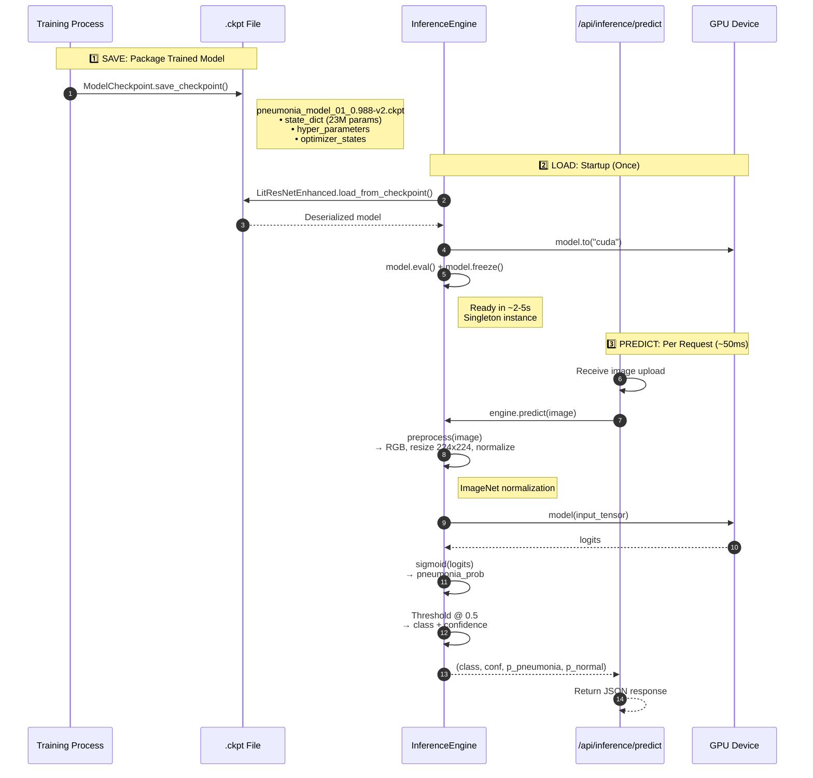
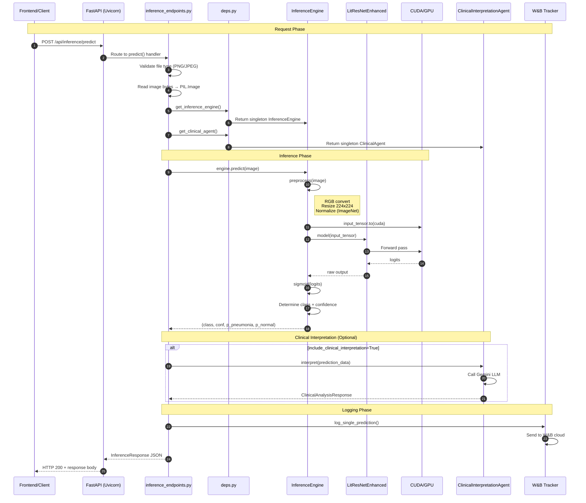

# Inference Architecture Documentation

This document explains how the pneumonia detection model is packaged and served via FastAPI endpoints.

## Architecture Overview

The inference system follows a **layered architecture** with clear separation of concerns:

```
┌─────────────────────────────────────────────────────────────────┐
│                        API Layer                                 │
│  inference_endpoints.py - HTTP request/response handling         │
│  deps.py - Dependency injection, singleton management           │
└─────────────────────────────────────────────────────────────────┘
                              │
                              ▼
┌─────────────────────────────────────────────────────────────────┐
│                      Control Layer                               │
│  inference_engine.py - Core ML logic, preprocessing, inference  │
│  clinical_agent.py - AI clinical interpretation                 │
└─────────────────────────────────────────────────────────────────┘
                              │
                              ▼
┌─────────────────────────────────────────────────────────────────┐
│                      Entity Layer                                │
│  LitResNetEnhanced - PyTorch Lightning model (.ckpt file)       │
└─────────────────────────────────────────────────────────────────┘
```

---

## Sequence 1: Model Packaging, Loading & Prediction

High-level overview of how a trained model is saved, loaded, and used for prediction.



### What's Inside the .ckpt File

The checkpoint file is a PyTorch Lightning serialized archive containing:

| Component | Description | Used in Inference? |
|-----------|-------------|-------------------|
| `state_dict` | All model weights (~23M parameters from ResNet50 backbone + custom head) | ✅ Yes |
| `hyper_parameters` | Training config (lr, focal_loss params, warmup_epochs, etc.) | ✅ Yes (for model architecture) |
| `optimizer_states` | AdamW optimizer state (momentum buffers, learning rates) | ❌ No (training only) |
| `epoch` | Epoch number when checkpoint was saved | ❌ No (metadata only) |
| `pytorch-lightning_version` | Version used during training | ❌ No (compatibility check) |

### Key Function Signatures

**Model Saving (during training):**
```python
# training_callbacks.py:280-289
checkpoint_callback = ModelCheckpoint(
    dirpath=checkpoint_dir,
    filename=f"{model_filename}_{{epoch:02d}}_{{val_recall:.3f}}",
    monitor="val_recall",
    mode="max",
    save_top_k=3
)
```

**Model Loading:**
```python
# inference_engine.py:60-68
self.model = LitResNetEnhanced.load_from_checkpoint(
    str(self.checkpoint_path),
    map_location=self.device,
    config=None,
    class_weights_tensor=None,
)
self.model.to(self.device)
self.model.eval()
self.model.freeze()
```

**Preprocessing:**
```python
# inference_engine.py:88-100
def preprocess(self, image: Image.Image) -> torch.Tensor:
    if image.mode != "RGB":
        image = image.convert("RGB")
    tensor = self._transform(image)  # Resize, normalize
    return tensor.unsqueeze(0).to(self.device)
```

**Prediction:**
```python
# inference_engine.py:102-129
@torch.no_grad()
def predict(self, image: Image.Image) -> Tuple[str, float, float, float]:
    input_tensor = self.preprocess(image)
    logits = self.model(input_tensor)
    pneumonia_prob = torch.sigmoid(logits).item()
    normal_prob = 1.0 - pneumonia_prob
    # ... determine class and confidence
    return predicted_class, confidence, pneumonia_prob, normal_prob
```

---

## Sequence 2: Inference Request Flow

This sequence shows what happens when a request hits the `/predict` endpoint.



### Timing Breakdown (Typical)

| Phase | Duration | Notes |
|-------|----------|-------|
| Request parsing | ~5ms | File upload + validation |
| Preprocessing | ~10ms | PIL resize + tensor conversion |
| GPU inference | ~15-30ms | Forward pass (warm GPU) |
| Clinical interpretation | ~2-5s | Gemini API call (optional) |
| Response serialization | ~2ms | JSON encoding |
| **Total (no clinical)** | **~50-70ms** | GPU inference only |
| **Total (with clinical)** | **~2-5s** | Dominated by LLM call |

---

## Key Design Patterns

### 1. Singleton Pattern (Lazy Loading)

The model is loaded **once** and reused for all requests:

```python
# deps.py
_inference_engine: Optional[InferenceEngine] = None

def get_inference_engine() -> Optional[InferenceEngine]:
    global _inference_engine
    if _inference_engine is None:
        _inference_engine = InferenceEngine()  # Load model
    return _inference_engine
```

**Why?** Loading a PyTorch model takes 2-5 seconds. Loading per-request would be catastrophic.

### 2. Dependency Injection (FastAPI Depends)

```python
# inference_endpoints.py
@router.post("/predict")
async def predict(
    engine: Optional[InferenceEngine] = Depends(get_inference_engine),
    clinical_agent: Optional[ClinicalInterpretationAgent] = Depends(get_clinical_agent),
):
    ...
```

**Why?** Allows testing with mock services and centralizes dependency management. Each concern is injected separately.

### 3. Graceful Degradation

```python
# inference_endpoints.py
if engine is None:
    raise HTTPException(status_code=503, detail="Model unavailable")

if clinical_agent is None:
    # Skip interpretation, don't crash
    clinical_interpretation = fallback_interpretation(prediction)
```

**Why?** Clinical agent (Gemini) may be unavailable. The core inference still works.

---

## Latency Optimization Techniques

### Currently Implemented

| Technique | Location | Impact |
|-----------|----------|--------|
| GPU inference | `inference_engine.py:40` | ~10x faster than CPU |
| `model.eval()` | `inference_engine.py:67` | Disables dropout/batchnorm updates |
| `model.freeze()` | `inference_engine.py:68` | Prevents gradient computation |
| `@torch.no_grad()` | `inference_engine.py:102` | Skips autograd tracking |
| Singleton model | `deps.py:125` | Avoids repeated loading |

### Recommended Enhancements

#### 1. TorchScript Compilation (JIT)

**What:** Convert model to optimized TorchScript format.

**Impact:** 20-40% inference speedup

```python
# In inference_engine.py
def _load_model(self) -> None:
    ...
    self.model.eval()
    # Add JIT compilation
    self.model = torch.jit.script(self.model)
    # Or trace-based:
    # dummy_input = torch.randn(1, 3, 224, 224).to(self.device)
    # self.model = torch.jit.trace(self.model, dummy_input)
```

#### 2. ONNX Runtime

**What:** Export to ONNX format and use ONNX Runtime for inference.

**Impact:** 30-50% speedup, better cross-platform support

```python
# Export once
torch.onnx.export(model, dummy_input, "model.onnx")

# Inference
import onnxruntime as ort
session = ort.InferenceSession("model.onnx", providers=['CUDAExecutionProvider'])
outputs = session.run(None, {"input": input_tensor.numpy()})
```

#### 3. TensorRT (NVIDIA GPUs only)

**What:** NVIDIA's high-performance inference optimizer.

**Impact:** 2-5x speedup on compatible GPUs

```python
import torch_tensorrt

trt_model = torch_tensorrt.compile(model,
    inputs=[torch_tensorrt.Input((1, 3, 224, 224))],
    enabled_precisions={torch.float16}  # FP16 for speed
)
```

#### 4. Batched Inference with Async

**What:** Collect multiple requests and process as batch.

**Impact:** Higher throughput (not lower latency)

```python
# Accumulate requests for 50ms, then batch
async def batch_predict(images: List[Image.Image]):
    tensors = torch.stack([preprocess(img) for img in images])
    with torch.no_grad():
        logits = model(tensors)  # Single forward pass
    return logits
```

#### 5. Model Quantization (INT8)

**What:** Reduce precision from FP32 to INT8.

**Impact:** 2-4x speedup, smaller memory footprint

```python
# Post-training quantization
quantized_model = torch.quantization.quantize_dynamic(
    model, {torch.nn.Linear}, dtype=torch.qint8
)
```

#### 6. Warm-up on Startup

**What:** Run dummy inference on startup to "warm" the GPU.

**Impact:** Eliminates cold-start latency for first request

```python
# In lifespan handler or after model load
def warmup(self):
    dummy = torch.randn(1, 3, 224, 224).to(self.device)
    with torch.no_grad():
        _ = self.model(dummy)
    torch.cuda.synchronize()  # Ensure complete
```

#### 7. Response Streaming (for Clinical Interpretation)

**What:** Stream LLM response as it generates.

**Impact:** Better perceived latency (user sees partial results)

```python
@router.post("/predict-stream")
async def predict_stream(...):
    yield json.dumps({"prediction": prediction})  # Immediate
    async for chunk in agent.stream_interpret(...):
        yield json.dumps({"interpretation_chunk": chunk})
```

---

## Summary: Optimization Priority

| Priority | Technique | Effort | Expected Gain |
|----------|-----------|--------|---------------|
| 1 | GPU warmup on startup | Low | Eliminate 500ms cold start |
| 2 | TorchScript (JIT) | Low | 20-40% speedup |
| 3 | Disable clinical interpretation default | Config | Avoid 2-5s LLM latency |
| 4 | ONNX Runtime | Medium | 30-50% speedup |
| 5 | TensorRT | Medium | 2-5x speedup (NVIDIA only) |
| 6 | INT8 Quantization | Medium | 2-4x speedup, accuracy tradeoff |
| 7 | Batched inference | High | Better throughput |
