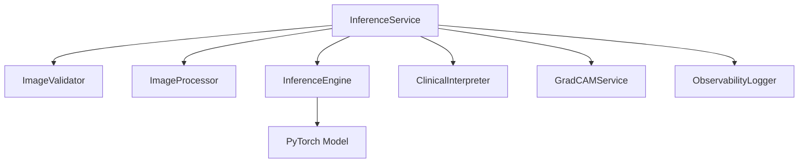

# Model Inference Submodule

## Purpose
The Model Inference submodule provides a production-grade pipeline for pneumonia detection from chest X-ray images. It handles everything from image validation to clinical interpretation.

## Problem Solved
Running deep learning models in production requires more than just a `model.predict()` call. This submodule handles image validation (size, format), preprocessing (normalization, resizing), explainability (GradCAM), and provides a structured clinical interpretation of the results.

## How It Works
The `InferenceService` acts as a **Facade**, orchestrating a series of specialized internal components. It supports both single-image and batch processing, providing detailed timing and observability data for each request.

## Key Files
- `inference_service.py` - Main facade for API consumption.
- `internals/inference_engine.py` - PyTorch Lightning model wrapper.
- `internals/image_processor.py` - Image reading and transformation logic.
- `internals/clinical_interpreter.py` - Rule-based clinical logic and risk assessment.
- `gradcam_service.py` - Explainability heatmap generation.

## Dependencies
- Requires: `torch`, `torchvision`, `PIL`, `pytorch-lightning`.
- Used by: `api/endpoints/inference/`

## Architecture

## Integration Points
- **Upstream**: Called by FastAPI endpoints in `src/api/endpoints/inference/`.
- **Downstream**: Loads model checkpoints from `src/control/model_inferance/*.ckpt`.
- **Clinical**: Can integrate with an external Clinical Agent for advanced interpretations.
