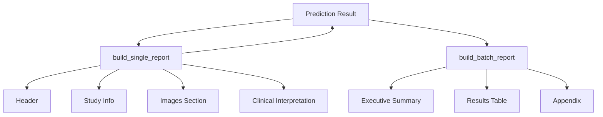

# Report Generation Submodule

## Purpose
The Report Generation submodule provides functionality to generate professional, clinical-grade PDF reports for pneumonia detection results.

## Problem Solved
Raw AI predictions are difficult for clinicians to interpret in isolation. This submodule converts model outputs, images, heatmaps, and clinical interpretations into a structured, printable PDF format that follows medical reporting standards.

## How It Works
The submodule uses the **ReportLab** library to programmatically build PDF documents. It follows a modular approach where different sections of the report (Header, Study Info, Results, Images, Interpretation) are built by specialized functions and then assembled into a final "story".

## Key Files
- `pdf_report.py` - Main facade providing `generate_prediction_report` and `generate_batch_summary_report`.
- `internals/sections/` - Modular builders for different report sections.
- `internals/styles.py` - Centralized ReportLab styles and branding colors.
- `internals/images/` - Utilities for embedding PIL images and Base64 heatmaps into PDFs.

## Dependencies
- Requires: `reportlab`, `PIL`.
- Used by: `api/endpoints/inference/`

## Architecture

## Integration Points
- **Upstream**: Called by FastAPI endpoints to provide downloadable reports.
- **Downstream**: Consumes data from `InferenceService` and `ClinicalInterpreter`.
