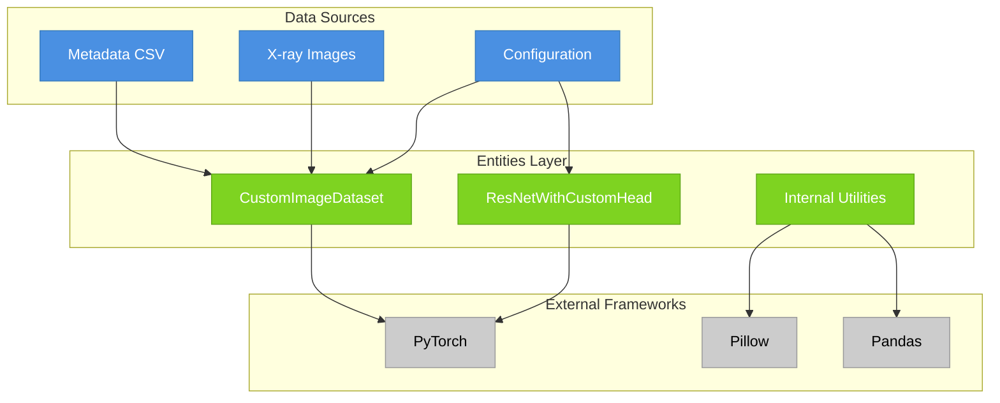
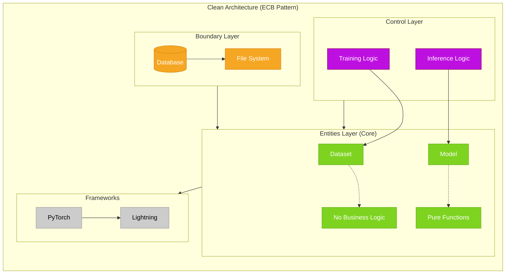
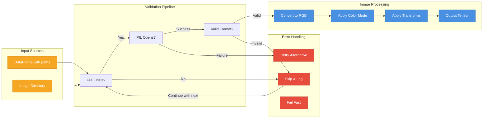
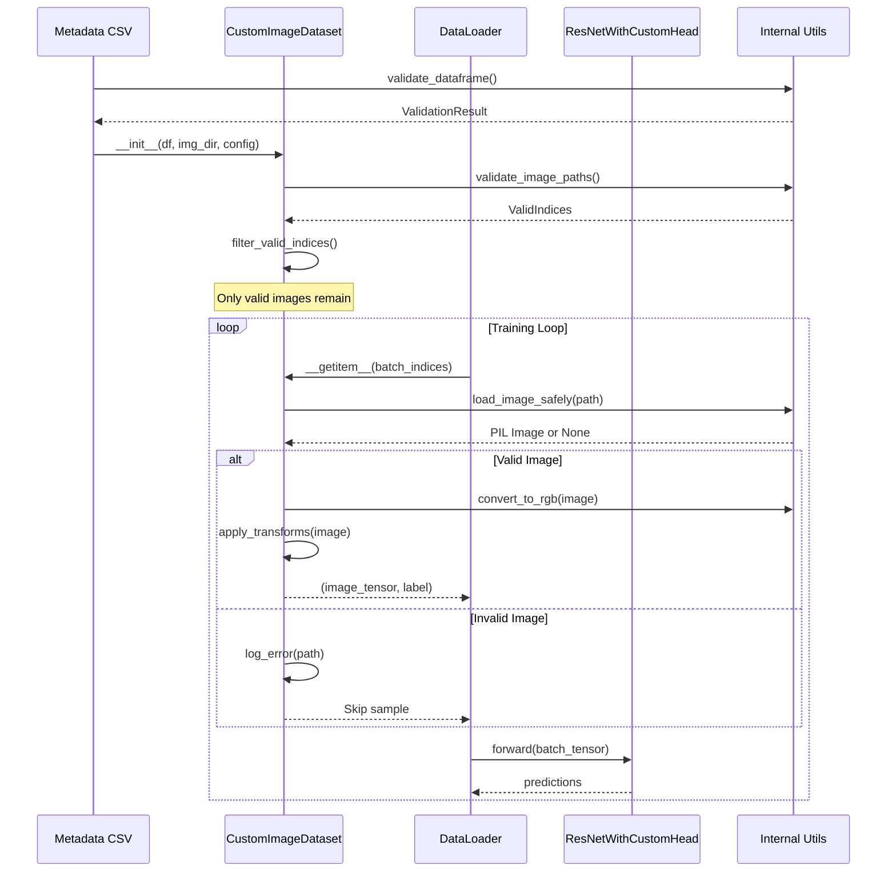

# Entities Layer

**Date**: 2026-01-24
**Agent**: Sub-Apollo (Documentation Specialist)

## Problem
The Entities layer documentation needed to clearly explain the domain models and their role in the Clean Architecture pattern. The documentation required better visualization of the dataset and model architectures.

## Solution
Created comprehensive documentation with professional Mermaid diagrams showing the PyTorch Dataset implementation, ResNet architecture, and entity relationships. The documentation emphasizes the pure, stateless nature of entities.

### Key Implementation Files
- `src/entities/custom_image_dataset.py:1` - PyTorch Dataset for X-ray images
- `src/entities/resnet_with_custom_head.py:1` - Transfer learning model architecture
- `src/entities/cust_image_internals/image_ops.py:1` - Image loading and preprocessing
- `src/entities/res_internals/model_builder.py:1` - Model construction utilities

### System Connections



### Clean Architecture Position



### CustomImageDataset Architecture

```mermaid
classDiagram
    class Dataset {
        <<PyTorch>>
        +__len__() int
        +__getitem__(idx) Tuple[Tensor, int]
    }

    class CustomImageDataset {
        -dataframe: DataFrame
        -image_dir: Path
        -valid_indices: List[int]
        -transforms: Optional[Transform]
        -color_mode: str
        +__len__() int
        +__getitem__(idx) Tuple[Tensor, int]
        +get_class_distribution() Dict[str, int]
        +validate_all_images() ValidationReport
        +get_memory_usage_estimate() MemoryInfo
        +filter_valid_indices() None
    }

    class ImageOperations {
        <<Utility>>
        +load_image_safely(path: Path) Optional[Image.Image]
        +convert_to_rgb(image: Image.Image) Image.Image
        +apply_color_mode(image: Image.Image, mode: str) Image.Image
    }

    class ValidationUtils {
        <<Utility>>
        +validate_file_exists(path: Path) bool
        +validate_image_readable(path: Path) bool
        +validate_dataset_structure(df: DataFrame, img_dir: Path) ValidationResult
    }

    class StatsUtils {
        <<Utility>>
        +calculate_class_distribution(df: DataFrame) Dict[str, int]
        +estimate_memory_usage(sample_paths: List[Path], transform: Transform) MemoryInfo
        +calculate_balance_ratio(distribution: Dict[str, int]) float
    }

    Dataset <|-- CustomImageDataset
    CustomImageDataset --> ImageOperations
    CustomImageDataset --> ValidationUtils
    CustomImageDataset --> StatsUtils

    classDef dataset fill:#4A90E2,stroke:#357ABD,color:#fff
    classDef util fill:#7ED321,stroke:#5FA818,color:#fff

    class CustomImageDataset dataset
    class ImageOperations,ValidationUtils,StatsUtils util
```

### Image Loading Pipeline



### ResNetWithCustomHead Architecture

```mermaid
classDiagram
    class nn_Module {
        <<PyTorch>>
        +forward(x) Tensor
        +parameters() Iterator[Parameter]
        +train(mode: bool) None
    }

    class ResNetWithCustomHead {
        -features: ResNet50
        -classifier: Sequential
        -num_classes: int
        -dropout_rate: float
        +forward(x) Tensor
        +freeze_backbone() None
        +unfreeze_backbone() None
        +set_dropout_rate(rate: float) None
        +get_feature_maps(x, layer_name) Tensor
        +get_model_info() ModelInfo
    }

    class ModelBuilder {
        <<Utility>>
        +create_backbone(pretrained: bool) ResNet50
        +create_classifier(num_classes: int, dropout: float) Sequential
        +build_resnet(config: ModelConfig) ResNetWithCustomHead
    }

    class ModelOperations {
        <<Utility>>
        +freeze_layers(model: Module, num_layers: int) None
        +unfreeze_layers(model: Module, num_layers: int) None
        +set_all_dropout(model: Module, rate: float) None
        +hook_feature_maps(model: Module, layer_name: str) Hook
    }

    class ValidationUtils {
        <<Utility>>
        +validate_model_config(config: ModelConfig) ValidationResult
        +check_model_compatibility(model: Module, dataset: Dataset) bool
    }

    nn_Module <|-- ResNetWithCustomHead
    ResNetWithCustomHead --> ModelBuilder
    ResNetWithCustomHead --> ModelOperations
    ResNetWithCustomHead --> ValidationUtils

    classDef model fill:#BD10E0,stroke:#8B0A50,color:#fff
    classDef util fill:#7ED321,stroke:#5FA818,color:#fff

    class ResNetWithCustomHead model
    class ModelBuilder,ModelOperations,ValidationUtils util
```

### Model Architecture Detail

```mermaid
flowchart TB
    subgraph Input["Input Processing"]
        Img[224x224 Image]
        Norm[ImageNet Normalize]
    end

    subgraph Backbone["ResNet50 Backbone (Frozen)"]
        Conv1[Conv 7x7, 64, stride 2]
        Pool1[MaxPool 3x3, stride 2]
        Conv2_x[Conv Blocks: 256]
        Conv3_x[Conv Blocks: 512]
        Conv4_x[Conv Blocks: 1024]
        Conv5_x[Conv Blocks: 2048]
    end

    subgraph Head["Custom Classification Head"]
        GAP[GlobalAvgPool2d]
        FC1[Dense 2048 → 256]
        Drop1[Dropout 0.3]
        FC2[Dense 256 → 64]
        Drop2[Dropout 0.3]
        FC3[Dense 64 → 1]
        Sig[Sigmoid]
    end

    subgraph Output["Output"]
        Prob[Pneumonia Probability]
        Class[Normal/Pneumonia]
        Features[Feature Maps (Optional)]
    end

    Img --> Norm
    Norm --> Conv1
    Conv1 --> Pool1
    Pool1 --> Conv2_x
    Conv2_x --> Conv3_x
    Conv3_x --> Conv4_x
    Conv4_x --> Conv5_x
    Conv5_x --> GAP
    GAP --> FC1
    FC1 --> Drop1
    Drop1 --> FC2
    FC2 --> Drop2
    Drop2 --> FC3
    FC3 --> Sig
    Sig --> Prob
    Prob --> Class
    
    Conv4_x -.-> Features

    classDef backbone fill:#4A90E2,stroke:#357ABD,color:#fff
    classDef head fill:#BD10E0,stroke:#8B0A50,color:#fff
    classDef io fill:#7ED321,stroke:#5FA818,color:#fff

    class Conv1,Pool1,Conv2_x,Conv3_x,Conv4_x,Conv5_x backbone
    class GAP,FC1,Drop1,FC2,Drop2,FC3,Sig head
    class Img,Norm,Prob,Class,Features io
```

### Data Flow Sequence



### Decision Rationale
- **PyTorch Dataset Chosen**: Standard interface with DataLoader integration
- **ResNet50 Backbone**: Proven architecture with ImageNet pretraining
- **Lazy Loading**: Memory-efficient for large datasets
- **Modular Design**: Clear separation between dataset and model concerns
- **Internal Utilities**: Reusable components for validation and operations

### Integration Points
- **Upstream**: Used by Control layer for training and inference
- **Downstream**: Depends on PyTorch, PIL, and Pandas
- **Configuration**: Receives config from Control layer
- **State**: Stateless design with injected dependencies

## Key Features

### CustomImageDataset Features

| Feature | Implementation | Benefit |
|---------|----------------|---------|
| **Valid Indices Masking** | Filters corrupted files without re-indexing | Maintains original indexing |
| **Lazy Transforms** | Applied at `__getitem__` time | Memory efficient |
| **Memory Estimation** | Samples 10 images to estimate footprint | Prevents OOM errors |
| **Class Distribution** | Counts per label for imbalance detection | Data quality insights |
| **Error Resilience** | Graceful handling of corrupted images | Robust training |

### ResNetWithCustomHead Features

| Feature | Implementation | Benefit |
|---------|----------------|---------|
| **Progressive Unfreezing** | `fine_tune_layers_count=-4` unfreezes last 4 layers | Controlled fine-tuning |
| **Dropout Adjustment** | `set_dropout_rate()` modifies all dropout layers | Regularization control |
| **Feature Extraction** | `get_feature_maps()` hooks intermediate layers | Explainability |
| **Model Info** | Parameter counts, architecture summary | Model inspection |

## Quick Reference

### Dataset Operations

```python
# Create dataset
dataset = CustomImageDataset(
    dataframe=df,
    image_dir="/path/to/images",
    config=config,
    transforms=training_transforms
)

# Get dataset info
class_dist = dataset.get_class_distribution()
memory_info = dataset.get_memory_usage_estimate()
validation_report = dataset.validate_all_images()

# Access data
image_tensor, label = dataset[0]
dataloader = DataLoader(dataset, batch_size=32, shuffle=True)
```

### Model Operations

```python
# Create model
model = ResNetWithCustomHead(
    config=config,
    num_classes=1,
    dropout_rate=0.3
)

# Model operations
model.freeze_backbone()
model.unfreeze_backbone()
model.set_dropout_rate(0.5)

# Feature extraction
features = model.get_feature_maps(x, "layer4")

# Model info
info = model.get_model_info()
print(f"Total parameters: {info.total_params}")
```

## Key Files Structure

```
src/entities/
├── custom_image_dataset.py           # Main PyTorch Dataset class
├── resnet_with_custom_head.py        # Main PyTorch nn.Module class
├── cust_image_internals/              # Dataset utilities
│   ├── image_ops.py                  # PIL loading and processing
│   ├── stats.py                      # Class distribution, memory
│   └── validation.py                 # File and data validation
├── res_internals/                     # Model utilities
│   ├── model_builder.py              # Model construction functions
│   ├── model_ops.py                  # Model operations (freeze/unfreeze)
│   └── validation.py                 # Parameter validation
└── __init__.py                       # Package exports
```

## Configuration Integration

```python
# Dataset configuration
class DatasetConfig:
    img_size: Tuple[int, int] = (224, 224)
    batch_size: int = 32
    num_workers: int = 4
    color_mode: str = "rgb"
    validate_on_init: bool = True

# Model configuration  
class ModelConfig:
    architecture: str = "resnet50"
    pretrained: bool = True
    num_classes: int = 1
    dropout_rate: float = 0.3
    fine_tune_layers_count: int = -4
```

## Design Principles

- **Stateless**: No internal state across method calls
- **Injectable**: All dependencies passed via constructor
- **Pure Functions**: `forward()` and `__getitem__()` are deterministic
- **Fail-Fast**: Validate inputs immediately
- **Framework Agnostic**: Business logic independent of training frameworks

## Performance Considerations

- **Memory Efficiency**: Lazy loading prevents holding all images in memory
- **Precomputation**: Class distribution calculated once
- **Validation Pipeline**: Multi-stage validation prevents redundant checks
- **Feature Hooks**: Efficient feature map extraction without modification