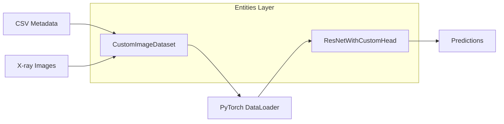
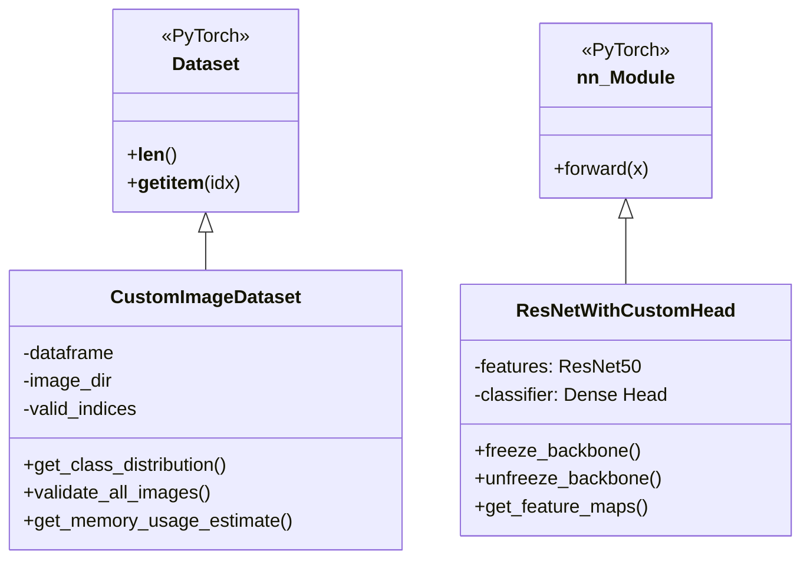
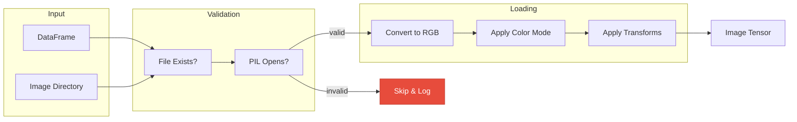
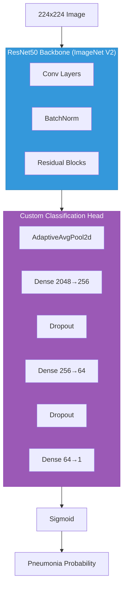
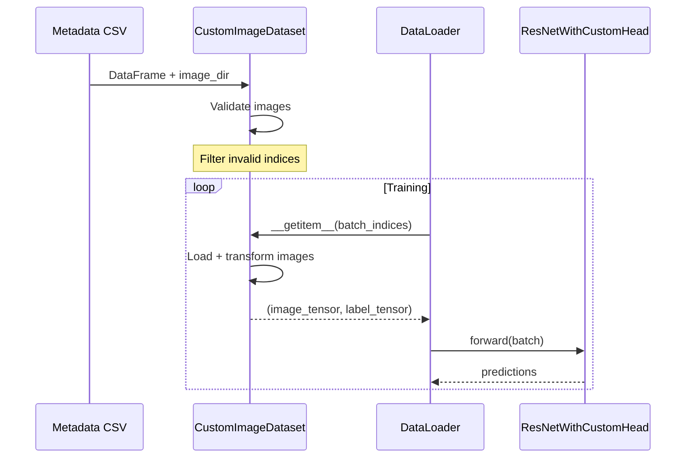
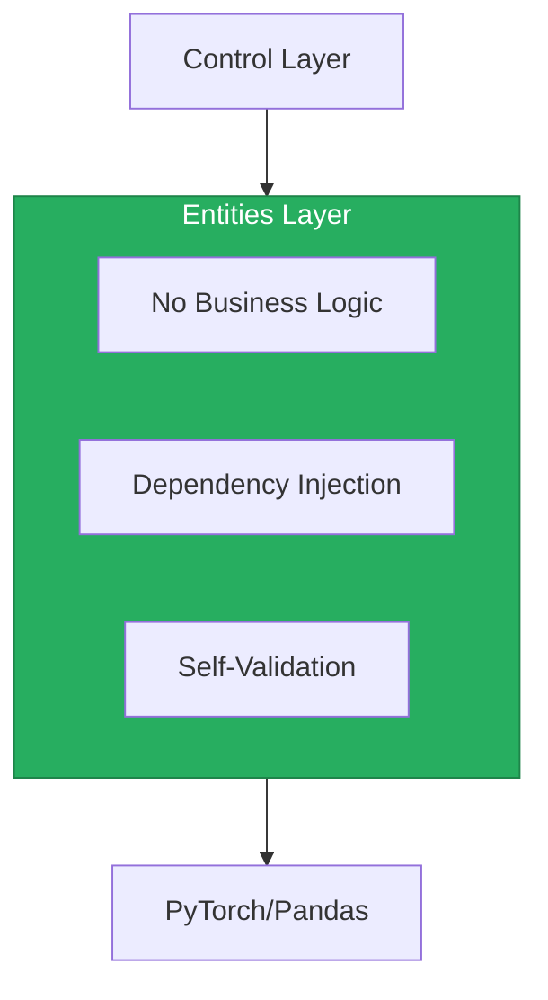

# Entities Layer

Domain models for the ML pipeline: dataset and neural network definitions.

## What It Does



## Architecture

Two core entities following Clean Architecture principles:



## CustomImageDataset

Robust image loader with graceful error handling:



**Key Features:**
| Feature | Description |
|---------|-------------|
| Valid indices masking | Corrupted files excluded without re-indexing |
| Lazy transforms | Applied at `__getitem__` time |
| Memory estimation | Samples 10 images to estimate footprint |
| Class distribution | Counts per label for imbalance detection |

**Utils:**

- `image_ops.py` - PIL loading with RGB intermediate
- `stats.py` - Class distribution, memory estimation
- `validation.py` - Multi-stage file validation

## ResNetWithCustomHead

Transfer learning model with configurable fine-tuning:



**Key Features:**
| Feature | Description |
|---------|-------------|
| Progressive unfreezing | `fine_tune_layers_count=-4` unfreezes last 4 layers |
| Dropout adjustment | `set_dropout_rate()` modifies all dropout layers |
| Feature extraction | `get_feature_maps()` hooks intermediate layers |
| Model info | Parameter counts, architecture summary |

**Utils:**

- `model_builder.py` - Backbone/head creation functions
- `model_ops.py` - Freeze/unfreeze, dropout, feature hooks
- `validation.py` - Parameter validation

## Data Flow



## Key Files

```
entities/
├── custom_image_dataset.py           # PyTorch Dataset
├── custom_image_dataset_utils/
│   ├── image_ops.py                  # PIL loading
│   ├── stats.py                      # Class distribution, memory
│   └── validation.py                 # File validation
│
├── resnet_with_custom_head.py        # nn.Module
└── resnet_with_custom_head_utils/
    ├── model_builder.py              # Backbone + head creation
    ├── model_ops.py                  # Freeze/unfreeze, features
    └── validation.py                 # Parameter validation
```

## Design Principles



- **Stateless**: No orchestration or side effects
- **Injectable**: Config passed at construction
- **Testable**: Mock config for isolated tests
- **Pure**: `forward()` and `__getitem__()` are functional

## Quick Reference

| Action                 | Method                                            |
| ---------------------- | ------------------------------------------------- |
| Create dataset         | `CustomImageDataset(df, image_dir, config)`       |
| Get class counts       | `dataset.get_class_distribution()`                |
| Validate all images    | `dataset.validate_all_images()`                   |
| Create model           | `ResNetWithCustomHead(config, num_classes=1)`     |
| Freeze backbone        | `model.freeze_backbone()`                         |
| Unfreeze last N layers | `ResNetWithCustomHead(fine_tune_layers_count=-N)` |
| Extract features       | `model.get_feature_maps(x, "layer4")`             |
