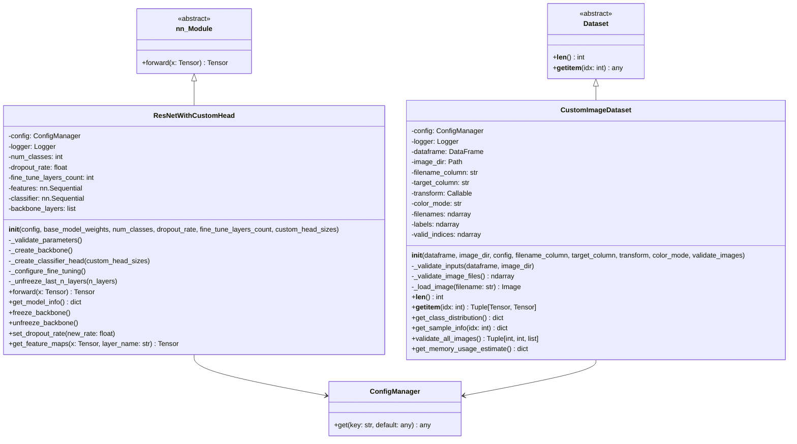

# Entities Layer

**Purpose**: Domain models and immutable data structures for the federated pneumonia detection system.

This layer defines PyTorch nn.Module classes and Dataset classes that form the backbone of the neural network architecture and data loading pipeline. Entities follow Clean Architecture principles—they contain no business logic, orchestration, or presentation concerns.

---

## Mermaid Class Diagram



---

## Entities Layer Overview

The entities layer defines the core domain models of the pneumonia detection system. These entities are:

- **Stateless models** containing configuration and learned parameters
- **Data containers** with type-safe access patterns
- **Pure data structures** with no orchestration or business logic
- **Independently testable** through dependency injection

This layer operates at the boundary between PyTorch framework abstractions and the control/boundary layers, ensuring clean separation of concerns.

### Design Principles

1. **No Business Logic**: Entities know only how to validate themselves and expose their structure
2. **Dependency Injection**: Configuration injected; no hardcoded values
3. **Immutable Where Possible**: State changes explicit and logged
4. **Type Safe**: Full type hints for IDE support and static analysis
5. **Error Handling**: Fast failure with specific exceptions and logging

---

## Role in Clean Architecture

### Entity Position in Architecture

```
┌─────────────────────────────────────────┐
│         Boundary Layer (I/O)            │
│  REST API, WebSocket, CLI, Logging      │
└────────────────────┬────────────────────┘
                     │
┌────────────────────▼─────────────────────┐
│      Control Layer (Orchestration)       │
│  Use Cases, LitResNet, Training Logic    │
└────────────────────┬─────────────────────┘
                     │
┌────────────────────▼──────────────────────┐
│     ENTITIES LAYER (Domain Models)       │
│  ResNetWithCustomHead, CustomImageDataset │
└──────────────────────────────────────────┘
                     │
┌────────────────────▼──────────────────────┐
│    Framework Layer (PyTorch, Pandas)     │
│  nn.Module, Dataset, DataFrame, Tensors  │
└──────────────────────────────────────────┘
```

**Dependencies**:
- Entities depend ONLY on framework abstractions (PyTorch, Pandas)
- Entities are INDEPENDENT of control/boundary layers
- Control layer depends on entities (one-way dependency)

---

## Entity Models

### 1. ResNetWithCustomHead

**File**: [resnet_with_custom_head.py](resnet_with_custom_head.py)

**Purpose**: Medical image classification model using ResNet50 backbone with custom binary classification head.

**Architecture**:
- **Backbone**: ResNet50 V2 (ImageNet pretrained)
- **Head**: Global average pooling → Dense 2048→256→64→1
- **Regularization**: Configurable dropout (default 0.5)
- **Fine-tuning**: Layer freezing/unfreezing support

**Input/Output**:
- **Input**: Batch of 224×224 chest X-rays (RGB images)
- **Output**: Binary probabilities for pneumonia classification

**Key Attributes**:
- `config: ConfigManager` - Configuration management
- `logger: Logger` - Structured logging
- `num_classes: int` - Number of output classes (1 for binary)
- `dropout_rate: float` - Dropout probability (0.0-1.0)
- `fine_tune_layers_count: int` - Backbone layers to unfreeze
- `features: nn.Sequential` - ResNet50 feature extractor
- `classifier: nn.Sequential` - Custom classification head
- `backbone_layers: list[nn.Module]` - Reference to backbone layers

**Key Methods**:
- `__init__(config, base_model_weights, num_classes, dropout_rate, fine_tune_layers_count, custom_head_sizes)` - Initialize model with configuration validation
- `forward(x: Tensor) -> Tensor` - Forward pass through backbone and head
- `get_model_info() -> dict` - Return model statistics (parameter counts, architecture info)
- `freeze_backbone()` - Freeze all backbone parameters for transfer learning
- `unfreeze_backbone()` - Unfreeze all backbone parameters
- `set_dropout_rate(new_rate: float)` - Update dropout rate in classifier
- `get_feature_maps(x: Tensor, layer_name: Optional[str]) -> Tensor` - Extract intermediate feature maps

**Parameter Configuration**:
- Reads from config: `experiment.dropout_rate`, `experiment.fine_tune_layers_count`, `system.img_size`
- Parameters can be overridden at instantiation time
- Validation on all parameters with specific error messages

**Initialization Flow**:
1. Load/create ConfigManager
2. Resolve parameters from config with overrides
3. Validate all parameters
4. Create ResNet50 backbone with ImageNet weights
5. Build custom classifier head
6. Apply fine-tuning configuration (freeze/unfreeze layers)
7. Log initialization details

**Error Handling**:
- Validates `num_classes > 0`
- Validates `0.0 <= dropout_rate <= 1.0`
- Validates `fine_tune_layers_count` is integer
- Catches backbone creation failures
- Catches forward pass failures with detailed logging

---

### 2. CustomImageDataset

**File**: [custom_image_dataset.py](custom_image_dataset.py)

**Purpose**: PyTorch Dataset for loading, validating, and augmenting chest X-ray images with comprehensive error recovery.

**Data Flow**:
- **Input**: Pandas DataFrame with filename and target columns
- **Output**: (image_tensor, label_tensor) tuples via DataLoader

**Key Attributes**:
- `config: ConfigManager` - Configuration management
- `logger: Logger` - Structured logging
- `dataframe: pd.DataFrame` - Source metadata
- `image_dir: Path` - Directory containing image files
- `filename_column: str` - Column name for filenames
- `target_column: str` - Column name for labels
- `transform: Optional[Callable]` - Optional augmentation pipeline
- `color_mode: str` - "RGB" or "L" (grayscale)
- `filenames: np.ndarray` - Array of filenames from dataframe
- `labels: np.ndarray` - Array of labels (float32)
- `valid_indices: np.ndarray` - Indices of valid/accessible images

**Key Methods**:
- `__init__(dataframe, image_dir, config, filename_column, target_column, transform, color_mode, validate_images)` - Initialize with validation
- `__len__() -> int` - Return count of valid samples
- `__getitem__(idx: int) -> Tuple[Tensor, Tensor]` - Load image and label at index
- `get_class_distribution() -> dict` - Return class counts for valid samples
- `get_sample_info(idx: int) -> dict` - Return detailed sample metadata
- `validate_all_images() -> Tuple[int, int, list]` - Validate all images, return (valid_count, invalid_count, invalid_files)
- `get_memory_usage_estimate() -> dict` - Estimate memory footprint

**Configuration Parameters**:
- Reads from config: `columns.filename`, `columns.target`
- Parameters can be overridden at instantiation time
- Supports empty dataframes (returns length 0)

**Data Augmentation**:
- Transform pipeline passed as optional `Callable`
- Applied after image loading in `__getitem__`
- Typical transforms: rotation, flips, normalization, resizing

**Validation Strategy**:
- Input validation: DataFrame type, image directory exists, required columns present
- Image validation: File exists, PIL can open, format is valid
- Error recovery: Invalid images logged and excluded from dataset
- Graceful degradation: Dataset size reduced but remains functional

**Image Loading**:
1. Convert all images to RGB (handles various input formats)
2. Convert to target color mode (RGB or L)
3. Handle PIL exceptions with detailed logging
4. Never crashes on single image failure

**Error Handling**:
- Validates dataframe is pd.DataFrame
- Validates image_dir exists and is directory
- Validates color_mode is "RGB" or "L"
- Validates required columns present (if dataframe not empty)
- Catches image open/read failures during validation
- Catches image load failures during `__getitem__`
- Index bounds checking with specific error messages

---

## Immutability Principle

Entities in this layer follow the **Immutability Principle**:

**Core Rule**: Entities do not contain business logic or orchestration.

- **Data Containers**: Entities hold data and configuration
- **Validation Only**: Entities validate their own structure (parameters, inputs)
- **State Changes Logged**: Any state mutation (e.g., dropout update) is explicit and logged
- **No Side Effects**: Entities do not call external services or modify application state
- **Pure Transformations**: Methods like `forward()` and `__getitem__()` are functional

**Why?**:
- Testability: Entities can be tested in isolation
- Composability: Entities combine cleanly in control layer
- Clarity: No hidden dependencies or orchestration
- Reusability: Entities work with any orchestration pattern

---

## Type Hints

All entities use **full type annotation**:

**ResNetWithCustomHead**:
```python
def __init__(
    self,
    config: Optional['ConfigManager'] = None,
    base_model_weights: Optional[ResNet50_Weights] = None,
    num_classes: int = 1,
    dropout_rate: Optional[float] = None,
    fine_tune_layers_count: Optional[int] = None,
    custom_head_sizes: Optional[list] = None,
) -> None: ...

def forward(self, x: torch.Tensor) -> torch.Tensor: ...

def get_model_info(self) -> dict: ...
```

**CustomImageDataset**:
```python
def __init__(
    self,
    dataframe: pd.DataFrame,
    image_dir: Union[str, Path],
    config: Optional['ConfigManager'] = None,
    filename_column: Optional[str] = None,
    target_column: Optional[str] = None,
    transform: Optional[Callable] = None,
    color_mode: str = "RGB",
    validate_images: bool = True,
) -> None: ...

def __getitem__(self, idx: int) -> Tuple[torch.Tensor, torch.Tensor]: ...

def get_class_distribution(self) -> dict: ...

def validate_all_images(self) -> Tuple[int, int, list]: ...
```

**Type Safety Benefits**:
- IDE autocomplete and type checking
- Static analysis with mypy/pylint
- Self-documenting code
- Fail-fast on type mismatches

---

## Usage Patterns

### Creating ResNetWithCustomHead

```python
from federated_pneumonia_detection.config.config_manager import ConfigManager
from federated_pneumonia_detection.src.entities.resnet_with_custom_head import ResNetWithCustomHead

# Load configuration
config = ConfigManager()

# Create model with config
model = ResNetWithCustomHead(
    config=config,
    num_classes=1,
    dropout_rate=0.5,
    fine_tune_layers_count=-4  # Unfreeze last 4 layers
)

# Forward pass
import torch
batch = torch.randn(4, 3, 224, 224)  # 4 images, 3 channels, 224x224
logits = model(batch)  # Shape: (4, 1)

# Inspect model
info = model.get_model_info()
print(f"Total parameters: {info['total_parameters']}")
print(f"Trainable parameters: {info['trainable_parameters']}")

# Adjust fine-tuning
model.set_dropout_rate(0.3)
model.freeze_backbone()
model.unfreeze_backbone()

# Extract features from intermediate layer
features = model.get_feature_maps(batch, layer_name="layer4")
```

### Creating CustomImageDataset

```python
import pandas as pd
from pathlib import Path
from federated_pneumonia_detection.config.config_manager import ConfigManager
from federated_pneumonia_detection.src.entities.custom_image_dataset import CustomImageDataset

# Prepare metadata
df = pd.DataFrame({
    'filename': ['img_001.png', 'img_002.png', 'img_003.png'],
    'Target': [0, 1, 0]  # 0: normal, 1: pneumonia
})

image_dir = Path('/data/xray_images')

# Load configuration
config = ConfigManager()

# Create dataset with validation
dataset = CustomImageDataset(
    dataframe=df,
    image_dir=image_dir,
    config=config,
    validate_images=True  # Check all images at init
)

# Inspect dataset
print(f"Dataset size: {len(dataset)}")
class_dist = dataset.get_class_distribution()
print(f"Class distribution: {class_dist}")

# Get sample information
sample_info = dataset.get_sample_info(0)
print(f"Sample 0: {sample_info}")

# Validate all images
valid_count, invalid_count, invalid_files = dataset.validate_all_images()
print(f"Valid: {valid_count}, Invalid: {invalid_count}")

# Estimate memory usage
mem_est = dataset.get_memory_usage_estimate()
print(f"Estimated memory: {mem_est['estimated_total_memory_mb']} MB")

# Load a single sample
image_tensor, label_tensor = dataset[0]  # PIL Image auto-converted to tensor if transform applied

# Use with DataLoader
from torch.utils.data import DataLoader

dataloader = DataLoader(
    dataset,
    batch_size=32,
    shuffle=True,
    num_workers=4
)

for batch_images, batch_labels in dataloader:
    print(f"Batch shape: {batch_images.shape}, Labels: {batch_labels.shape}")
    break
```

### With Transformations

```python
from federated_pneumonia_detection.src.utils.image_transforms import get_train_transforms

# Create dataset with augmentation pipeline
transform_pipeline = get_train_transforms()

dataset = CustomImageDataset(
    dataframe=df,
    image_dir=image_dir,
    config=config,
    transform=transform_pipeline  # Applied in __getitem__
)

# Each sample now returns augmented image
image_tensor, label_tensor = dataset[0]  # Already tensorized and augmented
```

---

## Integration

### With Control Layer

**LitResNet** (PyTorch Lightning module) wraps ResNetWithCustomHead:
- See: [../control/dl_model/utils/model/lit_resnet.py](../control/dl_model/utils/model/lit_resnet.py)
- Adds training/validation step logic
- Manages optimizer and loss computation
- Integrates with Lightning trainer

**XRayDataModule** creates CustomImageDataset instances:
- See: [../control/dl_model/utils/model/xray_data_module.py](../control/dl_model/utils/model/xray_data_module.py)
- Wraps dataset in DataLoader
- Handles train/val/test splits
- Manages batch preparation

**CentralizedTrainer** builds models for training:
- See: [../control/dl_model/centralized_trainer.py](../control/dl_model/centralized_trainer.py)
- Instantiates ResNetWithCustomHead
- Orchestrates training pipeline
- Saves/loads model checkpoints

**Federated Clients** initialize models:
- See: [../control/federated_new_version/core/client_app.py](../control/federated_new_version/core/client_app.py)
- Create local model instances
- Participate in federated rounds
- Sync parameters with server

### With Utils Layer

**image_transforms.py** provides transform pipelines:
- See: [../utils/image_transforms.py](../utils/image_transforms.py)
- Defines augmentation strategies
- Normalization and preprocessing
- Returns Callable for CustomImageDataset

**data_processing.py** prepares DataFrames:
- See: [../utils/data_processing.py](../utils/data_processing.py)
- Loads CSV metadata
- Splits into train/val/test
- Handles class balancing
- Returns DataFrames ready for CustomImageDataset

**logger.py** provides structured logging:
- See: [../utils/loggers/logger.py](../utils/loggers/logger.py)
- Initialized via `get_logger(__name__)`
- Used in validation and error handling
- Correlation IDs for tracing

---

## Data Flow

```
CSV Metadata
     ↓
DataProcessor (data_processing.py)
     ↓
Pandas DataFrame
     ↓
CustomImageDataset (entities layer)
     ↓
PyTorch DataLoader
     ↓
LitResNet (control layer)
     ↓
Training/Validation/Test Loop
```

**Key Interfaces**:
1. **DataFrame → CustomImageDataset**: `__init__` receives dataframe
2. **CustomImageDataset → DataLoader**: Implements `__len__` and `__getitem__`
3. **DataLoader → LitResNet**: Provides batches to `training_step`/`validation_step`
4. **Images → ResNetWithCustomHead**: Forward pass in LitResNet

---

## Testing Considerations

Entities are designed for **isolated unit testing**:

**ResNetWithCustomHead Testing**:
```python
# Test forward pass
model = ResNetWithCustomHead(config=mock_config)
x = torch.randn(2, 3, 224, 224)
output = model(x)
assert output.shape == (2, 1)

# Test parameter freezing
model.freeze_backbone()
assert not list(model.features.parameters())[0].requires_grad

# Test dropout update
model.set_dropout_rate(0.3)
# Verify Dropout layers have p=0.3
```

**CustomImageDataset Testing**:
```python
# Test with mock dataframe
df = pd.DataFrame({
    'filename': ['test1.png', 'test2.png'],
    'Target': [0, 1]
})

dataset = CustomImageDataset(
    dataframe=df,
    image_dir=test_image_dir,
    config=mock_config,
    validate_images=False  # Skip validation in tests
)

# Test __getitem__
image, label = dataset[0]
assert isinstance(image, Image.Image)
assert label == 0.0

# Test class distribution
dist = dataset.get_class_distribution()
assert dist == {0: 1, 1: 1}
```

**Dependency Injection Benefits**:
- Mock ConfigManager for parameter testing
- Mock image files in isolated test directories
- Mock transform pipelines
- No external dependencies needed

---

## Related Documentation

- **Control Layer**: See [../control/README.md](../control/README.md) for orchestration and training logic
- **Utils Layer**: See [../utils/README.md](../utils/README.md) for data processing and transforms
- **Boundary Layer**: See [../boundary/README.md](../boundary/README.md) for API and I/O
- **Project Overview**: See [../../../README.md](../../../README.md) for system architecture
