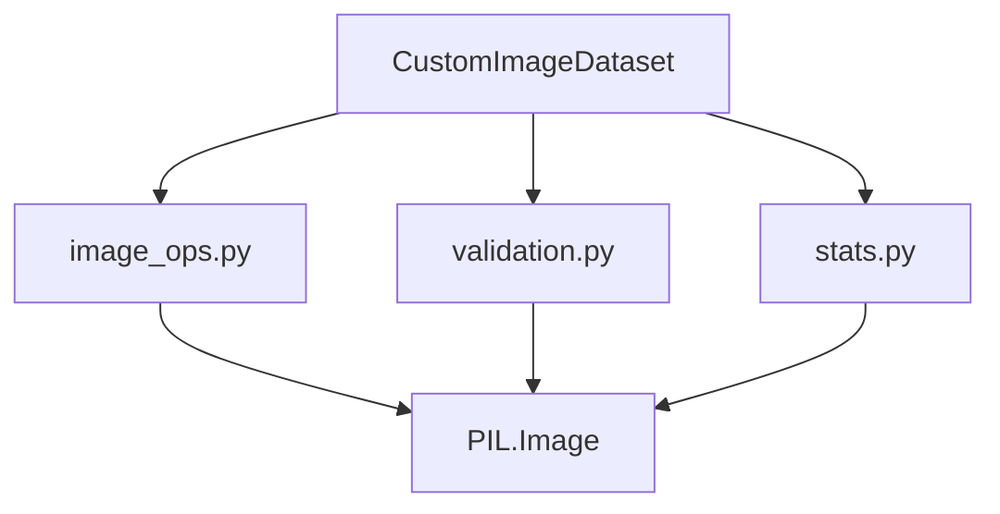

# Custom Image Internals

## Purpose
Provides low-level image operations, dataset statistics, and validation logic for the `CustomImageDataset` entity.

## Problem Solved
Separates the boilerplate of image handling and dataset validation from the PyTorch `Dataset` interface, making the code more modular and testable.

## How It Works
The submodule is divided into three functional areas:
1. **Image Operations**: Handles the actual loading and color mode conversion of image files.
2. **Statistics**: Provides metadata and memory estimation for the dataset.
3. **Validation**: Ensures data integrity by checking file existence and image format validity.

## Key Files
- `image_ops.py:12` - `load_image`: Robust image loading with PIL and error handling.
- `stats.py:13` - `get_class_distribution`: Calculates label frequency.
- `stats.py:90` - `get_memory_usage_estimate`: Heuristic-based memory footprint estimation.
- `validation.py:15` - `validate_inputs`: Constructor parameter validation.
- `validation.py:62` - `validate_image_files`: Verifies physical existence and readability of images.

## Dependencies
- **Requires**: `PIL` (Pillow), `numpy`, `pandas`, `torch`
- **Used by**: `CustomImageDataset`

## Architecture

## Integration Points
- **Upstream**: Called by `CustomImageDataset` during initialization and `__getitem__`.
- **Downstream**: Interacts with the local filesystem to read X-ray images.
