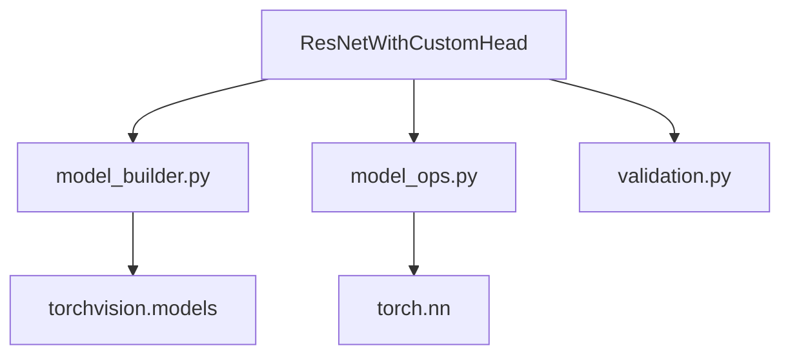

# ResNet Internals

## Purpose
Provides model building, operation, and validation utilities for the `ResNetWithCustomHead` entity.

## Problem Solved
Encapsulates the complexity of PyTorch model manipulation, including backbone modification, custom head construction, and fine-tuning logic.

## How It Works
The submodule is divided into three functional areas:
1. **Model Builder**: Handles the creation of the ResNet50 backbone and the custom classification head.
2. **Model Operations**: Provides utilities for freezing/unfreezing parameters, updating dropout rates, and extracting feature maps via hooks.
3. **Validation**: Validates model hyperparameters like class counts and dropout rates.

## Key Files
- `model_builder.py:10` - `create_backbone`: Loads and strips ResNet50.
- `model_builder.py:46` - `create_classifier_head`: Builds the MLP head.
- `model_builder.py:101` - `configure_fine_tuning`: Manages layer freezing.
- `model_ops.py:10` - `get_model_info`: Aggregates parameter statistics.
- `model_ops.py:116` - `get_feature_maps`: Implements forward hooks for activation extraction.
- `validation.py:6` - `validate_parameters`: Ensures valid hyperparameter ranges.

## Dependencies
- **Requires**: `torch`, `torchvision`
- **Used by**: `ResNetWithCustomHead`

## Architecture

## Integration Points
- **Upstream**: Called by `ResNetWithCustomHead` during initialization and for runtime operations (e.g., Grad-CAM feature extraction).
- **Downstream**: Interacts with `torchvision` to load pretrained weights.
