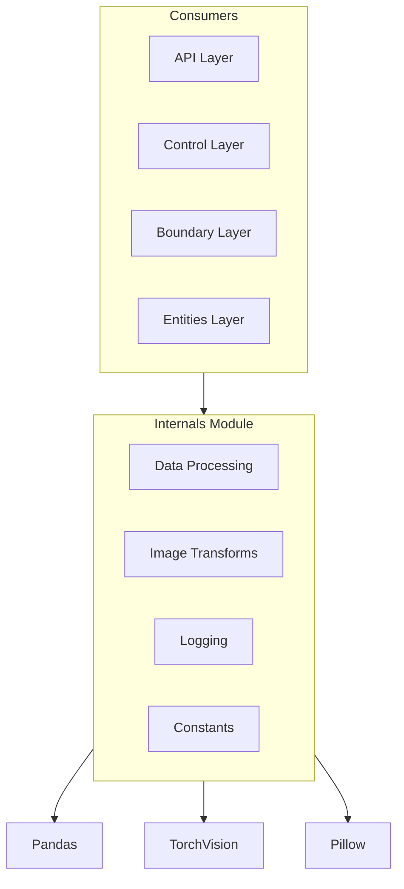
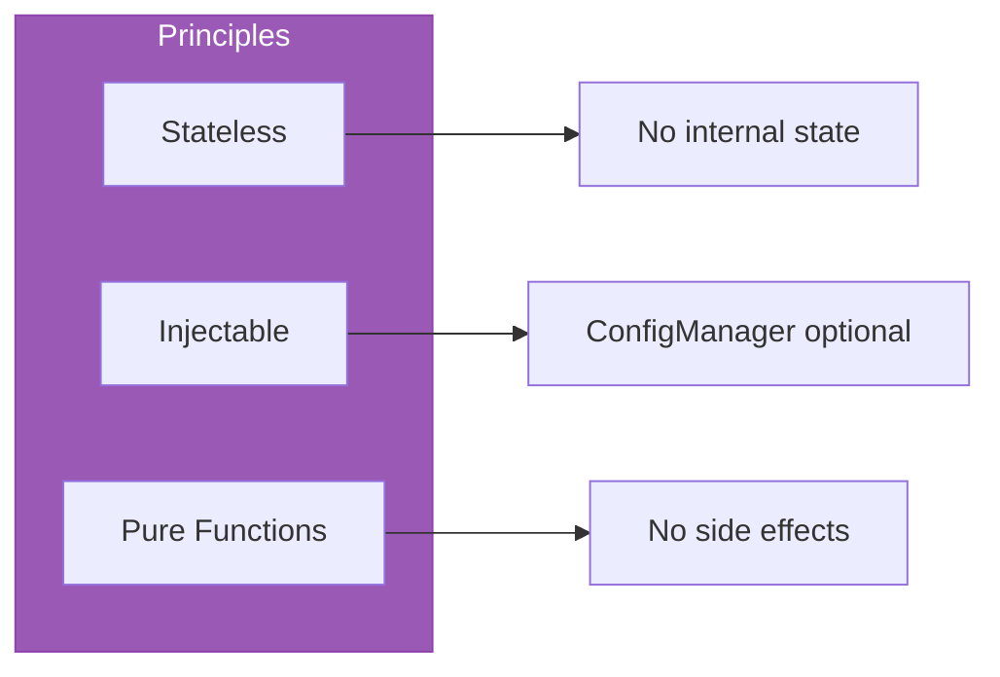

# Internals Module

The `internals/` module contains core utility submodules that provide essential services to both centralized and federated training paths. These utilities ensure consistency in logging, metric tracking, and data preprocessing.

## What It Does



## Module Overview

| Module | Purpose | Key Pattern |
| :--- | :--- | :--- |
| **[constants/](./constants/)** | Metric names and global constants | No magic strings |
| **[loggers/](./loggers/)** | Structured logging & silencing | Third-party silencing |
| **[transforms/](./transforms/)** | Augmentation & X-ray preprocessing | Strategy & Builder patterns |
| **data_processing.py** | Load CSV, stratified splits | Config-driven columns |
| **data_processing_functions.py** | Sampling, validation, stats | Stratified preservation |

## Submodules

### 1. [Constants](./constants/)
Centralized metric names and global constants.
- **Purpose**: Prevents magic strings and ensures consistent metric keys across the project.
- **Key File**: `metric_names.py`

### 2. [Loggers](./loggers/)
Centralized logging configuration.
- **Purpose**: Provides consistent log formatting and silences noisy third-party libraries (LangChain, Uvicorn, etc.).
- **Key File**: `logging_config.py`

### 3. [Transforms](./transforms/)
X-ray image preprocessing and augmentation framework.
- **Purpose**: Provides a modular, strategy-based framework for preparing images for deep learning models.
- **Key Files**: `builder.py`, `strategies.py`, `base.py`

## Usage Across the Project

### Training & Evaluation
The `constants` module is used in `CentralizedTrainer` and `FederatedClient` to log metrics:
```python
from federated_pneumonia_detection.src.internals.constants import VAL_ACCURACY
self.log(VAL_ACCURACY, acc)
```

### Data Loading
The `transforms` module is used by DataModules to create image pipelines:
```python
from federated_pneumonia_detection.src.internals.image_transforms import get_transforms
self.train_transforms = get_transforms(config, is_training=True)
```

### Application Startup
The `loggers` module is initialized at the entry point of the application:
```python
from federated_pneumonia_detection.src.internals.loggers import configure_logging
configure_logging()
```

## Key Files

```
internals/
├── constants/                   # Metric names and global constants
├── loggers/                     # Structured logging
├── transforms/                  # Strategy-based transform framework
├── data_processing.py           # DataProcessor class
├── data_processing_functions.py # Standalone utilities
└── image_transforms.py          # Facade for TransformBuilder + XRayPreprocessor
```

## Design Principles



- **Stateless**: No internal state across calls.
- **Injectable**: All components accept optional config.
- **Pure**: Functions return values, no mutations.
- **Fail-fast**: Validate inputs immediately.
