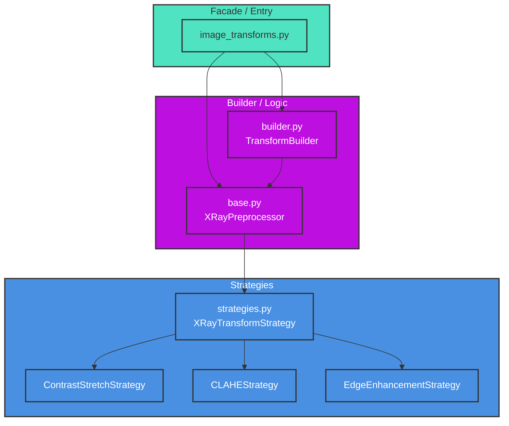

# X-ray Image Transforms Module

## Overview
The `transforms` module provides a modular, strategy-based framework for X-ray image preprocessing and augmentation. It refactors the previously monolithic `image_transforms.py` into a decoupled architecture that separates pipeline construction, preprocessing logic, and specific transformation algorithms.

## Architecture
The module follows a layered approach:
1.  **Facade (`image_transforms.py`)**: Provides a simplified interface for the rest of the application.
2.  **Builder (`builder.py`)**: Orchestrates the creation of complex `torchvision.transforms.Compose` pipelines.
3.  **Preprocessor (`base.py`)**: Manages X-ray specific preprocessing logic and strategy execution.
4.  **Strategies (`strategies.py`)**: Implements individual transformation algorithms using the Strategy Pattern.

### System Connections


## Key Benefits
-   **Decoupling**: Separation of concerns between pipeline orchestration and algorithm implementation.
-   **Strategy Pattern**: New preprocessing techniques can be added by implementing `XRayTransformStrategy` without modifying existing code.
-   **Maintainability**: Smaller, focused files are easier to test and modify.
-   **Configurability**: `TransformBuilder` allows for flexible pipeline generation based on experiment requirements.

## Key Files
- `image_transforms.py:21` - `get_transforms()` entry point (Facade).
- `builder.py:16` - `TransformBuilder` class for pipeline construction.
- `base.py:19` - `XRayPreprocessor` for coordinating preprocessing.
- `strategies.py:12` - `XRayTransformStrategy` base class and implementations.

## Transformation Strategies
The module implements several X-ray specific strategies in `strategies.py`:
- **ContrastStretchStrategy**: Normalizes image intensity based on percentiles (default 5th and 95th).
- **CLAHEStrategy**: Adaptive histogram equalization (requires `cv2`, currently falls back to original image if missing).
- **EdgeEnhancementStrategy**: Uses PIL's `UnsharpMask` to sharpen edges, making lung features more prominent.

## Transform Builder
The `TransformBuilder` in `builder.py` provides methods to create standard pipelines:
- `build_training_transforms()`: Includes random cropping, flipping, rotation, and color jitter.
- `build_validation_transforms()`: Standard resizing and center cropping.
- `build_test_time_augmentation_transforms()`: Generates multiple augmented versions of an image for TTA.
- `create_custom_transform()`: Fully configurable pipeline creation.

## Usage Example
```python
from federated_pneumonia_detection.src.internals.image_transforms import get_transforms

# Get standard training transforms
train_transforms = get_transforms(config, is_training=True)

# Get transforms with custom preprocessing
val_transforms = get_transforms(
    config, 
    is_training=False, 
    use_custom_preprocessing=True,
    edge_enhance=True
)
```
