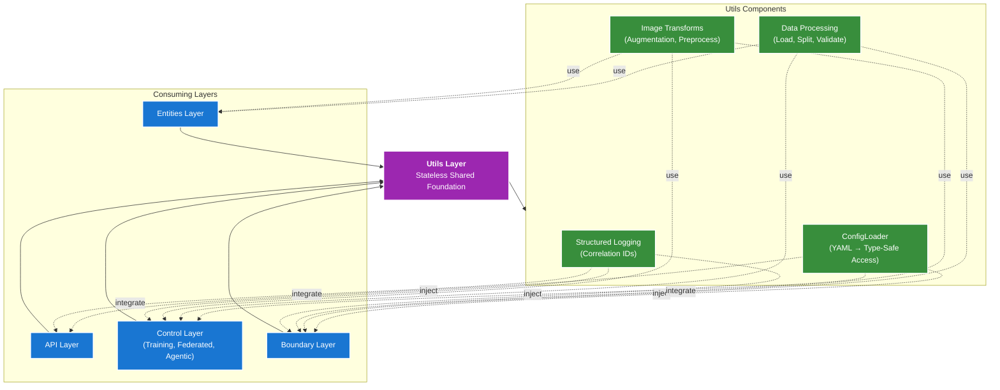

# Utils Layer

**Purpose**: Stateless, reusable utilities providing shared foundation for all layers in the federated pneumonia detection system.

The utils layer provides configuration management, data processing, image transformations, and structured logging—enabling consistent, DRY implementations across the API, Control, Boundary, and Entities layers.

---

## Architecture Overview



---

## Table of Contents

- [Overview](#overview)
- [Core Components](#core-components)
- [Design Principles](#design-principles)
- [Module Breakdown](#module-breakdown)
- [Logging Strategy](#logging-strategy)
- [Error Handling](#error-handling)
- [DI-Friendly Design](#di-friendly-design)
- [Common Patterns](#common-patterns)
- [Integration Examples](#integration-examples)
- [Related Documentation](#related-documentation)

---

## Overview

The Utils layer encapsulates four critical responsibilities:

1. **Configuration Management** - Type-safe access to YAML configuration via dot notation
2. **Data Processing** - Metadata loading, train/validation splitting, statistical analysis
3. **Image Transformations** - Data augmentation pipelines and X-ray preprocessing
4. **Structured Logging** - Correlation ID tracking and consistent log formatting

These components are stateless, pure, and injectable—designed for maximum reusability without coupling consumers to implementation details.

---

## Core Components

### 1. ConfigLoader (config_manager.py)

**Location**: `federated_pneumonia_detection/config/config_manager.py`

**Purpose**: Type-safe, nested access to YAML configuration with mutation tracking and persistence.

**Key Classes & Functions**:

| Item | Purpose |
|------|---------|
| `ConfigManager` | Central configuration interface |
| `ConfigManager.get()` | Retrieve values via dot notation (e.g., 'experiment.learning_rate') |
| `ConfigManager.set()` | Update values with change tracking |
| `ConfigManager.save()` | Persist configuration to YAML file |
| `ConfigManager.reload()` | Discard changes and reload from disk |
| `get_config_manager()` | Factory function for ConfigManager |
| `quick_get()` | Single-call config retrieval |

**Key Features**:
- **Dot notation access**: `config.get('experiment.learning_rate')`
- **Nested mutation**: `config.set('system.validation_split', 0.2)`
- **Default values**: `config.get('key', default=None)`
- **Backup & restore**: Create snapshots before mutations
- **Flattened inspection**: `config.list_keys('section')`

**Configuration Sections Used**:
- `columns.patient_id`, `columns.target`, `columns.filename`
- `system.image_extension`, `system.img_size`, `system.seed`
- `system.validation_split`, `system.sample_fraction`
- `experiment.learning_rate`, `experiment.augmentation_strength`
- `experiment.use_custom_preprocessing`

**Usage Example**:
```python
from federated_pneumonia_detection.config.config_manager import ConfigManager

config = ConfigManager()

# Retrieve value
lr = config.get('experiment.learning_rate')
img_size = config.get('system.img_size', default=224)

# Mutate and save
config.set('experiment.learning_rate', 0.002)
config.save()

# Batch update
config.update({
    'experiment.learning_rate': 0.002,
    'system.validation_split': 0.25
})
config.save()
```

**Dependencies**:
- PyYAML: YAML file I/O
- pathlib: Path resolution
- copy: Deep copy for backup/reset

**Used By**:
- [data_processing.py](data_processing.py): Column names, split ratios
- [image_transforms.py](image_transforms.py): Image size, augmentation strength
- [Control Layer](../control/README.md): Training hyperparameters
- [API Layer](../api/README.md): Feature flags and system settings

---

### 2. Data Processing (data_processing.py)

**Location**: `src/utils/data_processing.py`

**Purpose**: Safe metadata handling and dataset preparation for training pipelines.

**Key Functions**:

| Function | Purpose | Key Features |
|----------|---------|--------------|
| `load_metadata()` | Load CSV metadata with validation | Type checking, path resolution, error handling |
| `sample_dataframe()` | Stratified sampling preserving class distribution | Reproducible via seed |
| `create_train_val_split()` | Stratified train/validation split | Preserves target distribution |
| `load_and_split_data()` | Complete pipeline: load → sample → split | Single entry point for data prep |
| `validate_image_paths()` | Check image directory exists and contains files | Fails fast on missing files |
| `get_image_directory_path()` | Construct full image path | Config-driven path resolution |
| `get_data_statistics()` | Return class counts, sample sizes | Basic dataset analysis |

**Key Features**:
- **Configuration-driven**: All paths and column names via ConfigManager
- **Reproducible**: Seed-controlled randomization
- **Fail-fast**: Immediate validation of inputs and data
- **Stratified splitting**: Preserves class balance in train/val
- **Comprehensive logging**: Every step logged with context

**Configuration Parameters**:
```
columns.patient_id        # Column name for patient identifiers
columns.target            # Column name for diagnosis labels
columns.filename          # Column name for image filenames
system.image_extension    # File extension (e.g., '.png')
system.validation_split   # Train/val ratio (e.g., 0.2 = 20% validation)
system.sample_fraction    # Data sampling ratio for fast iteration
system.seed               # Random seed for reproducibility
```

**Error Handling**:
- `FileNotFoundError`: Missing CSV, image directory, or files
- `ValueError`: Invalid column names, missing data, empty dataframe
- `TypeError`: Incompatible data types
- All errors logged with correlation ID

**Usage Example**:
```python
from federated_pneumonia_detection.src.utils.data_processing import (
    load_metadata,
    create_train_val_split,
    get_data_statistics
)
from federated_pneumonia_detection.config.config_manager import ConfigManager

config = ConfigManager()

# Load and prepare data
metadata_df = load_metadata(
    csv_path='path/to/metadata.csv',
    config=config
)

# Create stratified split
train_df, val_df = create_train_val_split(
    df=metadata_df,
    config=config,
    val_split=0.2,
    seed=42
)

# Get dataset statistics
stats = get_data_statistics(metadata_df)
print(f"Total samples: {stats['total_samples']}")
print(f"Class distribution: {stats['class_distribution']}")
```

**Used By**:
- [xray_data_module.py](../control/dl_model/utils/model/xray_data_module.py): DataModule initialization
- [centralized_trainer.py](../control/dl_model/centralized_trainer.py): Training data preparation
- [client_app.py](../control/federated_new_version/core/client_app.py): Federated client data loading

---

### 3. Image Transforms (image_transforms.py)

**Location**: `src/utils/image_transforms.py`

**Purpose**: Configurable augmentation pipelines and X-ray specific preprocessing.

#### Custom Preprocessing (`XRayPreprocessor` class)

**Methods**:

| Method | Purpose | Parameters |
|--------|---------|-----------|
| `contrast_stretch_percentile()` | Enhance contrast using percentile-based stretching | `image`, `lower_percentile`, `upper_percentile` |
| `adaptive_histogram_equalization()` | Apply CLAHE for local contrast improvement | `image`, `clip_limit`, `kernel_size` |
| `edge_enhancement()` | Highlight lung boundaries using Sobel edge detection | `image`, `strength` |

**Features**:
- **Robust preprocessing**: Percentile-based stretching handles outliers
- **Local contrast**: CLAHE improves visibility of pneumonia indicators
- **Edge emphasis**: Sobel filtering highlights subtle structures
- **Graceful degradation**: Falls back to identity if cv2 unavailable

**Usage Example**:
```python
from federated_pneumonia_detection.src.utils.image_transforms import XRayPreprocessor
from PIL import Image

preprocessor = XRayPreprocessor()
pil_image = Image.open('xray.png')

# Apply custom preprocessing
enhanced = preprocessor.contrast_stretch_percentile(
    image=pil_image,
    lower_percentile=2,
    upper_percentile=98
)

# Stack multiple enhancements
enhanced = preprocessor.adaptive_histogram_equalization(
    image=enhanced,
    clip_limit=2.0,
    kernel_size=8
)
```

#### Transform Builder (`TransformBuilder` class)

**Methods**:

| Method | Purpose | Usage |
|--------|---------|-------|
| `build_training_transforms()` | Create augmented transform pipeline | Use during training epochs |
| `build_validation_transforms()` | Create deterministic transform pipeline | Use for validation/test |
| `build_test_time_augmentation_transforms()` | Create multiple augmented versions for ensemble | Use for TTA predictions |

**Transform Composition**:

**Training Pipeline**:
- RandomRotation (±15°)
- RandomHorizontalFlip (50%)
- ColorJitter (brightness, contrast, saturation)
- RandomAffine (shear, scale)
- Resize & CenterCrop
- Normalize (ImageNet or custom)

**Validation Pipeline**:
- Deterministic Resize
- CenterCrop
- Normalize (ImageNet or custom)

**TTA Pipeline**:
- Multiple augmented versions (5-10 transforms)
- Ensemble predictions from all versions

**Configuration Parameters**:
```
system.img_size                    # Target image size (224, 256, etc.)
experiment.augmentation_strength   # Scaling factor for augmentation intensity
system.use_imagenet_norm          # Use ImageNet normalization
experiment.use_custom_preprocessing # Enable X-ray specific preprocessing
experiment.contrast_stretch       # Enable percentile contrast stretching
experiment.adaptive_histogram      # Enable CLAHE preprocessing
experiment.edge_enhancement        # Enable edge emphasis
```

**Convenience Functions**:

| Function | Purpose |
|----------|---------|
| `get_transforms()` | Get pipeline by mode: 'train', 'val', 'test' |
| `create_preprocessing_function()` | Create standalone preprocessing callable |

**Usage Example**:
```python
from federated_pneumonia_detection.src.utils.image_transforms import (
    TransformBuilder,
    get_transforms
)
from federated_pneumonia_detection.config.config_manager import ConfigManager

config = ConfigManager()

# Create builder
builder = TransformBuilder(config=config)

# Get training transforms
train_transforms = builder.build_training_transforms(
    enable_augmentation=True,
    augmentation_strength=0.5
)

# Apply to image
from PIL import Image
img = Image.open('xray.png')
augmented = train_transforms(img)

# Convenience: Get by mode
val_transforms = get_transforms(mode='val', config=config)
```

**Dependencies**:
- torchvision.transforms: Standard augmentation pipelines
- PIL/Pillow: Image operations
- numpy: Array operations
- opencv-python (optional): CLAHE preprocessing

**Used By**:
- [xray_data_module.py](../control/dl_model/utils/model/xray_data_module.py): DataModule transform attachment
- [custom_image_dataset.py](../entities/custom_image_dataset.py): Per-image transform application
- [API inference endpoints](../api/README.md): Image preprocessing before prediction

---

### 4. Structured Logging (loggers/)

**Location**: `src/utils/loggers/`

**Purpose**: Centralized, correlation-aware logging across all layers.

**Core Module**: `loggers/logger.py`

**Key Functions**:

| Function | Purpose |
|----------|---------|
| `get_logger()` | Get or create named logger |
| `setup_logger()` | Configure logger with format and handlers |
| `get_correlation_id()` | Retrieve current request's correlation ID |
| `set_correlation_id()` | Set correlation ID for request tracking |

**Log Format**:
```
%(asctime)s - %(name)s - %(levelname)s - [%(correlation_id)s] - %(message)s
```

**Log Levels**:
- **DEBUG**: Internal state, variable values
- **INFO**: Operation start/completion, statistics
- **WARNING**: Recoverable issues, deprecated usage
- **ERROR**: Exceptions, failed operations (with stack trace)
- **CRITICAL**: System failures

**Additional Loggers**:

| Module | Purpose |
|--------|---------|
| `progress_logger.py` | Training epoch/step progress |
| `websocket_logger.py` | WebSocket connection events |
| `websocket_progress_logger.py` | Combined WebSocket + training progress |

**Correlation ID Tracking**:
- Request enters system → generate/receive correlation ID
- All logs within request tagged with correlation ID
- Enables end-to-end tracing across layers
- Useful for debugging concurrent requests

**Usage Example**:
```python
from federated_pneumonia_detection.src.utils.loggers.logger import (
    get_logger,
    set_correlation_id,
    get_correlation_id
)
import uuid

logger = get_logger(__name__)

# Set correlation ID for request
request_id = str(uuid.uuid4())
set_correlation_id(request_id)

logger.info("Processing request")
logger.debug(f"Loaded {count} samples")

# Later in different module
current_id = get_correlation_id()
logger.info(f"Continuing request {current_id}")
```

**Used By**:
- [API Layer](../api/README.md): Request tracking
- [Control Layer](../control/README.md): Training progress
- [Data Processing](data_processing.py): Load/split operations
- [Image Transforms](image_transforms.py): Preprocessing operations

---

## Design Principles

### 1. Statelessness
- No internal state across calls
- Pure functions where possible
- Side effects isolated and explicit

### 2. Configuration Injection
All components accept optional `ConfigManager`:
```python
data_processor = load_metadata(csv_path, config=config)
transforms = TransformBuilder(config=config)
logger = get_logger(__name__)  # Global config for logging setup
```

### 3. No Business Logic
Utils layer contains only:
- Data loading/transformation
- Formatting and serialization
- Cross-cutting concerns (logging, config)

No domain logic, no model instantiation, no learning rate scheduling.

### 4. Fail-Fast Validation
- Validate inputs immediately on entry
- Specific exception types with context
- No silent failures or defaults

### 5. DRY Across All Layers
Prevent duplication by centralizing:
- Metadata loading (used by training, inference, API)
- Image augmentation (used by training, clients, API)
- Logging setup (used everywhere)
- Configuration access (centralized source of truth)

---

## Logging Strategy

### Correlation ID Flow

```
API Request
  ├─ set_correlation_id(uuid)
  ├─ Control Layer
  │   ├─ log.info("Training started") [with correlation_id]
  │   ├─ Data Processing
  │   │   ├─ log.info("Loading metadata") [with correlation_id]
  │   │   └─ log.info("Loaded X samples") [with correlation_id]
  │   └─ log.info("Training completed") [with correlation_id]
  └─ Return Response
```

### Log Levels in Context

| Layer | Use Case | Example |
|-------|----------|---------|
| DEBUG | Internal computation | `log.debug(f"Image shape: {img.shape}")` |
| INFO | Operation start/end | `log.info("Train/val split complete")` |
| WARNING | Recoverable issues | `log.warning("Class imbalance detected")` |
| ERROR | Exceptions caught | `log.error(f"Failed to load: {path}", exc_info=True)` |
| CRITICAL | System failure | `log.critical("Config file not found")` |

---

## Error Handling

### Exception Hierarchy

**Data Processing**:
```python
try:
    df = load_metadata(csv_path, config)
except FileNotFoundError as e:
    logger.error(f"Metadata file not found: {csv_path}", exc_info=True)
    raise
except ValueError as e:
    logger.error(f"Invalid metadata: {str(e)}", exc_info=True)
    raise
```

**Image Transforms**:
```python
try:
    transforms = builder.build_training_transforms()
except (ImportError, ValueError) as e:
    logger.error(f"Transform pipeline failed: {str(e)}", exc_info=True)
    # Fallback to basic transforms
    transforms = get_transforms(mode='val', config=config)
```

**Configuration**:
```python
try:
    value = config.get('experiment.learning_rate')
except KeyError as e:
    logger.error(f"Missing config key: {str(e)}")
    # Use provided default or raise
    value = config.get('experiment.learning_rate', default=0.001)
```

### Principles

1. **Specific exceptions**: `FileNotFoundError`, `ValueError`, `KeyError`—not generic `Exception`
2. **Context in logs**: Include affected paths, keys, values
3. **Stack traces**: Use `exc_info=True` for unexpected exceptions
4. **Graceful degradation**: Fall back to defaults when safe
5. **Fast failure**: Validate on entry, fail immediately if invalid

---

## DI-Friendly Design

### Constructor Injection Pattern

**Bad** (couples to ConfigManager):
```python
class DataProcessor:
    def __init__(self):
        self.config = ConfigManager()  # Hard dependency
```

**Good** (injectable):
```python
class DataProcessor:
    def __init__(self, config: ConfigManager = None):
        self.config = config or ConfigManager()  # Optional dependency
```

**Best** (dependency protocol):
```python
class DataProcessor:
    def __init__(self, config_provider: Callable[[], ConfigManager]):
        self.config = config_provider()  # Factory injection
```

### Usage in Consumers

```python
from federated_pneumonia_detection.config.config_manager import ConfigManager
from federated_pneumonia_detection.src.utils.data_processing import load_metadata

# Create dependencies once
config = ConfigManager()

# Pass to data processor
train_df = load_metadata('path/to/data.csv', config=config)

# Pass to image transforms
transforms = TransformBuilder(config=config)
```

---

## Common Patterns

### 1. Configuration-Driven Behavior

Pattern: Define behavior in config, implement in utils.

```python
# In default_config.yaml
experiment:
  use_custom_preprocessing: true
  contrast_stretch: true
  adaptive_histogram: false

# In image_transforms.py
if config.get('experiment.use_custom_preprocessing'):
    img = preprocessor.contrast_stretch_percentile(img)
    if config.get('experiment.adaptive_histogram'):
        img = preprocessor.adaptive_histogram_equalization(img)
```

### 2. Stratified Data Operations

Pattern: Preserve class distribution in splits and samples.

```python
# All operations preserve target distribution
train_df, val_df = create_train_val_split(
    df=metadata_df,
    val_split=0.2,
    target_col='diagnosis'  # Stratify by this column
)

sampled_df = sample_dataframe(
    df=metadata_df,
    fraction=0.5,
    target_col='diagnosis'  # Preserve distribution
)
```

### 3. Correlation ID Threading

Pattern: Pass correlation ID through call stack for tracing.

```python
# In API endpoint
correlation_id = str(uuid.uuid4())
set_correlation_id(correlation_id)

# In data loading (different module)
logger.info("Loading data")  # Automatically tagged with correlation_id

# In image processing (yet another module)
logger.debug("Transforming images")  # Same correlation_id
```

### 4. Config-Driven Imports

Pattern: Conditionally use optional dependencies.

```python
try:
    import cv2
    use_cv2 = True
except ImportError:
    use_cv2 = False

# Later
if use_cv2 and config.get('experiment.adaptive_histogram'):
    img = preprocessor.adaptive_histogram_equalization(img)
else:
    img = preprocessor.contrast_stretch_percentile(img)
```

---

## Integration Examples

### Complete Data Preparation Pipeline

```python
from federated_pneumonia_detection.config.config_manager import ConfigManager
from federated_pneumonia_detection.src.utils.data_processing import (
    load_metadata,
    create_train_val_split,
    get_data_statistics
)
from federated_pneumonia_detection.src.utils.loggers.logger import get_logger

logger = get_logger(__name__)
config = ConfigManager()

# Load metadata
logger.info("Loading metadata")
df = load_metadata('path/to/metadata.csv', config=config)

# Print statistics
stats = get_data_statistics(df)
logger.info(f"Total samples: {stats['total_samples']}")

# Create stratified split
train_df, val_df = create_train_val_split(
    df=df,
    config=config,
    val_split=0.2,
    seed=42
)
logger.info(f"Train: {len(train_df)}, Val: {len(val_df)}")
```

### Transform Pipeline for Training

```python
from federated_pneumonia_detection.src.utils.image_transforms import TransformBuilder
from federated_pneumonia_detection.src.entities.custom_image_dataset import CustomImageDataset

config = ConfigManager()
builder = TransformBuilder(config=config)

# Create transforms
train_transforms = builder.build_training_transforms(
    enable_augmentation=True,
    augmentation_strength=config.get('experiment.augmentation_strength')
)

# Use in dataset
train_dataset = CustomImageDataset(
    dataframe=train_df,
    transform=train_transforms,
    config=config
)
```

### Federated Client Data Loading

```python
from federated_pneumonia_detection.src.utils.data_processing import (
    load_metadata,
    create_train_val_split
)
from federated_pneumonia_detection.config.config_manager import ConfigManager

config = ConfigManager()

# Load client's partition
df = load_metadata('path/to/partition.csv', config=config)

# Split locally
train_df, val_df = create_train_val_split(
    df=df,
    config=config,
    val_split=0.2
)

# Transforms applied per image
for img_path in train_df['filename']:
    # load_metadata provides paths relative to config
```

---

## Module Dependencies

### Internal Dependencies (Utils → Utils)
- `data_processing.py` → `loggers/logger.py`
- `image_transforms.py` → `loggers/logger.py`
- Config utilities (`config/utils.py`) → `loggers/logger.py`

### External Dependencies (Utils ← Other Layers)
- **Entities Layer**: Uses data_processing, image_transforms
- **Boundary Layer**: Uses data_processing, image_transforms, logging
- **Control Layer**: Uses all four components
- **API Layer**: Uses all four components

### Third-Party Dependencies
| Package | Usage | Optional |
|---------|-------|----------|
| `pandas` | DataFrame operations | Required |
| `Pillow` | Image loading/manipulation | Required |
| `torchvision` | Standard transforms | Required |
| `numpy` | Array operations | Required |
| `PyYAML` | Config file I/O | Required |
| `opencv-python` | CLAHE preprocessing | Optional |
| `scikit-learn` | train_test_split | Required |

---

## Related Documentation

- **Entities Layer**: [entities/README.md](../entities/README.md) - Data structures using utils
- **Control Layer**: [control/README.md](../control/README.md) - Training pipelines using utils
- **Boundary Layer**: [boundary/README.md](../boundary/README.md) - Orchestration layer
- **API Layer**: [api/README.md](../api/README.md) - HTTP endpoints using utils
- **Configuration**: [config/README.md](../../config/README.md) - ConfigManager details
