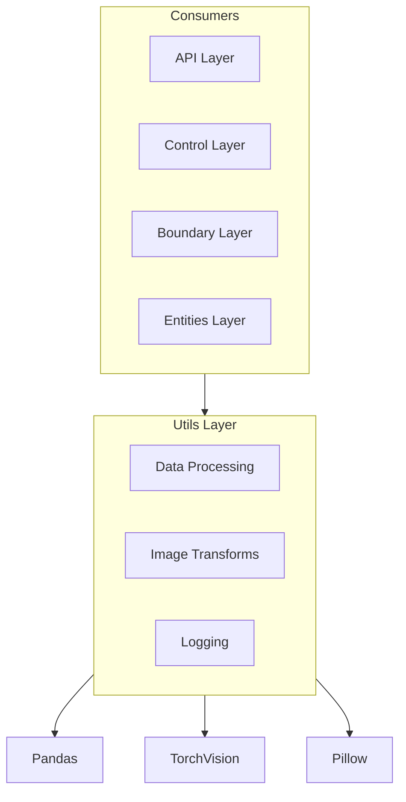
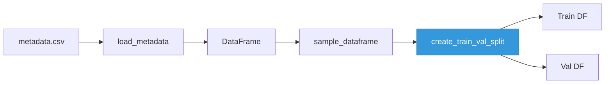
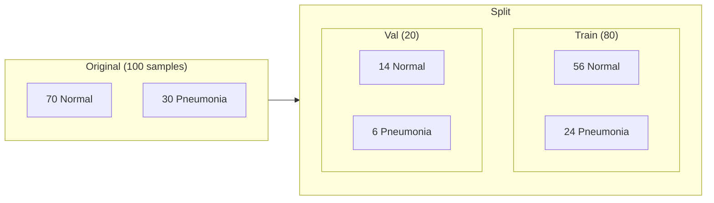
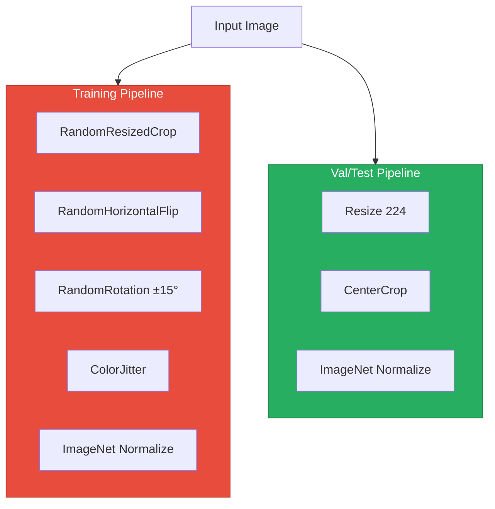
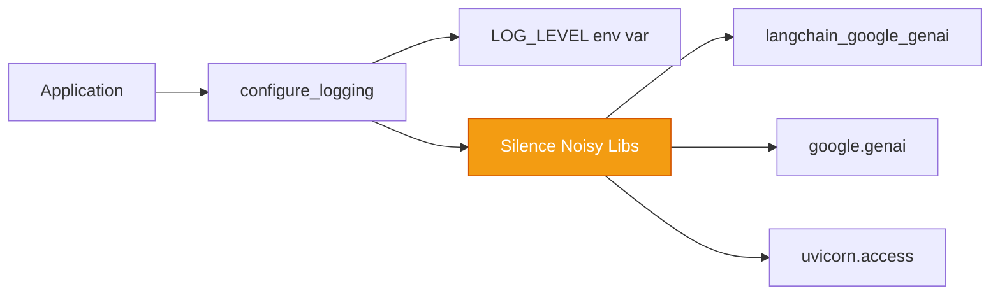
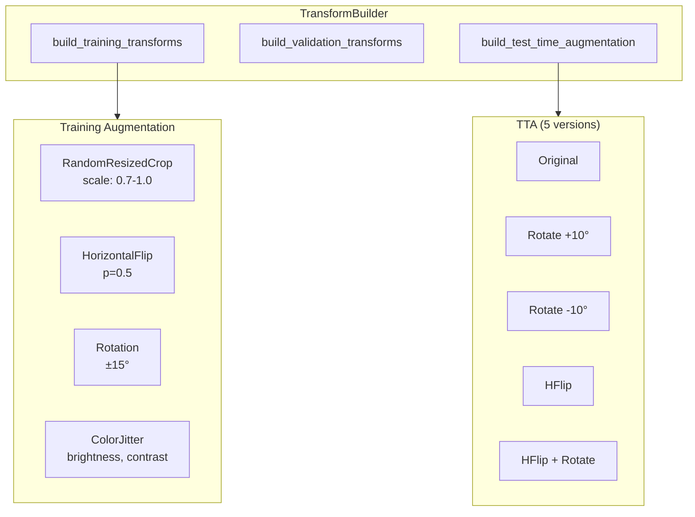
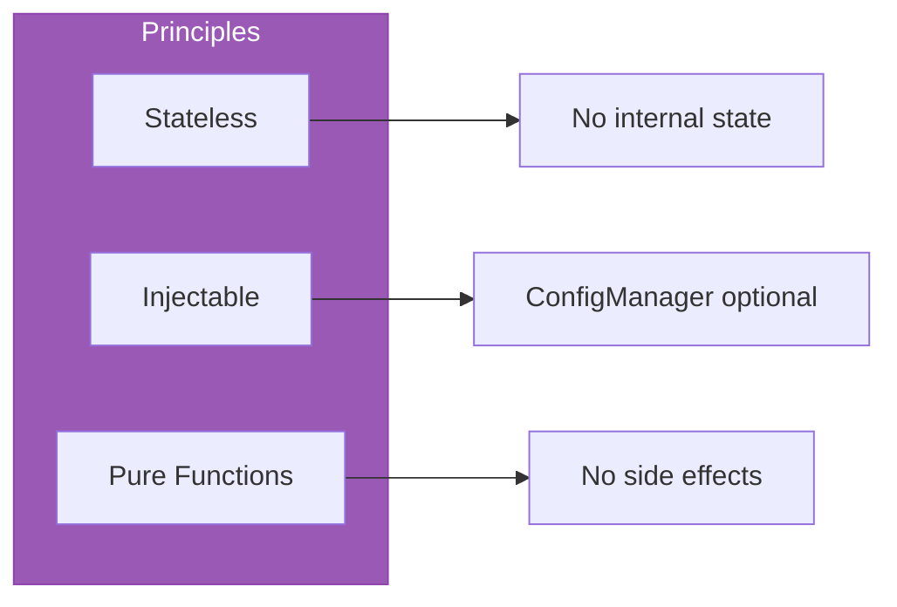

# Utils Layer

Shared utilities for data processing, image transforms, and logging across all layers.

## What It Does



## Module Overview

| Module | Purpose | Key Pattern |
|--------|---------|-------------|
| **data_processing.py** | Load CSV, stratified splits | Config-driven columns |
| **data_processing_functions.py** | Sampling, validation, stats | Stratified preservation |
| **image_transforms.py** | Augmentation pipelines | Builder pattern |
| **loggers/** | Structured logging | Third-party silencing |

## Data Processing

Two-file architecture: `DataProcessor` class orchestrates, functions provide utilities.



**Key Functions:**
| Function | Purpose |
|----------|---------|
| `load_metadata()` | CSV → DataFrame with filename column |
| `sample_dataframe()` | Stratified sampling (preserves class dist) |
| `create_train_val_split()` | 80/20 stratified split via sklearn |
| `validate_image_paths()` | Check directory + file existence |
| `get_data_statistics()` | Class counts, balance ratio |

**Stratified Split:**


## Image Transforms

Configurable augmentation with X-ray specific preprocessing:



**Augmentation Strength:**
- `strength=0.0` → No augmentation
- `strength=1.0` → Moderate (default)
- `strength=2.0` → Aggressive

**X-Ray Preprocessing (Optional):**
| Method | Purpose |
|--------|---------|
| `contrast_stretch_percentile()` | 5-95th percentile normalization |
| `edge_enhancement()` | UnsharpMask for lung boundaries |
| `adaptive_histogram()` | CLAHE (requires cv2) |

**Normalization:**
- ImageNet: mean=[0.485, 0.456, 0.406], std=[0.229, 0.224, 0.225]
- Alternative: [-1, 1] range

## Logging

Simple wrapper with third-party silencing:



**Configuration:**
| Setting | Value |
|---------|-------|
| Default level | INFO |
| Format | `LEVEL - MESSAGE - FILENAME - LINENO` |
| Third-party level | WARNING (silenced) |
| Handlers | Console only |

**Usage:**
```python
from utils.loggers import get_logger
logger = get_logger(__name__)
logger.info("Processing started")
```

## Transform Pipeline Detail



## Key Files

```
utils/
├── data_processing.py           # DataProcessor class
├── data_processing_functions.py # Standalone utilities
├── image_transforms.py          # TransformBuilder + XRayPreprocessor
└── loggers/
    ├── logger.py                # get_logger() wrapper
    └── logging_config.py        # configure_logging() + silencing
```

## Design Principles



- **Stateless**: No internal state across calls
- **Injectable**: All components accept optional config
- **Pure**: Functions return values, no mutations
- **Fail-fast**: Validate inputs immediately

## Quick Reference

| Action | Function |
|--------|----------|
| Load CSV metadata | `load_metadata(path, config)` |
| Stratified split | `create_train_val_split(df, val_split=0.2)` |
| Sample preserving class dist | `sample_dataframe(df, frac=0.5)` |
| Get class counts | `get_data_statistics(df)` |
| Training transforms | `TransformBuilder(config).build_training_transforms()` |
| Validation transforms | `TransformBuilder(config).build_validation_transforms()` |
| Quick transform access | `get_transforms(mode='train', config=config)` |
| Get logger | `get_logger(__name__)` |
| Configure logging | `configure_logging()` |
