# Utils Module

**Purpose**: Shared utility functions and helpers for data processing, image transformations, and logging across the entire system.

This module provides reusable components for data preparation, image preprocessing, and structured logging that are used throughout both centralized and federated learning pipelines.

## Table of Contents
- [Overview](#overview)
- [Core Components](#core-components)
- [Data Processing Pipeline](#data-processing-pipeline)
- [Image Transformations](#image-transformations)
- [Logging Infrastructure](#logging-infrastructure)
- [Module Dependencies](#module-dependencies)

---

## Overview

The utils module is organized into three main functional areas:

1. **Data Processing** - CSV loading, train/val splitting, dataset statistics
2. **Image Transformations** - Augmentation pipelines, X-ray preprocessing
3. **Logging** - Structured logging setup with correlation IDs

These utilities support the principle of **DRY** (Don't Repeat Yourself) by centralizing common operations used across the control, boundary, and API layers.

---

## Core Components

### 1. Data Processing (`data_processing.py`)

**File**: [data_processing.py](data_processing.py)

**Purpose**: Essential metadata handling and dataset preparation utilities.

**Key Functions**:

| Function | Purpose | Reference |
|----------|---------|-----------|
| `load_metadata()` | Load and prepare CSV metadata file with validation | lines 20-54 |
| `sample_dataframe()` | Sample DataFrame while preserving class distribution | lines 57-90 |
| `create_train_val_split()` | Split data into train/validation with stratification | lines 93-130 |
| `load_and_split_data()` | Complete pipeline: load → sample → split | lines 133-170 |
| `validate_image_paths()` | Verify image directory exists and contains files | lines 173-200 |
| `get_image_directory_path()` | Construct full path to image directory | lines 203-220 |
| `get_data_statistics()` | Return basic statistics about DataFrame | lines 223-250 |

**Key Features**:
- **Configuration-driven**: Uses ConfigManager for column names and paths
- **Error Handling**: Comprehensive validation with detailed error messages
- **Backward Compatibility**: Supports legacy SystemConstants (deprecated)
- **Logging**: Structured logging at each step

**Configuration Parameters Used**:
- `columns.patient_id`: Patient ID column name (line 71)
- `columns.target`: Target label column name (line 72)
- `columns.filename`: Filename column name (line 73)
- `system.image_extension`: Image file extension (line 74)
- `system.validation_split`: Train/val split ratio (used in split function)
- `system.sample_fraction`: Data sampling ratio (used in sample function)
- `system.seed`: Random seed for reproducibility (used in split function)

**Usage Examples**:
```python
# Load metadata from CSV
df = load_metadata("path/to/metadata.csv")

# Split into train/validation
train_df, val_df = create_train_val_split(df, val_split=0.2, seed=42)

# Get statistics
stats = get_data_statistics(df)
```

**Integration Points**:
- [xray_data_module.py](../control/dl_model/utils/model/xray_data_module.py): Loads and prepares metadata for DataModule
- [centralized_trainer.py](../control/dl_model/centralized_trainer.py): Prepares data for training
- [client_app.py](../control/federated_new_version/core/client_app.py): Loads partition data on clients

---

### 2. Image Transformations (`image_transforms.py`)

**File**: [image_transforms.py](image_transforms.py)

**Purpose**: Configurable transformation pipelines and X-ray specific preprocessing utilities.

#### Custom Preprocessing (`XRayPreprocessor` class)

**Methods**:

| Method | Purpose | Reference |
|--------|---------|-----------|
| `contrast_stretch_percentile()` | Enhance contrast using percentile-based stretching | lines 34-66 |
| `adaptive_histogram_equalization()` | Apply CLAHE for better visibility | lines 68-120 |
| `edge_enhancement()` | Apply edge detection to highlight lung structures | lines 122-160 |

**Features**:
- **Percentile-based contrast**: Robust to outliers
- **CLAHE (Adaptive Histogram Equalization)**: Improves local contrast
- **Edge enhancement**: Highlights subtle pneumonia indicators
- **Fallback behavior**: Graceful degradation if cv2 unavailable

#### Transform Builder (`TransformBuilder` class)

**Methods**:

| Method | Purpose | Reference |
|--------|---------|-----------|
| `build_training_transforms()` | Create transform pipeline with data augmentation | lines 219-280 |
| `build_validation_transforms()` | Create transform pipeline for validation/test | lines 282-330 |
| `build_test_time_augmentation_transforms()` | Create multiple TTA pipelines | lines 332-380 |

**Transform Components**:
- **Training**: RandomRotation, RandomHorizontalFlip, ColorJitter, RandomAffine, Normalize
- **Validation**: Resize, CenterCrop, Normalize (deterministic)
- **TTA**: Multiple augmented versions for ensemble predictions

**Configuration Parameters Used**:
- `system.img_size`: Target image dimensions (line 240)
- `experiment.augmentation_strength`: Augmentation intensity scaling (line 245)
- `system.use_imagenet_norm`: Use ImageNet normalization (line 265)
- `experiment.use_custom_preprocessing`: Enable custom preprocessing (line 250)
- `experiment.contrast_stretch`, `adaptive_histogram`, `edge_enhancement`: Custom preprocessing flags

**Convenience Functions**:

| Function | Purpose |
|----------|---------|
| `get_transforms()` | Get transform pipeline by mode (train/val/test) |
| `create_preprocessing_function()` | Create standalone preprocessing function |

---

### 3. Logging Infrastructure (`loggers/` directory)

**File**: [loggers/logger.py](loggers/logger.py)

**Purpose**: Centralized logging setup with structured formatting.

**Key Functions**:

| Function | Purpose |
|----------|---------|
| `get_logger()` | Get or create logger by name |
| `setup_logger()` | Configure logger with formatting and handlers |

**Logging Format**:
```
%(asctime)s - %(name)s - %(levelname)s - %(message)s
```

**Additional Loggers**:
- `progress_logger.py`: Training progress logging
- `websocket_logger.py`: WebSocket event logging
- `websocket_progress_logger.py`: Combined WebSocket + progress logging

**Usage**:
```python
from federated_pneumonia_detection.src.utils.loggers.logger import get_logger

logger = get_logger(__name__)
logger.info("Processing started")
logger.error(f"Error occurred: {exception}")
```

---

## Data Processing Pipeline

```mermaid
graph LR
    Raw["📄 Metadata CSV"]
    Img["🖼️ Images"]
    
    subgraph Loading
        DF["DataFrame"]
        Split["Train/Val Split"]
    end
    
    subgraph Processing
        Load["PIL Image"]
        Aug["Augmentation<br/>(Rotate/Flip)"]
        Norm["Normalization"]
    end
    
    subgraph ModelReady
        Tensor["Tensor"]
        Batch["Batch (DataLoader)"]
    end

    Raw --> DF --> Split
    Split -->|File Path| Load
    Img --> Load
    
    Load --> Aug --> Norm --> Tensor
    Tensor --> Batch

    %% Styling
    classDef source fill:#6200EA,stroke:#fff,stroke-width:2px,color:#fff;
    classDef process fill:#0091EA,stroke:#fff,stroke-width:2px,color:#fff;
    classDef ready fill:#00C853,stroke:#fff,stroke-width:2px,color:#fff;
    
    class Raw,Img source;
    class DF,Split,Load,Aug,Norm process;
    class Tensor,Batch ready;
```



---

## Usage Examples

### 1. Loading and Splitting Data
```python
from federated_pneumonia_detection.src.utils.data_processing import load_metadata, create_train_val_split

# Load metadata
df = load_metadata("path/to/metadata.csv")

# Create stratified split
train_df, val_df = create_train_val_split(
    df, 
    val_split=0.2, 
    target_col="Target", 
    seed=42
)
```

### 2. Image Transformations
```python
from federated_pneumonia_detection.src.utils.image_transforms import TransformBuilder

builder = TransformBuilder(config)

# Create training pipeline with augmentation
train_transforms = builder.build_training_transforms(
    enable_augmentation=True,
    augmentation_strength=0.5
)

# Apply to image
transformed_image = train_transforms(pil_image)
```

---

## Core Components

### Internal Dependencies
- **utils/loggers/**: Logging infrastructure
- **entities/**: Domain models (CustomImageDataset)
- **config/**: Configuration management (ConfigManager)

### External Dependencies
- **pandas**: DataFrame operations
- **PIL/Pillow**: Image loading and manipulation
- **torchvision**: Standard image transformations (Normalize, Resize, etc.)
- **numpy**: Array operations
- **opencv-python** (optional): CLAHE preprocessing
- **scikit-learn**: train_test_split function

### External Usage
- [xray_data_module.py](../control/dl_model/utils/model/xray_data_module.py): Data module creation
- [centralized_trainer.py](../control/dl_model/centralized_trainer.py): Trainer setup
- [client_app.py](../control/federated_new_version/core/client_app.py): Client data preparation
- [custom_image_dataset.py](../entities/custom_image_dataset.py): Transform application

---

## Key Design Patterns

### Configuration Injection
All components accept optional `ConfigManager` for flexible parameter management:
```python
dataset = CustomImageDataset(dataframe=df, config=config_manager)
transforms = TransformBuilder(config=config_manager)
```

### Error Handling
Defensive programming with specific exception types:
- `FileNotFoundError`: Missing files
- `ValueError`: Invalid data or parameters
- Graceful degradation (e.g., cv2 availability check)

### Separation of Concerns
- **Data Processing**: Metadata and splitting logic
- **Image Transforms**: Augmentation and preprocessing
- **Logging**: Structured logging setup

### DRY Principle
Centralized utilities prevent duplication across:
- Centralized training
- Federated learning clients
- API data preparation

---

## Related Documentation

- **Data Loading**: See [entities/README.md](../entities/README.md) for CustomImageDataset
- **Model Training**: See [control/dl_model/utils/README.md](../control/dl_model/utils/README.md)
- **Configuration**: See [config/README.md](../../config/README.md)
- **Data Flow**: See [README.md](../../README.md) for system-wide flow
