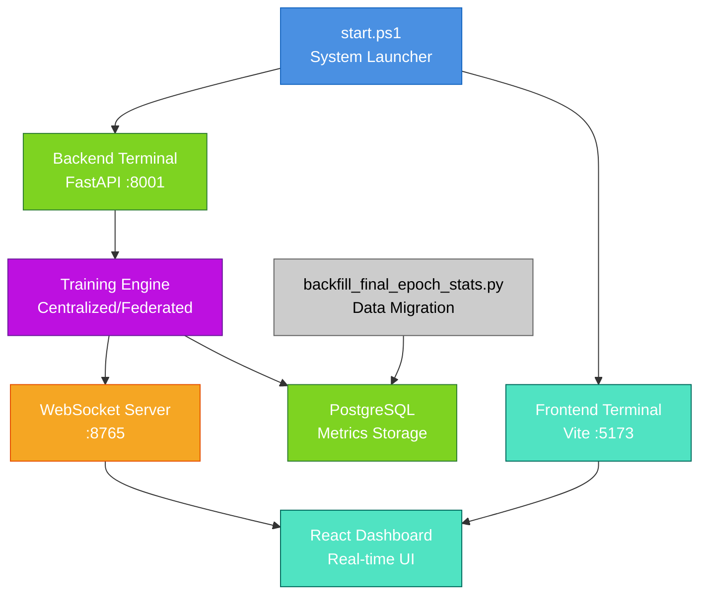
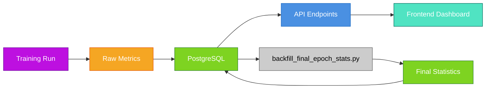

# Scripts & Orchestration Documentation

**Date**: 2026-01-24  
**Agent**: sub-Apollo (Documentation Specialist)

## Overview

This directory contains orchestration scripts and utilities for launching and managing the Federated Pneumonia Detection system. These scripts coordinate the startup of backend services, frontend dashboard, and supporting infrastructure.

---

## 🚀 Quick Start

### Launch Full System
```powershell
# From project root
.\scripts\start.ps1
```
This launches:
- **Backend**: FastAPI server on `http://127.0.0.1:8001`
- **Frontend**: Vite dev server on `http://localhost:5173`

### Manual Launch
```powershell
# Backend (from project root)
uv run uvicorn federated_pneumonia_detection.src.api.main:app --reload --host 127.0.0.1 --port 8001

# Frontend (from frontend directory)
cd xray-vision-ai-forge
npm run dev

# WebSocket server (optional, for real-time metrics)
python scripts/websocket_server.py
```

---

## 📁 Script Descriptions

### `start.ps1` - System Launcher
**Purpose**: One-click launch of the complete development stack

**What it does**:
- Opens separate PowerShell terminals for backend and frontend
- Configures proper working directories
- Sets up environment variables
- Displays access URLs

**Key Features**:
- **Lines 14-16**: Backend startup with uvicorn
- **Lines 19-21**: Frontend startup with npm dev server
- **Lines 26-27**: URL display for easy access

**Usage**:
```powershell
.\scripts\start.ps1
```

### `websocket_server.py` - Real-time Metrics Relay
**Purpose**: Broadcast training metrics from backend to frontend clients

**What it does**:
- Listens for metric messages from training backend
- Broadcasts to all connected frontend clients
- Handles connection management and error recovery

**Key Features**:
- **Lines 33-80**: WebSocket connection handler
- **Lines 46-65**: Message parsing and broadcasting
- **Lines 88-102**: Server startup and management

**Usage**:
```bash
python scripts/websocket_server.py
# Server runs on ws://localhost:8765
```

**Message Format**:
```json
{
  "type": "epoch_end",
  "timestamp": "2026-01-24T10:30:00",
  "epoch": 15,
  "train_loss": 0.234,
  "val_accuracy": 0.892,
  "val_recall": 0.884
}
```

### `backfill_final_epoch_stats.py` - Data Migration Utility
**Purpose**: Calculate and persist final epoch statistics for completed runs

**What it does**:
- Processes completed training runs
- Calculates final confusion matrix statistics
- Backfills missing metrics in database
- Safe to run multiple times (idempotent)

**Key Features**:
- **Lines 34-44**: Centralized run checking
- **Lines 46-59**: Federated run checking  
- **Lines 62-108**: Run processing logic
- **Lines 111-175**: CLI interface and batch processing

**Usage**:
```bash
# Preview changes (dry run)
python -m scripts.backfill_final_epoch_stats --dry-run

# Process all completed runs
python -m scripts.backfill_final_epoch_stats

# Process specific run
python -m scripts.backfill_final_epoch_stats --run-id 5
```

---

## 🔄 Orchestration Flow



---

## 📊 Experiment Data Flow

### Training Execution
1. **User Action**: Start training via API or frontend
2. **Backend**: Creates run record in PostgreSQL
3. **Training**: Executes centralized or federated training
4. **Metrics**: Streams real-time data via WebSocket
5. **Storage**: Persists results to database

### Data Collection
- **Runs**: Metadata and configuration
- **Metrics**: Per-epoch training/validation metrics
- **Evaluations**: Final model performance statistics
- **Client Sessions**: Federated client participation data

### Result Aggregation


---

## 🛠️ Configuration

### Environment Variables
- **Database**: Configured in backend settings
- **Ports**: 
  - Backend: `8001` (configurable in start.ps1:15)
  - Frontend: `5173` (configurable in start.ps1:20)
  - WebSocket: `8765` (configurable in websocket_server.py:88)

### Script Dependencies
- **PowerShell 5.1+**: For start.ps1 execution
- **Python 3.11+**: For backend and utilities
- **Node.js 18+**: For frontend development
- **PostgreSQL**: For data persistence

---

## 🔧 Troubleshooting

### Common Issues

**Backend fails to start**
```powershell
# Check Python environment
uv --version
python --version

# Verify dependencies
uv install
```

**Frontend build errors**
```bash
# Check Node environment
node --version
npm --version

# Install dependencies
cd xray-vision-ai-forge
npm install
```

**WebSocket connection issues**
```bash
# Check if port is available
netstat -an | findstr :8765

# Test server manually
python scripts/websocket_server.py
```

**Database connection errors**
- Verify PostgreSQL is running
- Check connection string in config
- Ensure database exists

### Port Conflicts
If ports are in use, modify in:
- **Backend**: `start.ps1:15` and `start.ps1:26`
- **Frontend**: `start.ps1:20` and `start.ps1:27`
- **WebSocket**: `websocket_server.py:88`

---

## 📝 Development Notes

### Script Design Principles
- **Idempotent**: Safe to run multiple times
- **Error Handling**: Graceful failure with logging
- **Modular**: Each script has single responsibility
- **Cross-platform**: Windows PowerShell support

### Adding New Scripts
1. Place in `scripts/` directory
2. Add executable permissions if needed
3. Update this README with purpose and usage
4. Consider adding to orchestration flow diagram

### Maintenance
- **Regular Updates**: Keep dependencies current
- **Testing**: Verify scripts after system changes
- **Documentation**: Update README when functionality changes

---

## 📚 Related Documentation

- **Backend API**: [federated_pneumonia_detection/README.md](../federated_pneumonia_detection/README.md)
- **Frontend Dashboard**: [xray-vision-ai-forge/README.md](../xray-vision-ai-forge/README.md)
- **System Overview**: [../README.md](../README.md)
- **Agent Documentation**: [../AGENTS.md](../AGENTS.md)

---

**Last Updated**: 2026-01-24  
**Maintained by**: sub-Apollo (Documentation Specialist)