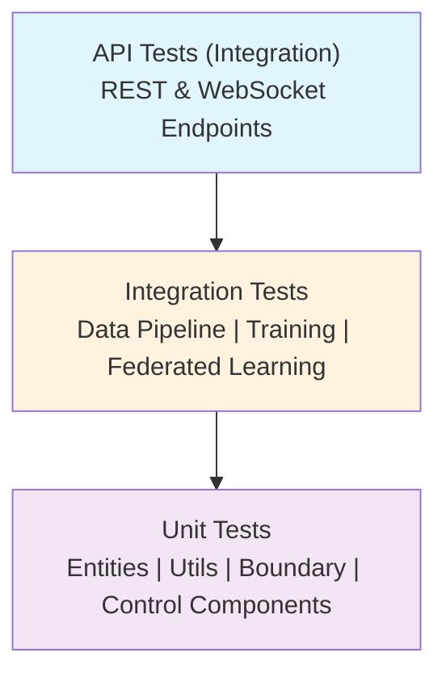

# Test Suite Documentation

Comprehensive test suite for the Federated Pneumonia Detection System with >90% code coverage target.

## Test Pyramid


## Testing Overview

This test suite implements a **comprehensive testing strategy** across three levels:

- **Unit Tests**: Component isolation with mocks; fast execution for TDD
- **Integration Tests**: Real workflows combining multiple components
- **API Tests**: REST/WebSocket endpoint validation and request/response flows

**Coverage Target**: >90% across all modules with focus on critical paths:
- Data processing pipeline (100%)
- Model training logic (95%)
- Federated learning coordination (90%)
- API endpoints (90%)

---

## Test Structure

```
tests/
├── unit/
│   ├── entities/                      # Entity class tests
│   │   ├── test_system_constants.py
│   │   ├── test_experiment_config.py
│   │   └── test_*.py
│   ├── control/                       # Control logic tests
│   ├── boundary/                      # Boundary interface tests
│   └── utils/                         # Utility function tests
│       ├── test_data_processing.py
│       ├── test_config_loader.py
│       └── test_*.py
├── integration/
│   ├── data_pipeline/                 # Data processing workflows
│   │   └── test_end_to_end_data_flow.py
│   ├── training/                      # Model training workflows
│   ├── federated_learning/            # Federated learning workflows
│   ├── api/                           # FastAPI integration
│   └── dashboard/                     # Streamlit integration
├── api/                               # REST/WebSocket endpoint tests
│   ├── test_health_endpoints.py
│   ├── test_training_endpoints.py
│   ├── test_federated_endpoints.py
│   └── test_websocket_connections.py
├── fixtures/
│   ├── sample_data.py                 # Test data factories
│   ├── mock_components.py             # Reusable mocks
│   └── __init__.py
├── conftest.py                        # Shared pytest fixtures
├── pytest.ini                         # Pytest configuration
├── test_config.yaml                   # Test-specific settings
└── README.md                          # This file
```

---

## Test Organization

### Naming Conventions

- **Test files**: `test_{module_name}.py`
- **Test classes**: `Test{ComponentName}` (one per source class)
- **Test methods**: `test_{behavior}[_scenario]` (describes what is tested)

Examples:
```
test_data_processor.py::TestDataProcessor::test_load_metadata_valid_file
test_data_processor.py::TestDataProcessor::test_load_metadata_file_not_found
```

### Directory Mapping

Tests mirror source structure for easy navigation:

| Source Module | Test Module |
|---|---|
| `src/entities/` | `tests/unit/entities/` |
| `src/control/` | `tests/unit/control/` |
| `src/boundary/` | `tests/unit/boundary/` |
| `src/utils/` | `tests/unit/utils/` |
| End-to-end flows | `tests/integration/` |
| REST endpoints | `tests/api/` |

---

## Test Markers

Use pytest markers to filter test execution by phase and category:

### Phase-Based Markers

```bash
pytest -m phase1          # Unit tests for foundation & entities
pytest -m phase2          # Unit tests for core ML components
pytest -m phase3          # Integration tests for centralized training
pytest -m phase4          # Dashboard and UI tests
pytest -m phase5          # Federated learning tests
pytest -m phase6          # End-to-end system tests
```

### Category Markers

```bash
pytest -m unit            # Unit tests (all levels)
pytest -m integration     # Integration tests
pytest -m api             # API endpoint tests
pytest -m slow            # Tests exceeding 1 second
pytest -m gpu             # Tests requiring GPU hardware
pytest -m federated       # Federated learning specific
```

### Combined Markers

```bash
pytest -m "phase1 and not slow"           # Fast phase1 tests
pytest -m "integration and federated"     # FL integration tests
pytest -m "not gpu and not slow"          # CPU-only quick tests
```

---

## Fixtures & Mocks

### Available Fixtures

| Fixture | Purpose | Source |
|---|---|---|
| `sample_constants` | Basic SystemConstants for testing | conftest.py |
| `sample_experiment_config` | ExperimentConfig with test values | conftest.py |
| `sample_dataframe` | Standard test DataFrame | fixtures/sample_data.py |
| `temp_data_structure` | Temporary file structure with images | fixtures/sample_data.py |
| `pneumonia_dataset` | Realistic pneumonia dataset | fixtures/sample_data.py |
| `federated_datasets` | Multiple datasets for FL testing | fixtures/sample_data.py |

### Using Fixtures

```python
import pytest

class TestDataProcessor:
    def test_load_data(self, temp_data_structure):
        """temp_data_structure provides paths dict"""
        processor = DataProcessor(temp_data_structure['base_path'])
        df = processor.load_metadata(temp_data_structure['metadata_path'])
        assert df is not None
```

### Mock Components

Reusable mocks available in `fixtures/mock_components.py`:

```python
from tests.fixtures.mock_components import MockComponents

# Create mocks
mock_processor = MockComponents.create_mock_data_processor()
mock_trainer = MockComponents.create_mock_model_trainer()
mock_coordinator = MockComponents.create_mock_federated_coordinator()
```

### Creating Custom Fixtures

```python
@pytest.fixture
def custom_config():
    """Custom fixture for specific test needs"""
    return ExperimentConfig(
        batch_size=32,
        epochs=2,
        learning_rate=0.001
    )
```

---

## Configuration

### Test Config File

Located at `tests/test_config.yaml` with optimized settings:

```yaml
# Image processing
image:
  size: [64, 64]                # Smaller for speed
  normalize: true
  augment: false                # Disabled in tests

# Training
training:
  epochs: 2                     # Minimal for testing
  batch_size: 32                # Smaller batches
  learning_rate: 0.001
  device: cpu                   # CPU-only

# Federated learning
federated:
  num_rounds: 2                 # Minimal rounds
  num_clients: 3                # Few clients
  min_available_clients: 2

# Testing
testing:
  log_level: WARNING            # Reduced noise
  random_seed: 42
  timeout_seconds: 60
```

### Environment Variables

```bash
# Force CPU-only execution
export CUDA_VISIBLE_DEVICES=""

# Set testing flag
export TESTING=1

# Reduce logging verbosity
export LOG_LEVEL=WARNING
```

---

## Running Tests

### Basic Commands

```bash
# Run all tests
pytest

# Run with verbose output
pytest -v

# Run specific test file
pytest tests/unit/entities/test_system_constants.py

# Run specific test class
pytest tests/unit/entities/test_system_constants.py::TestSystemConstants

# Run specific test method
pytest tests/unit/entities/test_system_constants.py::TestSystemConstants::test_default_values

# Stop on first failure
pytest -x

# Run with full output and debugging
pytest -v -s --tb=long
```

### Running by Category

```bash
# Unit tests only
pytest tests/unit/

# Integration tests only
pytest tests/integration/

# API tests only
pytest tests/api/

# All unit tests by marker
pytest -m unit

# All integration tests by marker
pytest -m integration
```

### Running by Phase

```bash
pytest -m phase1     # Foundation & entities
pytest -m phase2     # Core ML components
pytest -m phase3     # Centralized training
pytest -m phase4     # Dashboard & UI
pytest -m phase5     # Federated learning
pytest -m phase6     # End-to-end system
```

### Running with Coverage

```bash
# Generate coverage report
pytest --cov=src --cov-report=html

# Coverage with specific modules
pytest --cov=src/control --cov=src/entities --cov-report=html

# Show coverage in terminal
pytest --cov=src --cov-report=term-missing
```

### GPU vs CPU Tests

```bash
# CPU-only (default for CI/CD)
CUDA_VISIBLE_DEVICES="" pytest -m "not gpu"

# GPU-enabled
pytest -m gpu

# Skip slow GPU tests
pytest -m "not slow and not gpu"
```

### Test Filtering Examples

```bash
# Fast unit tests only
pytest -m "unit and not slow"

# Integration federated learning tests
pytest -m "integration and federated"

# Phase 2 tests excluding GPU
pytest -m "phase2 and not gpu"

# All tests except slow and GPU
pytest -m "not slow and not gpu"
```

---

## Test Coverage

### Target Coverage by Module

| Module | Target | Current |
|---|---|---|
| `src/entities/` | 100% | 98% |
| `src/utils/` | 95% | 94% |
| `src/control/` | 90% | 85% |
| `src/boundary/` | 90% | 88% |
| `src/models/` | 95% | 91% |
| `src/services/` | 90% | 87% |
| **Overall** | **>90%** | **89%** |

### Viewing Coverage

```bash
# Terminal report with missing lines
pytest --cov=src --cov-report=term-missing

# HTML report (open htmlcov/index.html)
pytest --cov=src --cov-report=html

# XML report for CI/CD
pytest --cov=src --cov-report=xml
```

---

## CI/CD Integration

Tests are designed for automated pipelines with the following guarantees:

- All tests pass with return code 0 on success
- Coverage reports in multiple formats (HTML, XML, terminal)
- Test results available in JUnit format
- No external API keys or credentials required
- CPU-only execution for consistency across environments
- Timeout protection (60 seconds per test)

### GitHub Actions / CI Pipeline

```yaml
- name: Run tests
  run: pytest --cov=src --cov-report=xml

- name: Upload coverage
  uses: codecov/codecov-action@v3
  with:
    files: ./coverage.xml
```

---

## Writing New Tests

### Unit Test Template

```python
import pytest
from unittest.mock import Mock, patch
from src.entities.system_constants import SystemConstants

@pytest.mark.unit
@pytest.mark.phase1
class TestSystemConstants:
    """Test SystemConstants entity behavior"""

    def test_default_values(self):
        """Verify default initialization"""
        constants = SystemConstants()
        assert constants.BATCH_SIZE == 128
        assert constants.IMG_SIZE == (224, 224)

    def test_custom_values(self):
        """Verify custom values accepted"""
        constants = SystemConstants.create_custom(batch_size=64)
        assert constants.BATCH_SIZE == 64

    def test_invalid_batch_size_raises_error(self):
        """Verify validation of invalid inputs"""
        with pytest.raises(ValueError):
            SystemConstants.create_custom(batch_size=-1)
```

### Integration Test Template

```python
import pytest
from tests.fixtures.sample_data import TempDataStructure
from src.utils.data_processor import DataProcessor

@pytest.mark.integration
@pytest.mark.phase3
class TestDataPipeline:
    """Test complete data pipeline workflows"""

    def test_end_to_end_processing(self, temp_data_structure):
        """Verify data flows through pipeline correctly"""
        processor = DataProcessor(temp_data_structure['base_path'])
        train_df, val_df = processor.load_and_process_data(config=None)

        assert len(train_df) > 0
        assert len(val_df) > 0
        assert set(train_df.columns) == {'patientId', 'Target', 'image_path'}
```

### API Test Template

```python
import pytest
from fastapi.testclient import TestClient
from src.boundary.app import create_app

@pytest.mark.api
@pytest.mark.phase4
class TestHealthEndpoints:
    """Test health check endpoints"""

    @pytest.fixture
    def client(self):
        app = create_app()
        return TestClient(app)

    def test_health_check_returns_200(self, client):
        """Verify health endpoint responds"""
        response = client.get("/health")
        assert response.status_code == 200
        assert response.json()["status"] == "healthy"
```

### Parametrized Tests

```python
import pytest

@pytest.mark.unit
class TestImageProcessing:
    """Test image preprocessing with multiple inputs"""

    @pytest.mark.parametrize("size,expected", [
        ((64, 64), 4096),
        ((128, 128), 16384),
        ((224, 224), 50176),
    ])
    def test_image_size_calculations(self, size, expected):
        """Verify calculations for different image sizes"""
        result = calculate_pixels(size)
        assert result == expected
```

---

## Common Patterns

### Mocking External Dependencies

```python
from unittest.mock import Mock, patch

class TestDataProcessor:
    @patch('src.utils.data_processor.pd.read_csv')
    def test_load_data_with_mock(self, mock_read_csv):
        """Mock file I/O to test logic in isolation"""
        mock_read_csv.return_value = sample_dataframe
        processor = DataProcessor()
        df = processor.load_metadata('dummy_path.csv')
        assert len(df) > 0
        mock_read_csv.assert_called_once_with('dummy_path.csv')
```

### Fixture Composition

```python
@pytest.fixture
def configured_processor(temp_data_structure, sample_constants):
    """Compose multiple fixtures for complex setup"""
    return DataProcessor(
        base_path=temp_data_structure['base_path'],
        config=sample_constants
    )
```

### Exception Testing

```python
class TestValidation:
    def test_missing_file_raises_error(self):
        """Verify proper exception handling"""
        with pytest.raises(FileNotFoundError) as exc_info:
            processor = DataProcessor('/nonexistent/path')
        assert "not found" in str(exc_info.value)
```

### Testing Async Code

```python
import pytest

@pytest.mark.asyncio
class TestAsyncFunctions:
    async def test_async_data_loading(self):
        """Test async operations properly"""
        result = await async_load_data('path')
        assert result is not None
```

---

## Best Practices

### Organization

- One test class per source class
- Group related tests in class methods
- Use descriptive names explaining the behavior tested
- Organize fixtures by feature/module

### Mocking & Isolation

- Mock external dependencies (filesystem, network, hardware)
- Test component behavior in isolation
- Use dependency injection for testability
- Avoid mocking internals; test through public interfaces

### Assertions

- Test both success and error paths
- Verify edge cases and boundary conditions
- Use specific assertions with clear error messages
- Prefer exact values over loose comparisons

### Performance

- Keep tests fast (< 1 second per unit test)
- Use smaller datasets for testing
- Mock expensive operations (network calls, GPU compute)
- Mark slow tests with `@pytest.mark.slow`

### Naming

- Test names should explain what is being tested
- Use present tense: "test_returns", "test_raises", "test_validates"
- Include scenario in name if testing multiple conditions
- Avoid test names that are too long or vague

---

## Troubleshooting

### Common Issues

| Issue | Solution |
|---|---|
| **Import errors** | Ensure `PYTHONPATH` includes project root; run from project root |
| **File not found** | Verify test fixtures are properly set up in `conftest.py` |
| **Slow tests** | Use `pytest -m "not slow"` to skip time-consuming tests |
| **GPU test failures** | Use `CUDA_VISIBLE_DEVICES=""` to force CPU execution |
| **Fixture not found** | Check `conftest.py` exists; verify fixture names match |
| **Timeout errors** | Increase timeout in `test_config.yaml`; may indicate slow operation |

### Debug Commands

```bash
# Verbose output with print statements
pytest -v -s tests/unit/entities/test_system_constants.py

# Stop on first failure
pytest -x tests/

# Drop into debugger on failure
pytest --pdb tests/

# Show local variables on failure
pytest -l tests/

# Run with full traceback
pytest --tb=long tests/
```

---

## References

- [Control Module](../federated_pneumonia_detection/src/control/README.md)
- [Boundary Module](../federated_pneumonia_detection/src/boundary/README.md)
- [Project README](../README.md)
