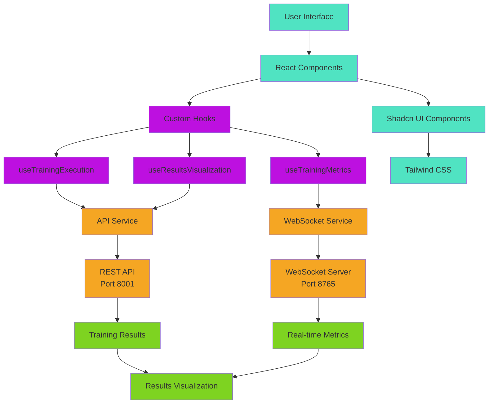
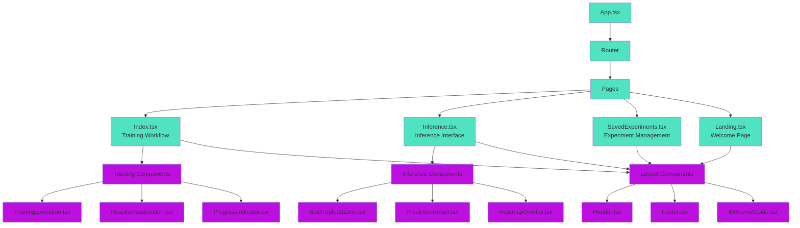

# X-Ray Vision AI Forge 🖥️

**Last Updated**: 2026-01-24  
**Agent**: Sub-Apollo (Documentation Specialist)

**A modern, real-time dashboard for the Hybrid Federated/Centralized Pneumonia Detection System.**

This React application serves as the primary user interface for controlling training sessions, visualizing results, monitoring system status, and performing inference on chest X-ray images.

---

## 🏗️ Architecture Overview

### Tech Stack
- **Framework**: [React](https://react.dev/) 18 + [Vite](https://vitejs.dev/)
- **Language**: TypeScript
- **Styling**: Tailwind CSS + Shadcn UI (Radix Primitives)
- **State Management**: React Query + Context API
- **Visualization**: Recharts
- **Communication**: WebSocket (Real-time updates)
- **Testing**: Vitest + React Testing Library

### Core Capabilities
- **Training Orchestration**: Start centralized or federated runs via guided workflow
- **Live Monitoring**: Real-time training metrics (Loss, Accuracy, F1) via WebSocket
- **Results Analysis**: Confusion matrices, ROC curves, per-epoch statistics
- **Inference Engine**: Batch/single image prediction with heatmaps
- **Chat Assistant**: Arxiv Agent integration for research queries
- **Experiment Management**: Save, load, and compare training runs

---

## 📂 Module Structure

```
src/
├── components/                 # UI Components
│   ├── training/              # Training workflow components
│   │   ├── TrainingExecution.tsx     # Main training control
│   │   ├── ResultsVisualization.tsx  # Results display
│   │   ├── ProgressIndicator.tsx     # Step progress
│   │   └── index.ts                 # Component exports
│   ├── inference/            # Inference/prediction components
│   │   ├── BatchUploadZone.tsx      # Batch file upload
│   │   ├── PredictionResult.tsx     # Result display
│   │   ├── HeatmapOverlay.tsx       # X-ray heatmaps
│   │   └── index.ts                 # Component exports
│   ├── layout/               # Layout components
│   │   ├── Header.tsx              # App header
│   │   ├── Footer.tsx              # App footer
│   │   └── WelcomeGuide.tsx        # First-time guide
│   ├── ui/                  # Shadcn UI primitives
│   └── shared/              # Shared utility components
├── context/                 # React Context providers
│   ├── ChatContext.tsx           # Chat state management
│   └── CopilotContext.tsx        # AI assistant context
├── hooks/                   # Custom React hooks
│   ├── useTrainingExecution.ts   # Training orchestration
│   ├── useTrainingMetrics.ts     # Real-time metrics
│   ├── useResultsVisualization.ts # Results processing
│   └── use-toast.ts              # Toast notifications
├── pages/                   # Route components
│   ├── Index.tsx                 # Main experiment workflow
│   ├── Inference.tsx             # Inference interface
│   ├── SavedExperiments.tsx      # Experiment management
│   └── Landing.tsx               # Landing page
├── services/                # API/WebSocket clients
│   ├── api.ts                    # REST API client
│   ├── websocket.ts              # WebSocket manager
│   └── inferenceApi.ts           # Inference API client
├── types/                   # TypeScript definitions
│   ├── api.ts                    # API response types
│   ├── experiment.ts             # Experiment configuration
│   ├── inference.ts              # Inference types
│   └── runs.ts                   # Run management types
└── utils/                   # Utility functions
    ├── env.ts                    # Environment variables
    ├── validation.ts             # Input validation
    └── configMapper.ts           # Configuration mapping
```

---

## 🔄 Data Flow Architecture



---

## 🔌 Backend Integration

### REST API Communication
**Service**: `src/services/api.ts`  
**Base URL**: `http://localhost:8001`

#### Key Endpoints
- **Training**: `/experiments/{centralized|federated}/train`
- **Results**: `/api/runs/{runId}/metrics`
- **Configuration**: `/config/current`
- **Inference**: `/inference/predict`

### WebSocket Real-time Updates
**Service**: `src/services/websocket.ts`  
**URL**: `ws://localhost:8765`

#### Event Types
- `training_start`: Training session initiated
- `training_mode`: Centralized vs Federated mode
- `epoch_end`: Epoch completion with metrics
- `round_end`: Federated round completion
- `batch_metrics`: Real-time training observability
- `training_end`: Session completion

---

## 🧩 Component Hierarchy



---

## 📊 Key Features by Module

### Training Workflow (`src/components/training/`)
- **TrainingExecution**: Orchestrates training start/stop, handles both centralized and federated modes
- **ResultsVisualization**: Displays training metrics, confusion matrices, comparison charts
- **ProgressIndicator**: Multi-step workflow navigation (Dataset → Config → Training → Results)

### Inference Engine (`src/components/inference/`)
- **BatchUploadZone**: Drag-and-drop interface for multiple X-ray images
- **PredictionResult**: Displays prediction confidence, class probabilities
- **HeatmapOverlay**: Grad-CAM visualization on X-ray images
- **ClinicalInterpretation**: AI-generated clinical insights

### Real-time Monitoring (`src/hooks/`)
- **useTrainingMetrics**: Subscribes to WebSocket `batch_metrics` events
- **useTrainingExecution**: Manages training lifecycle, WebSocket connections
- **useResultsVisualization**: Processes and formats results for display

---

## 🚀 Getting Started

### Prerequisites
- Node.js 20+
- npm or yarn
- Backend services running (API:8001, WS:8765)

### Installation
```bash
cd xray-vision-ai-forge
npm install
```

### Development
```bash
npm run dev          # Start development server (port 5173)
npm run lint         # ESLint checking
npm run type-check   # TypeScript validation
npm run test         # Run tests
```

### Environment Configuration
```env
VITE_API_BASE_URL=http://localhost:8001
VITE_WS_BASE_URL=ws://localhost:8765
VITE_API_TIMEOUT=30000
```

---

## 🔧 Key Integration Points

### Backend Metrics Flow
1. **Training Start** → API call → Backend initiates training
2. **WebSocket Connect** → Real-time metrics stream
3. **Batch Metrics** → `useTrainingMetrics` hook processes data
4. **UI Updates** → Charts and progress indicators refresh

### Federated vs Centralized
- **Mode Detection**: WebSocket `training_mode` event sets UI context
- **Metrics Adaptation**: Different visualization for rounds vs epochs
- **Results Processing**: Unified results API handles both modes

### Inference Pipeline
1. **Image Upload** → Validation and preprocessing
2. **API Request** → Backend prediction endpoint
3. **Result Display** → Confidence scores + heatmaps
4. **Clinical Insights** → AI-generated interpretation

---

## 🧪 Testing Strategy

### Unit Tests
- Component rendering with React Testing Library
- Hook behavior with test environments
- API service mocking with MSW

### Integration Tests
- WebSocket event handling
- End-to-end workflow testing
- Error boundary validation

---

## 📈 Performance Considerations

### WebSocket Optimization
- Throttled updates (500ms) for batch metrics
- Data windowing (max 200 points) for memory
- Auto-reconnect with exponential backoff

### React Query Caching
- API response caching for results
- Background refetching for live data
- Optimistic updates for UI responsiveness

---

## 🔄 State Management Pattern

### Server State (React Query)
- Training results and metrics
- Experiment configurations
- Inference predictions

### UI State (Context)
- Current workflow step
- WebSocket connection status
- Chat assistant state

### Local State (useState)
- Form inputs and validation
- Component-specific UI state
- Temporary UI preferences